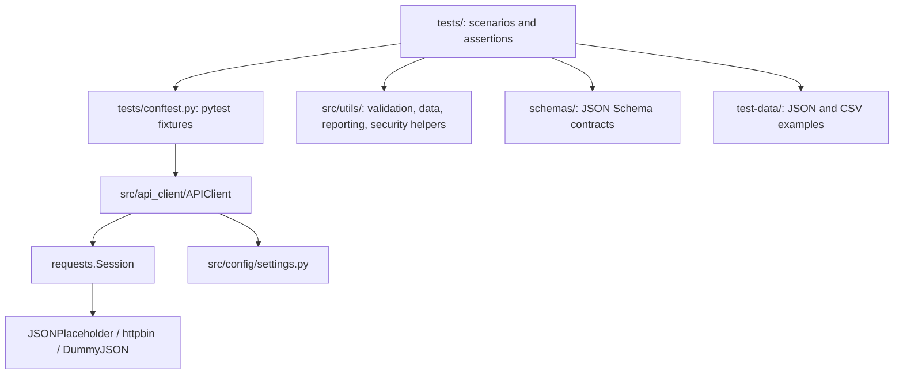
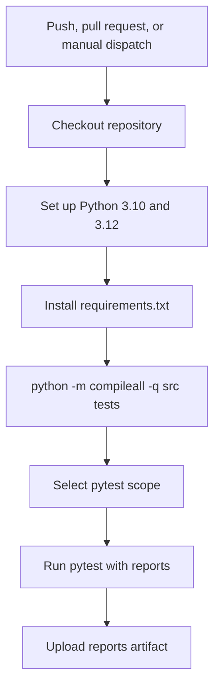

# API Testing Framework - Python + Pytest + Requests


Production-style REST API test automation framework built with Python, pytest, and requests.

This repository is also a learning project. It grows module by module from Python fundamentals and manual API concepts into a reusable API testing framework with configuration, fixtures, schema validation, data-driven testing, mocking, performance and security smoke checks, reporting, CI, and a DummyJSON capstone suite.

## Modular Learning Structure

This project is intentionally organized as a linear learning path. Each module was built on its own branch, then merged into `main` and tagged as a completed checkpoint.

That means you can inspect the framework at any stage of its evolution:

```bash
git tag --list 'module-*' --sort=version:refname
git checkout module-04-complete
git checkout module-07-complete
git checkout module-15-complete
```

To return to the finished project:

```bash
git checkout main
```

Module checkpoints:

| Checkpoint | What The Project Contains At That Point |
|---|---|
| `module-01-complete` | Python fundamentals for QA automation: values, control flow, functions, data structures, errors, QA idioms |
| `module-02-complete` | API fundamentals: HTTP requests/responses, API styles, versioning, auth concepts, reading docs |
| `module-03-complete` | Python virtual environment, dependencies, pytest discovery, requests preparation, project structure |
| `module-04-complete` | first live GET tests against JSONPlaceholder with status, body, header, nested-resource assertions |
| `module-05-complete` | POST, PUT, PATCH, DELETE examples and fake-API persistence boundaries |
| `module-06-complete` | pytest fixtures, parametrize, markers, classes, test organization, isolation strategy |
| `module-07-complete` | reusable API client, centralized settings, session-based fixtures, structured client logging |
| `module-08-complete` | basic auth, bearer tokens, API keys, cookies, sessions, OAuth2/JWT nuance |
| `module-09-complete` | JSON/CSV test data loading, file-driven parametrization, deterministic Faker payloads |
| `module-10-complete` | JSON Schema files, validator helpers, schema failure analysis, schema vs business assertions |
| `module-11-complete` | mocked HTTP error paths, flaky API patterns, version compatibility, consumer contract boundaries |
| `module-12-complete` | response-time budgets, timing summaries, security header checks, secret redaction |
| `module-13-complete` | GitHub Actions CI, selectable test scopes, markers, optional xdist parallel strategy |
| `module-14-complete` | pytest-html, JUnit, Allure results, safe report context, logs for failure analysis |
| `module-15-complete` | DummyJSON capstone covering auth, token refresh, products, pagination, users, carts, posts, comments, schemas, reports |

The docs for each module live under `docs/module-*`. They are written to explain the concepts behind the code at that module checkpoint, not just summarize the final state.

## Final Project State

At the final checkpoint, this repository is a complete API automation learning framework with both tutorial tests and a capstone API suite.

The final framework includes:

- reusable `APIClient` wrapper around `requests.Session`
- centralized environment-backed settings
- shared pytest fixtures for JSONPlaceholder, httpbin, and DummyJSON
- tutorial tests grouped by module under `tests/learning/`
- capstone tests grouped by DummyJSON domain under `tests/dummyjson/`
- JSON Schema files for JSONPlaceholder and DummyJSON responses
- JSON and CSV data-driven testing examples
- deterministic generated data examples with Faker
- HTTP mocking examples with `responses`
- response-time helper utilities
- security and secret-redaction helper utilities
- pytest markers for smoke, regression, auth, schema, performance, security, reporting, capstone, and e2e selection
- pytest-html, JUnit XML, and Allure report output support
- GitHub Actions CI with selectable test scope and optional parallel execution

The important learning point is progression: the final framework did not appear all at once. Each module adds one layer, and the capstone proves those layers can support a broader API regression suite.

## APIs Under Test

The project uses public demo APIs so the framework can be run without private infrastructure.

| API | Role In This Project |
|---|---|
| [JSONPlaceholder](https://jsonplaceholder.typicode.com) | primary learning API for Modules 4-14 |
| [httpbin](https://httpbin.org) | request-behavior and authentication examples |
| [DummyJSON](https://dummyjson.com) | Module 15 capstone API with auth, refresh tokens, search, pagination, categories, nested objects |
| [FakeStore API](https://fakestoreapi.com) | optional comparison/practice API configured for extension work |

JSONPlaceholder intentionally simulates write operations instead of persisting them. The CRUD modules document that boundary directly so test assertions stay honest about the API's behavior.

## What This Project Demonstrates

- Python API test automation with pytest and requests
- clean test layout for tutorial modules and capstone coverage
- reusable API client design with default headers, timeouts, auth helpers, and logging
- environment-backed configuration with `.env` support
- pytest fixtures, markers, parametrization, and class organization
- JSON Schema validation with focused business assertions
- data-driven testing with static files and generated payloads
- mocking API failures without depending on unstable live systems
- beginner-friendly performance and security smoke checks
- safe report context with token/header/query redaction
- CI execution with report artifacts and optional xdist parallelism

## Tech Stack

| Tool | Purpose |
|---|---|
| Python 3.10+ | language runtime |
| pytest | test runner, fixtures, markers, parametrization |
| requests | HTTP client library |
| python-dotenv | local environment variable loading |
| Faker | deterministic generated test data |
| jsonschema | response schema validation |
| responses | HTTP mocking for error paths and retry patterns |
| pytest-xdist | optional parallel execution strategy |
| pytest-html | self-contained HTML reports |
| allure-pytest | Allure result generation |
| GitHub Actions | continuous integration |

## Project Structure

```text
.
|-- .github/workflows/        # CI workflow
|-- docs/                     # Module-by-module learning docs
|-- reports/                  # Generated reports and artifacts, ignored except .gitkeep
|-- schemas/
|   |-- dummyjson/            # DummyJSON capstone response schemas
|   `-- jsonplaceholder/      # JSONPlaceholder learning response schemas
|-- src/
|   |-- api_client/           # APIClient wrapper around requests.Session
|   |-- config/               # environment-backed framework settings
|   |-- models/               # reserved package for future typed models
|   `-- utils/                # data loading, schema, performance, security, reporting helpers
|-- test-data/
|   `-- module_09/            # JSON and CSV test data examples
|-- tests/
|   |-- dummyjson/            # Module 15 capstone suite
|   |-- learning/             # Module-focused tutorial tests
|   `-- conftest.py           # shared pytest fixtures
|-- pyproject.toml            # pytest configuration and markers
|-- requirements.txt          # project dependencies
`-- README.md
```

## Architecture

The framework separates test intent from HTTP mechanics and environment setup.



Key framework files:

| File | Purpose |
|---|---|
| `src/api_client/client.py` | reusable HTTP client with base URL handling, default timeout, auth helpers, logging, and session cleanup |
| `src/config/settings.py` | central settings loaded from environment variables and `.env` |
| `src/utils/data_loader.py` | project-root aware JSON and CSV data loading helpers |
| `src/utils/schema_validator.py` | JSON Schema loading, validation, and validation-error collection |
| `src/utils/performance.py` | response-time budget and timing summary helpers |
| `src/utils/security.py` | security-header checks and sensitive query/header detection |
| `src/utils/reporting.py` | safe report context and redaction helpers |
| `tests/conftest.py` | shared JSONPlaceholder and httpbin fixtures |
| `tests/dummyjson/conftest.py` | DummyJSON client, credential, login, and authenticated-client fixtures |

## Test Grouping And Suite Organization

The repository contains both learning-focused tests and capstone tests.

Earlier module tests introduce concepts one at a time. Capstone tests prove the framework can support broader domain-organized API coverage. Keeping both categories is intentional: the earlier tests are teaching examples, and the capstone suite is the final broader regression layer.

Top-level test grouping:

| Group | Path | Purpose |
|---|---|---|
| Learning tests | `tests/learning/` | module-by-module tutorial coverage from environment setup through reporting |
| DummyJSON capstone | `tests/dummyjson/` | final API suite organized by business/domain area |
| Shared fixtures | `tests/conftest.py` | common clients, sessions, base URLs, and timeout fixtures |
| Capstone fixtures | `tests/dummyjson/conftest.py` | DummyJSON auth and token-aware client setup |

Learning module test groups:

| Module | Location | Focus |
|---|---|---|
| 03 | `tests/learning/test_03_environment_setup/` | pytest behavior, environment, request preparation |
| 04 | `tests/learning/test_04_basic_get/` | GET requests, status codes, response bodies, headers, nested resources |
| 05 | `tests/learning/test_05_crud/` | create, update, delete, fake persistence boundaries |
| 06 | `tests/learning/test_06_pytest_features/` | fixtures, markers, parametrization, test classes |
| 07 | `tests/learning/test_07_framework/` | API client and settings tests |
| 08 | `tests/learning/test_08_auth/` | basic auth, bearer tokens, API keys, cookies, sessions |
| 09 | `tests/learning/test_09_data_driven/` | JSON/CSV data loading and Faker-generated payloads |
| 10 | `tests/learning/test_10_schema/` | schema helper tests and response schema validation |
| 11 | `tests/learning/test_11_advanced/` | mocking, flaky API patterns, version compatibility, contract boundaries |
| 12 | `tests/learning/test_12_performance_security/` | response-time budgets, timing summaries, security smoke checks, secret handling |
| 13 | `tests/learning/test_13_cicd/` | CI workflow contract and marker strategy |
| 14 | `tests/learning/test_14_reporting/` | logging, report redaction, plugin checks, safe report context |

DummyJSON capstone coverage:

| Area | Location | Behavior Covered |
|---|---|---|
| Authentication | `tests/dummyjson/test_auth.py` | login, current user, refresh token, invalid login, token redaction |
| Products | `tests/dummyjson/test_products.py` | nested product shape, pagination, search, categories |
| Users | `tests/dummyjson/test_users.py` | collection schema, single user nesting, public demo user search |
| Carts | `tests/dummyjson/test_carts.py` | cart collection schema and total consistency |
| Posts/comments | `tests/dummyjson/test_posts_comments.py` | post collection schema, user filtering, nested comment user summary |

At the final checkpoint, pytest collects 222 tests across the learning and capstone suites.

## Prerequisites

- Python 3.10 or newer
- `pip`
- internet access for live public API tests

The checked local virtual environment used during this README pass is Python 3.14 with the project dependencies installed. The project itself declares support for Python 3.10+.

## Getting Started

Create and activate a virtual environment:

```bash
python -m venv .venv
source .venv/bin/activate
```

Install dependencies:

```bash
python -m pip install --upgrade pip
python -m pip install -r requirements.txt
```

Optional: create a local `.env` file from the template:

```bash
cp .env.example .env
```

Run a focused smoke check:

```bash
python -m pytest -m smoke -v
```

Run the full suite:

```bash
python -m pytest tests/ -v
```

## Common Commands

| Command | What It Runs |
|---|---|
| `python -m pytest tests/ -v` | full test suite |
| `python -m pytest tests/learning/test_04_basic_get/ -v` | first live GET learning module |
| `python -m pytest tests/learning/test_05_crud/ -v` | CRUD learning module |
| `python -m pytest tests/learning/test_07_framework/ -v` | API client and settings tests |
| `python -m pytest tests/learning/test_08_auth/ -v` | authentication examples |
| `python -m pytest tests/learning/test_10_schema/ -v` | JSON Schema examples |
| `python -m pytest tests/learning/test_12_performance_security/ -v` | performance and security examples |
| `python -m pytest tests/dummyjson/ -v` | DummyJSON capstone suite |
| `python -m pytest -m smoke -v` | smoke-marked tests |
| `python -m pytest -m schema -v` | schema-marked tests |
| `python -m pytest -m performance -v` | performance-marked tests |
| `python -m pytest -m security -v` | security-marked tests |
| `python -m pytest -m capstone -v` | capstone-marked tests |
| `python -m pytest tests/ -n auto` | optional parallel execution with xdist |
| `python -m pytest --collect-only -q` | collect tests without executing API calls |

## Running Selective Test Suites

Use folders when you want to run a module or domain:

```bash
python -m pytest tests/learning/test_04_basic_get/ -v
python -m pytest tests/learning/test_11_advanced/ -v
python -m pytest tests/dummyjson/test_products.py -v
python -m pytest tests/dummyjson/ -v
```

Use markers when you want a behavior-focused slice:

```bash
python -m pytest -m smoke -v
python -m pytest -m "auth or security" -v
python -m pytest -m "schema and not capstone" -v
python -m pytest -m capstone -v
```

Use pytest node IDs when you want one exact test:

```bash
python -m pytest tests/dummyjson/test_auth.py::test_login_returns_user_identity_and_tokens -v
python -m pytest tests/learning/test_10_schema/test_response_schemas.py::test_single_user_matches_nested_schema -v
```

Useful selection patterns:

| Goal | Command |
|---|---|
| Run one file | `python -m pytest tests/dummyjson/test_auth.py -v` |
| Run one folder | `python -m pytest tests/learning/test_09_data_driven/ -v` |
| Run one exact test | `python -m pytest path/to/test_file.py::test_name -v` |
| Run smoke tests | `python -m pytest -m smoke -v` |
| Run capstone only | `python -m pytest tests/dummyjson/ -v` |
| Run with print/log output | `python -m pytest tests/ -v -s` |
| Run in parallel | `python -m pytest tests/ -n auto` |
| Collect without running | `python -m pytest --collect-only -q` |

## Reports

The framework writes generated reports under `reports/`.

| Report | Example Path |
|---|---|
| pytest-html report | `reports/pytest-report.html` |
| JUnit XML | `reports/junit.xml` |
| Allure raw results | `reports/allure-results/` |
| Module-specific report examples | `reports/module-14-smoke.html`, `reports/module-14-junit.xml` |

Generate HTML, JUnit, and Allure results in one run:

```bash
python -m pytest tests/ \
  --html=reports/pytest-report.html \
  --self-contained-html \
  --junitxml=reports/junit.xml \
  --alluredir=reports/allure-results
```

Generate results for the capstone only:

```bash
python -m pytest tests/dummyjson/ \
  --html=reports/capstone-report.html \
  --self-contained-html \
  --junitxml=reports/capstone-junit.xml \
  --alluredir=reports/allure-results
```

If the Allure command-line tool is installed locally, view the Allure report with:

```bash
allure serve reports/allure-results
```

Generated reports and artifacts are ignored by Git.

## CI

GitHub Actions is configured in:

```text
.github/workflows/api-tests.yml
```

The workflow is named `API Test Framework CI`. It runs on:

- pushes to `main`
- pull requests targeting `main`
- manual dispatch with selectable test scope

The CI job runs on Ubuntu against Python 3.10 and Python 3.12. It installs dependencies, checks Python syntax, runs pytest, and uploads the generated `reports/` directory as an artifact.

CI execution flow:



Manual workflow scopes:

| Scope | What It Runs |
|---|---|
| `full` | `tests/` |
| `smoke` | `-m smoke` |
| `performance` | `-m performance` |
| `security` | `-m security` |
| `capstone` | `tests/dummyjson` |

The workflow also supports optional xdist execution through the `parallel` manual input.

CI does not commit reports back to the repository. Reports are generated evidence for a specific run, so they are uploaded as workflow artifacts and ignored by Git.

## Module Learning Path

The framework was built in 15 modules:

| Module | Topic | Docs |
|---|---|---|
| 01 | Python Fundamentals | `docs/module-01-python-fundamentals/` |
| 02 | API Fundamentals | `docs/module-02-api-fundamentals/` |
| 03 | Environment Setup | `docs/module-03-environment-setup/` |
| 04 | First API Tests | `docs/module-04-first-api-tests/` |
| 05 | CRUD Operations | `docs/module-05-crud-operations/` |
| 06 | Pytest Deep Dive | `docs/module-06-pytest-deep-dive/` |
| 07 | Framework Architecture | `docs/module-07-framework-architecture/` |
| 08 | Authentication Testing | `docs/module-08-authentication-testing/` |
| 09 | Data-Driven Testing | `docs/module-09-data-driven-testing/` |
| 10 | Schema Validation | `docs/module-10-schema-validation/` |
| 11 | Advanced Testing | `docs/module-11-advanced-testing/` |
| 12 | Performance and Security | `docs/module-12-performance-security/` |
| 13 | CI/CD Integration | `docs/module-13-cicd-integration/` |
| 14 | Reporting | `docs/module-14-reporting/` |
| 15 | Capstone Real-World API Suite | `docs/module-15-capstone/` |

The docs are intended to teach the concepts behind the code, not just list files.

## Environment Variables

Core local variables are documented in `.env.example`. Additional optional variables with framework defaults are shown here as well.

| Variable | Default |
|---|---|
| `BASE_URL` | `https://jsonplaceholder.typicode.com` |
| `HTTPBIN_URL` | `https://httpbin.org` |
| `DUMMYJSON_URL` | `https://dummyjson.com` |
| `FAKESTORE_URL` | `https://fakestoreapi.com` |
| `TEST_TIMEOUT` | `10` |
| `TEST_ENV` | `local` |
| `LOG_LEVEL` | `INFO` |
| `DUMMYJSON_USERNAME` | `emilys` |
| `DUMMYJSON_PASSWORD` | `emilyspass` |

The local `.env` file is intentionally ignored by Git. The DummyJSON credentials are public demo credentials and can be overridden for experiments or CI changes.

## Repository Hygiene

Tracked:

- source code
- tests
- docs
- schemas
- test data
- config
- workflows
- examples/templates such as `.env.example`

Ignored:

- virtual environments
- local `.env` files
- Python cache files
- pytest cache
- generated reports
- generated Allure output
- coverage output
- IDE and OS files
- logs

## Verification Snapshot

At the final Module 15 checkpoint, the project has these completed checkpoints:

```bash
git tag --list 'module-*' --sort=version:refname
```

Expected tags:

```text
module-01-complete
module-02-complete
module-03-complete
module-04-complete
module-05-complete
module-06-complete
module-07-complete
module-08-complete
module-09-complete
module-10-complete
module-11-complete
module-12-complete
module-13-complete
module-14-complete
module-15-complete
```

The latest collection check run during the README update:

```bash
.venv/bin/python -m pytest --collect-only -q
```

Observed result:

- 222 tests collected

The full suite depends on public demo APIs, so live execution can be affected by network availability or upstream service behavior. The advanced mocking modules show how to test important error paths without relying on live API instability.
