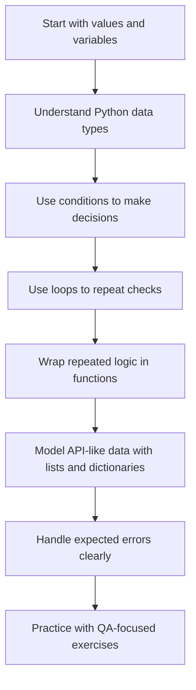
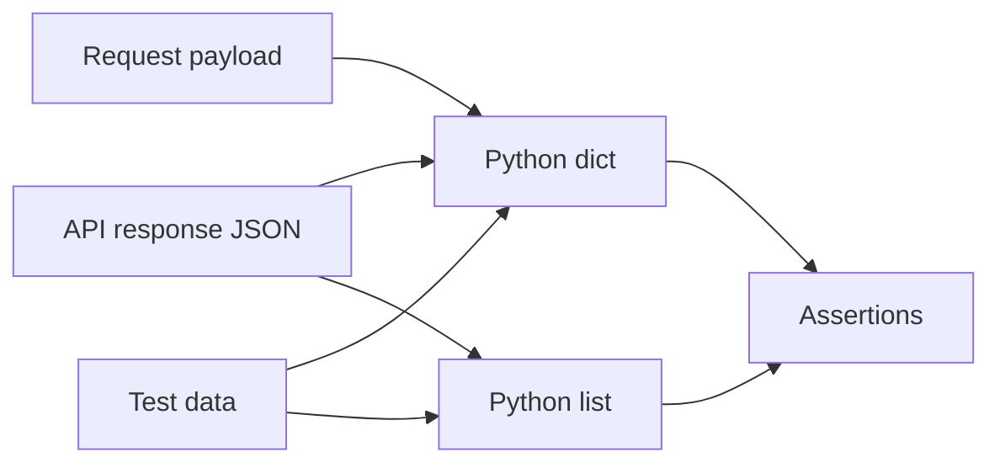

# Module 01: Python Fundamentals for QA

## What This Module Builds

Module 01 builds the Python foundation needed to read and write API tests later in the framework. There is no HTTP code yet. The goal is to make Python test code feel readable before pytest, requests, fixtures, clients, schemas, and reports are added.

By the end of this module, you should be able to:

- explain how Python stores test data in variables
- choose basic data types for API inputs and assertions
- use `if`, `for`, and `while` without guessing
- write small functions that make test logic reusable
- work with lists and dictionaries, the same structures returned by JSON APIs
- handle expected errors without hiding real bugs

## Learning Flow



The order matters. A future API test like this:

```python
def test_post_has_title(api_client):
    response = api_client.get("/posts/1")
    body = response.json()

    assert response.status_code == 200
    assert "title" in body
    assert isinstance(body["title"], str)
```

is built from Module 01 pieces:

| Python Piece | Where It Appears In The Test |
|---|---|
| function | `def test_post_has_title(...)` |
| variable | `response = ...`, `body = ...` |
| dictionary access | `body["title"]` |
| boolean expression | `"title" in body` |
| type check | `isinstance(..., str)` |

## Files Introduced In This Module

| File | Purpose |
|---|---|
| `docs/module-01-python-fundamentals/00-module-overview.md` | Module map and learning goals |
| `docs/module-01-python-fundamentals/01-values-variables-and-types.md` | First Python concept guide |
| `docs/module-01-python-fundamentals/02-control-flow.md` | Decisions, loops, retries, and repeated checks |
| `docs/module-01-python-fundamentals/03-functions.md` | Reusable behavior and helper design |
| `docs/module-01-python-fundamentals/04-data-structures.md` | Lists, dictionaries, tuples, sets, and JSON-shaped data |
| `docs/module-01-python-fundamentals/05-error-handling.md` | Exceptions, assertions, negative testing, and failure clarity |
| `docs/module-01-python-fundamentals/exercises.md` | QA-focused practice tasks |

No `src/` or `tests/` implementation files are introduced yet. The real project code begins in Module 03, and API tests begin in Module 04.

## Concept Map



Most REST APIs send and receive JSON. In Python, JSON objects become dictionaries, and JSON arrays become lists. That is why Module 01 spends time on data structures before any API calls are made.

## What Is Deferred

These topics are intentionally not added yet:

- pytest test discovery and assertions: Module 03
- requests and real HTTP calls: Module 03
- first GET API tests: Module 04
- reusable API client classes: Module 07
- authentication, schemas, mocking, reports, and CI: later modules

Keeping Module 01 focused prevents a beginner from learning Python syntax and HTTP testing at the same time.

## Quality Gate

Module 01 is complete when:

- docs explain Python basics with QA/API examples
- exercises require the learner to write small Python snippets
- no future-module framework code is introduced
- `CLAUDE.md` and `AGENTS.md` remain identical

## Key Takeaways

- Python basics are not separate from API testing; they are the language pieces used inside every future test.
- Dictionaries and lists matter because they mirror JSON objects and arrays.
- This module teaches reading and reasoning before automation libraries are introduced.
