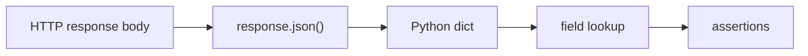

# Values, Variables, And Types

## What You Will Learn

This guide explains how Python stores information and how that connects to API testing. Every request payload, response body, status code, header, and test expectation eventually becomes a Python value.

## Values

A value is a piece of data:

```python
200
"GET"
True
None
```

In API testing, values represent things like:

| API Idea | Python Value |
|---|---|
| HTTP status code | `200` |
| HTTP method | `"GET"` |
| test passed condition | `True` |
| missing JSON value | `None` |

## Variables

A variable gives a name to a value:

```python
status_code = 200
method = "GET"
is_success = True
```

The name should describe the role of the value. In tests, clear names are not cosmetic. They make failures easier to understand.

Less clear:

```python
x = 200
y = "GET"
```

Clearer:

```python
expected_status_code = 200
request_method = "GET"
```

## Type Basics

Python values have types. A type tells Python what kind of data a value is and what operations make sense for it.

| Type | Example | API Testing Use |
|---|---|---|
| `str` | `"Leanne Graham"` | names, emails, URLs, methods, header values |
| `int` | `200` | status codes, IDs, counts |
| `float` | `9.99` | prices, response times, ratings |
| `bool` | `True` | pass/fail flags, feature toggles |
| `NoneType` | `None` | missing values |
| `list` | `[1, 2, 3]` | JSON arrays |
| `dict` | `{"id": 1}` | JSON objects |

## API-Like Example

Before making real API calls, you can model a response body as a dictionary:

```python
post = {
    "userId": 1,
    "id": 1,
    "title": "first post",
    "body": "example body",
}

expected_id = 1

assert post["id"] == expected_id
assert isinstance(post["title"], str)
```

This is the same thinking you will use later after `response.json()` returns a dictionary.



## Dynamic Typing

Python is dynamically typed. You do not declare the type before assigning a value:

```python
status_code = 200
status_code = "OK"
```

Python allows this, but tests become confusing when a variable changes meaning. In a test framework, prefer stable variable meaning:

```python
status_code = 200
reason_phrase = "OK"
```

## Common Beginner Mistakes

### Comparing Different Types

```python
assert 200 == "200"  # fails
```

The first value is an integer. The second is a string. API responses often mix these concerns: a status code is an integer, but a JSON field might contain a number as text.

### Using Vague Names

```python
data = {"id": 1}
```

`data` is sometimes acceptable in tiny examples, but in real tests use names that explain intent:

```python
post_response_body = {"id": 1}
```

### Assuming A Field Exists

```python
post = {"id": 1}
assert post["title"] == "hello"  # KeyError
```

Later, schema validation will give us stronger ways to prove fields exist. For now, understand that dictionary lookups fail when a key is missing.

## What This Prepares You For

Future API tests will use variables and types for:

- base URLs and endpoints
- request payloads
- expected status codes
- response body fields
- schema rules
- generated test data
- report metadata

## Key Takeaways

- Variables name values so test intent is readable.
- Types matter because assertions compare both value and meaning.
- Dictionaries and lists are the Python shapes you will use most when testing JSON APIs.
