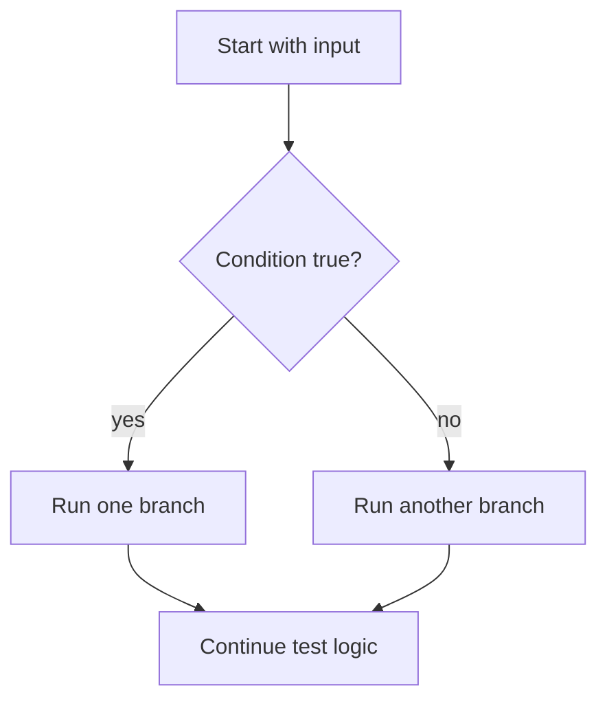
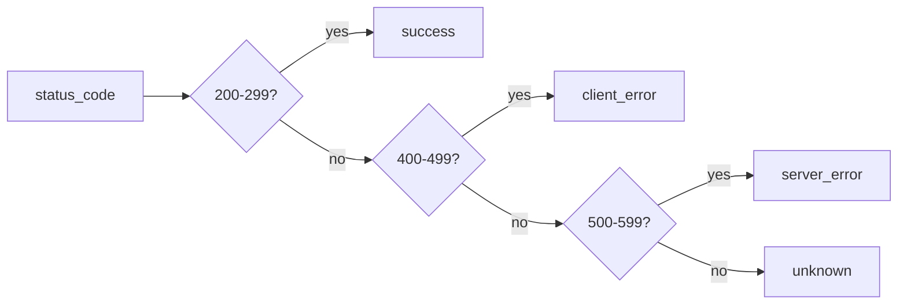

# Control Flow

## What You Will Learn

Control flow decides which code runs, when it runs, and how many times it runs. In API testing, control flow shows up when you classify status codes, loop through response records, retry a flaky operation, or stop checking after a critical failure.

## The Mental Model



A test is rarely just "call API, assert one thing." Real tests make decisions:

- if the status code is `200`, validate the body
- if it is `404`, validate the error message
- if it is `500`, fail immediately
- for every item in a list, check required fields

## `if`, `elif`, And `else`

Use conditionals when one path should run only if a condition is true.

```python
status_code = 201

if status_code == 200:
    result = "resource fetched"
elif status_code == 201:
    result = "resource created"
elif status_code == 404:
    result = "resource missing"
else:
    result = "unexpected response"
```

The conditions are checked from top to bottom. The first true branch wins.

## Status Code Classification

Status-code logic is one of the first places SDETs use conditionals.

```python
status_code = 404

if 200 <= status_code < 300:
    category = "success"
elif 400 <= status_code < 500:
    category = "client_error"
elif 500 <= status_code < 600:
    category = "server_error"
else:
    category = "unknown"
```



This same idea later becomes test assertions and helper functions.

## Boolean Operators

Use `and`, `or`, and `not` to combine conditions.

```python
status_code = 200
response_time_seconds = 0.42

is_fast_success = status_code == 200 and response_time_seconds < 1.0
is_accepted_success = status_code == 200 or status_code == 201
is_failure = not is_accepted_success
```

Important distinction:

| Operator | Meaning | Example |
|---|---|---|
| `and` | both sides must be true | status is 200 and response is fast |
| `or` | at least one side must be true | status is 200 or 201 |
| `not` | reverses truth | not authenticated |

## `for` Loops

Use a `for` loop when you need to repeat logic for every item in a collection.

```python
posts = [
    {"id": 1, "title": "first"},
    {"id": 2, "title": "second"},
    {"id": 3, "title": "third"},
]

for post in posts:
    assert "id" in post
    assert "title" in post
```

In API tests, `for` loops are useful when a response returns a list:

```python
for post in posts:
    assert isinstance(post["id"], int)
    assert isinstance(post["title"], str)
```

## `enumerate`

Use `enumerate` when the item position matters.

```python
endpoints = ["/posts", "/comments", "/users"]

for index, endpoint in enumerate(endpoints, start=1):
    print(f"Check {index}: {endpoint}")
```

This is useful when failure output should identify which case was being checked.

## Looping Over Dictionaries

API headers and JSON objects often behave like dictionaries.

```python
headers = {
    "Content-Type": "application/json",
    "Cache-Control": "no-cache",
}

for name, value in headers.items():
    print(f"{name}: {value}")
```

Use `.items()` when you need both key and value.

## `while` Loops

Use a `while` loop when repetition depends on a condition changing.

```python
attempt = 1
max_attempts = 3
success = False

while attempt <= max_attempts and not success:
    print(f"Attempt {attempt}")
    success = attempt == 2
    attempt += 1
```

This pattern prepares you for retry logic, but retries should be used carefully. Retrying every failure can hide real bugs. Later modules will distinguish acceptable transient failures from defects.

## `break`, `continue`, And `pass`

Use `break` to stop early:

```python
status_codes = [200, 200, 500, 200]

for status_code in status_codes:
    if status_code >= 500:
        print("critical server failure")
        break
```

Use `continue` to skip the rest of one loop iteration:

```python
users = [
    {"id": 1, "email": "a@example.com"},
    {"id": 2, "email": None},
]

for user in users:
    if user["email"] is None:
        continue
    print(user["email"])
```

Use `pass` only as a temporary placeholder:

```python
if status_code == 429:
    pass  # rate-limit handling comes later
```

Do not leave unexplained `pass` statements in production test code.

## Common Beginner Mistakes

### Using Assignment Instead Of Comparison

Python uses `=` for assignment and `==` for comparison.

```python
status_code = 200
assert status_code == 200
```

### Forgetting Indentation

Python uses indentation to define blocks:

```python
if status_code == 200:
    print("success")
```

### Making Conditions Too Clever

Prefer readable test logic over compact logic:

```python
is_success = 200 <= status_code < 300
assert is_success
```

## What This Prepares You For

Control flow appears in:

- response validation
- data-driven testing
- retry and flaky-test handling
- pagination loops
- workflow tests
- security payload checks

## Key Takeaways

- `if` statements model test decisions.
- `for` loops model checks across collections.
- `while` loops model repeat-until behavior, such as carefully scoped retries.
- Readability matters more than clever one-line logic in test automation.
