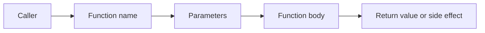

# Functions

## What You Will Learn

A function is a named, reusable block of code. Functions are the first step toward framework thinking: instead of repeating the same validation everywhere, you give the behavior a name and call it when needed.

## Why Functions Matter In Testing

Without functions, tests become copy-paste heavy:

```python
post = {"id": 1, "title": "hello"}
assert "id" in post
assert "title" in post
assert isinstance(post["id"], int)
assert isinstance(post["title"], str)
```

With a function:

```python
def assert_post_shape(post):
    assert "id" in post
    assert "title" in post
    assert isinstance(post["id"], int)
    assert isinstance(post["title"], str)
```

Now the intent is reusable:

```python
assert_post_shape({"id": 1, "title": "hello"})
```

## Function Flow



## Defining And Calling Functions

```python
def describe_status_code():
    print("200 means OK")

describe_status_code()
```

Function parts:

| Part | Example | Meaning |
|---|---|---|
| `def` | `def` | starts a function definition |
| name | `describe_status_code` | what the behavior is called |
| parentheses | `()` | where parameters go |
| colon | `:` | starts the function body |
| indented body | `print(...)` | code that runs when called |

Use `snake_case` for Python function names.

## Parameters And Arguments

Parameters let one function work with different values.

```python
def is_success_status(status_code):
    return 200 <= status_code < 300

assert is_success_status(200)
assert is_success_status(201)
assert not is_success_status(404)
```

`status_code` is the parameter. `200`, `201`, and `404` are arguments passed into the function.

## Return Values

Use `return` when the caller needs a result.

```python
def build_endpoint(resource, resource_id):
    return f"/{resource}/{resource_id}"

endpoint = build_endpoint("posts", 1)
assert endpoint == "/posts/1"
```

`return` exits the function immediately:

```python
def status_category(status_code):
    if 200 <= status_code < 300:
        return "success"
    if 400 <= status_code < 500:
        return "client_error"
    if 500 <= status_code < 600:
        return "server_error"
    return "unknown"
```

## Functions That Assert

In test code, some helper functions return data, while others assert behavior.

```python
def assert_has_required_fields(body, required_fields):
    for field in required_fields:
        assert field in body
```

Use assertion helpers when:

- the validation is repeated
- the function name makes test intent clearer
- failure output remains understandable

Do not hide too much logic in helpers. A test should still be readable.

## Default Parameters

Default parameters provide fallback values.

```python
def build_url(base_url, endpoint="/health"):
    return f"{base_url.rstrip('/')}/{endpoint.lstrip('/')}"

assert build_url("https://api.example.com") == "https://api.example.com/health"
assert build_url("https://api.example.com", "/posts") == "https://api.example.com/posts"
```

This prepares you for API clients, where timeout, headers, and query parameters often have defaults.

## Keyword Arguments

Keyword arguments make calls self-documenting.

```python
def create_post_payload(title, body, user_id):
    return {
        "title": title,
        "body": body,
        "userId": user_id,
    }

payload = create_post_payload(
    title="API testing",
    body="Functions keep tests readable",
    user_id=1,
)
```

When a function has several values, keyword arguments reduce mistakes caused by wrong ordering.

## `**kwargs` Preview

`**kwargs` collects extra named arguments into a dictionary.

```python
def build_post(**overrides):
    post = {
        "title": "default title",
        "body": "default body",
        "userId": 1,
    }
    post.update(overrides)
    return post

payload = build_post(title="custom title")
assert payload["title"] == "custom title"
assert payload["body"] == "default body"
```

This pattern becomes important in Module 09 when we build data factories.

## Scope

Variables created inside a function are local to that function.

```python
def make_status():
    status_code = 200
    return status_code

result = make_status()
```

`status_code` exists inside the function. `result` exists outside. This separation helps keep tests from accidentally modifying shared data.

## Common Beginner Mistakes

### Printing Instead Of Returning

```python
def build_endpoint_wrong():
    print("/posts/1")
```

This displays a value but does not give it back to the caller. Prefer:

```python
def build_endpoint():
    return "/posts/1"
```

### Doing Too Much In One Function

Avoid functions that build data, call an API, validate the response, write logs, and decide test strategy all at once. One function should have one clear job.

### Hiding Test Intent

This is too vague:

```python
def check(data):
    ...
```

This is clearer:

```python
def assert_post_has_required_fields(post):
    ...
```

## What This Prepares You For

Functions become:

- pytest test functions in Module 03
- reusable assertion helpers
- API client methods in Module 07
- data factories in Module 09
- schema loader helpers in Module 10
- report hooks in Module 14

## Key Takeaways

- Functions name reusable behavior.
- Parameters make a function flexible.
- Return values let functions produce useful results.
- Clear helper names are part of good test design.
