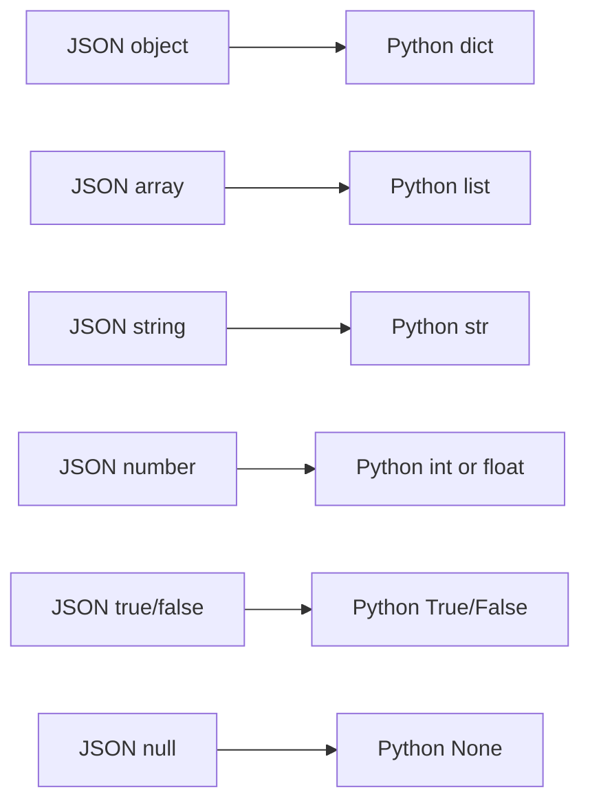
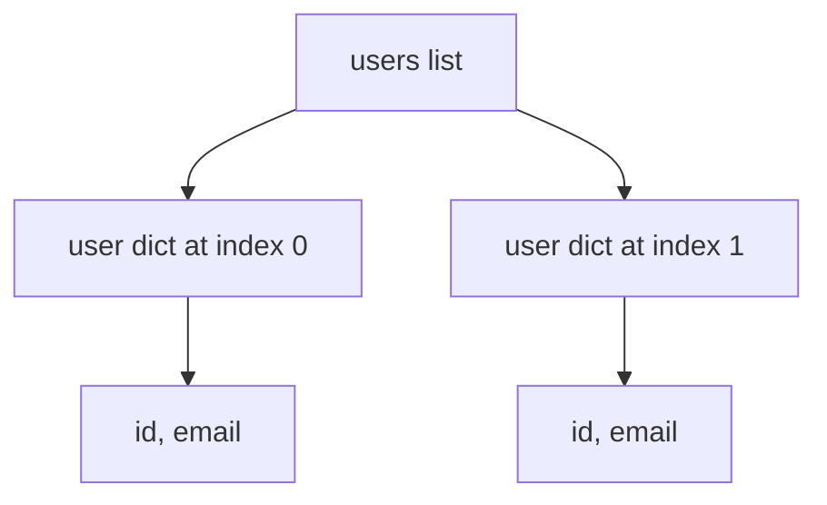

# Data Structures

## What You Will Learn

Data structures organize values. API testing depends heavily on two Python data structures:

- dictionaries, because JSON objects become Python dictionaries
- lists, because JSON arrays become Python lists

You will also see tuples and sets, but lists and dictionaries are the daily tools.

## JSON To Python Map



This mapping is why Python fundamentals matter before API testing starts.

## Lists

A list stores ordered items.

```python
endpoints = ["/posts", "/comments", "/users"]

assert endpoints[0] == "/posts"
assert len(endpoints) == 3
```

Lists are useful for:

- endpoint collections
- test case inputs
- JSON arrays returned by APIs
- ordered workflow steps

## Looping Through Lists

```python
posts = [
    {"id": 1, "title": "first"},
    {"id": 2, "title": "second"},
]

for post in posts:
    assert "id" in post
    assert "title" in post
```

Later, this becomes collection response validation.

## List Operations

```python
status_codes = [200, 201]

status_codes.append(204)
assert 404 not in status_codes
assert len(status_codes) == 3
```

Common operations:

| Operation | Example | Meaning |
|---|---|---|
| access item | `items[0]` | first item |
| length | `len(items)` | item count |
| append | `items.append(x)` | add one item |
| membership | `x in items` | check presence |

## Dictionaries

A dictionary stores key-value pairs.

```python
post = {
    "userId": 1,
    "id": 1,
    "title": "first post",
    "body": "example body",
}

assert post["id"] == 1
assert post["title"] == "first post"
```

Dictionaries are useful for:

- request payloads
- response bodies
- headers
- query parameters
- schema-like rules
- environment config snapshots

## Safe Dictionary Access

Direct access fails when a key is missing:

```python
post = {"id": 1}
# post["title"] raises KeyError
```

Use direct access when the field must exist. Use `.get()` when missing is acceptable and you want to handle it.

```python
title = post.get("title")
assert title is None
```

In tests, missing required fields should usually fail clearly.

```python
assert "title" in post
assert isinstance(post["title"], str)
```

## Nested Data

API responses often contain dictionaries inside dictionaries or lists inside dictionaries.

```python
user = {
    "id": 1,
    "name": "Leanne Graham",
    "address": {
        "city": "Gwenborough",
        "geo": {
            "lat": "-37.3159",
            "lng": "81.1496",
        },
    },
}

assert user["address"]["city"] == "Gwenborough"
assert "lat" in user["address"]["geo"]
```

Nested lookups should be readable. If a lookup gets too long, use intermediate variables:

```python
address = user["address"]
geo = address["geo"]

assert "lat" in geo
assert "lng" in geo
```

## List Of Dictionaries

This is one of the most common API response shapes.

```python
users = [
    {"id": 1, "email": "a@example.com"},
    {"id": 2, "email": "b@example.com"},
]

emails = []

for user in users:
    emails.append(user["email"])

assert "a@example.com" in emails
```



## Tuples

A tuple is an ordered collection that is usually treated as fixed.

```python
status_expectation = (200, "OK")

status_code, reason = status_expectation
assert status_code == 200
assert reason == "OK"
```

Tuples are useful when returning multiple values from a function.

## Sets

A set stores unique values.

```python
user_ids = {1, 2, 3, 3}
assert user_ids == {1, 2, 3}
```

Sets are useful for uniqueness checks:

```python
users = [
    {"id": 1},
    {"id": 2},
    {"id": 2},
]

ids = [user["id"] for user in users]
assert len(ids) != len(set(ids))
```

That assertion reveals duplicate IDs.

## Choosing The Right Structure

| Need | Use |
|---|---|
| ordered collection | list |
| key-value data | dict |
| fixed pair/group | tuple |
| uniqueness | set |

## Common Beginner Mistakes

### Confusing List Indexes And Dictionary Keys

```python
posts = [{"id": 1}]

first_post = posts[0]
post_id = first_post["id"]
```

Use numeric indexes for lists. Use keys for dictionaries.

### Mutating Shared Data Accidentally

```python
default_payload = {"title": "hello"}
payload = default_payload
payload["title"] = "changed"
```

Both names point to the same dictionary. Later modules will show safer factory patterns for fresh payloads.

### Overusing One Large Dictionary

Do not store unrelated things together just because dictionaries are flexible. Keep request data, expected data, and config separate.

## What This Prepares You For

Data structures appear in:

- response body assertions
- POST/PUT/PATCH payloads
- parametrized test cases
- JSON and CSV data loading
- schema validation
- DummyJSON capstone workflows

## Key Takeaways

- JSON objects map to Python dictionaries.
- JSON arrays map to Python lists.
- Nested data should be broken into readable intermediate variables.
- Sets are useful for uniqueness checks.
