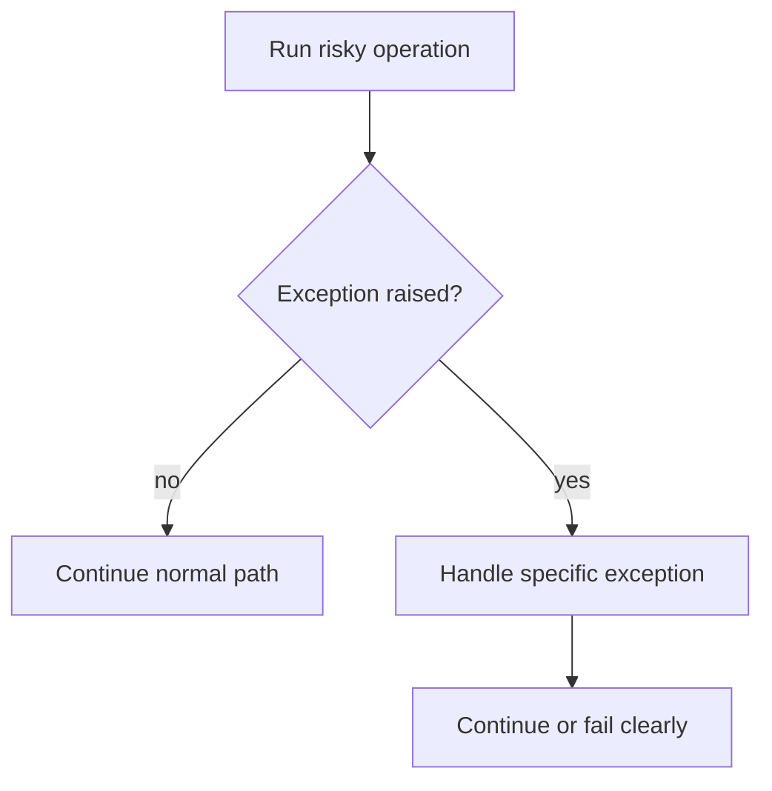

# Error Handling

## What You Will Learn

Error handling is how Python responds when something goes wrong. In test automation, the goal is not to hide failures. The goal is to make expected problems explicit and unexpected problems easy to diagnose.

## Errors Are Signals

An error usually means one of three things:

| Situation | Example | Test Automation Meaning |
|---|---|---|
| code bug | wrong variable name | fix the test/framework code |
| expected negative case | missing field | assert the failure clearly |
| external instability | temporary network issue | handle carefully, do not hide defects |

## Exceptions

Python raises exceptions when it cannot continue normally.

```python
post = {"id": 1}

title = post["title"]  # KeyError
```

The key `"title"` does not exist. Python raises `KeyError`.

Common exceptions in API test code:

| Exception | Common Cause |
|---|---|
| `KeyError` | missing dictionary key |
| `TypeError` | wrong data type for an operation |
| `ValueError` | invalid value |
| `AssertionError` | assertion failed |
| `TimeoutError` | operation exceeded time limit |

Requests-specific exceptions come later when the `requests` library is introduced.

## `try` And `except`

Use `try`/`except` when you expect a specific operation might fail and you know how to handle it.

```python
post = {"id": 1}

try:
    title = post["title"]
except KeyError:
    title = None

assert title is None
```



## Catch Specific Exceptions

Prefer this:

```python
try:
    user_id = int("abc")
except ValueError:
    user_id = None
```

Avoid this:

```python
try:
    user_id = int("abc")
except Exception:
    user_id = None
```

Catching every exception can hide real bugs. If you expected a `ValueError`, catch `ValueError`.

## `else` And `finally`

`else` runs when no exception happens. `finally` runs no matter what.

```python
try:
    status_code = int("200")
except ValueError:
    status_code = 0
else:
    assert status_code == 200
finally:
    print("conversion attempt finished")
```

In framework code, `finally` is often used for cleanup.

## Raising Your Own Errors

Use `raise` when your code detects an invalid situation.

```python
def require_success_status(status_code):
    if not 200 <= status_code < 300:
        raise ValueError(f"Expected success status, got {status_code}")

require_success_status(200)
```

In pytest tests, you will usually use assertions, but helper functions sometimes raise clear exceptions for invalid inputs.

## Assertions Are Test Failures

An assertion states what must be true.

```python
status_code = 404

assert status_code == 200
```

This raises `AssertionError`. In pytest, that becomes a failed test with useful output.

Use assertions for test expectations. Use exceptions for code situations your helper cannot handle.

## Negative Testing Mindset

A negative test expects a failure from the system under test, not from your test code.

Example expectation:

```python
status_code = 404
error_body = {"message": "Post not found"}

assert status_code == 404
assert error_body["message"] == "Post not found"
```

This is a passing negative test because the API failed in the expected way.

## Avoid Swallowing Failures

This is dangerous:

```python
try:
    assert status_code == 200
except AssertionError:
    pass
```

The test would continue even though the expectation failed. Do not catch `AssertionError` just to make a test pass.

## Debugging With Context

When something fails, useful context matters.

Less helpful:

```python
assert status_code == 200
```

More helpful:

```python
assert status_code == 200, f"Expected 200 for GET /posts/1, got {status_code}"
```

Do not overdo custom messages. Pytest already gives strong assertion output, but context helps when the value alone is not enough.

## What This Prepares You For

Error handling appears in:

- negative API tests
- schema validation failures
- retry and flaky-test handling
- file loading for test data
- reporting hooks
- API client timeout behavior

## Key Takeaways

- Errors are diagnostic signals, not annoyances to suppress.
- Catch specific exceptions only when you know how to handle them.
- Assertions should fail loudly when expectations are not met.
- Good failure messages explain what was being checked.
