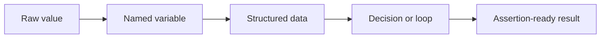

# Module 01 Checkpoint Deep Dive

This checkpoint is a language checkpoint, not a test-framework checkpoint. The repository contains project folders such as [`src/`](../../src/) and [`tests/`](../../tests/), but Module 01 intentionally leaves them empty except for package markers. That is the right design: before a learner automates APIs, they need to understand the Python shapes that API tests constantly read, build, and compare.

## Mental Model

Think of Python code in API testing as a chain of small transformations:



The module starts with simple values in [`01-values-variables-and-types.md`](01-values-variables-and-types.md), then moves toward response-shaped dictionaries and lists in [`04-data-structures.md`](04-data-structures.md). That sequence matters because future API responses are not magic objects. A JSON object becomes a Python `dict`, a JSON array becomes a `list`, numbers become `int` or `float`, and booleans become `True` or `False`.

## Execution Flow

When reading any Python example in this module, trace it in this order:

1. Identify the values that enter the snippet.
2. Name the variables that hold those values.
3. Follow each branch, loop, or function call.
4. Notice which expression produces the final answer.
5. Ask what would happen for missing, empty, or wrongly typed data.

That habit becomes important later when a test fails. A failed assertion usually has a data path behind it: value created, value transformed, value compared.

## Code Walkthrough Mindset

The exercises in [`exercises.md`](exercises.md) are designed to feel like tiny pieces of future API tests.

For example, "Model A JSON Object" teaches this future pattern:

```python
body = response.json()

assert body["id"] == 1
assert isinstance(body["title"], str)
```

The important part is not only the syntax. The learner should be able to say:

- `body` is a dictionary because JSON objects decode into dictionaries.
- `body["id"]` is direct key access and should be used only when the field is required.
- `isinstance(...)` checks the contract of the response value, not only its content.
- A failing assertion should make it obvious whether the problem is missing data, wrong data, or wrong type.

## Python Syntax To Notice

These are the syntax details that commonly show up inside framework code later:

| Syntax | Why It Matters For QA |
|---|---|
| `name = value` | Gives test data readable names so failures are easier to explain |
| `if/elif/else` | Models status-code decisions and negative-test branches |
| `for item in items` | Repeats checks across arrays returned by an API |
| `def helper(...):` | Moves repeated validation logic into a reusable function |
| `dict["key"]` | Reads required response fields |
| `dict.get("key")` | Reads optional response fields without raising `KeyError` |
| `assert condition` | Expresses the truth the test requires |
| `try/except` | Handles expected errors while allowing unexpected errors to surface |

Module 01 also introduces idioms in [`06-python-qa-idioms.md`](06-python-qa-idioms.md). Learn them as readability tools, not tricks. A list comprehension is useful when it makes response transformation clearer; a normal loop is better when each step needs explanation.

## Responsibility Boundaries

At this checkpoint, documentation has one responsibility: teach Python concepts using QA examples. It should not introduce real HTTP calls, pytest fixtures, reusable clients, schemas, mocks, reports, or CI.

The empty package files under [`src/`](../../src/) and [`tests/`](../../tests/) are placeholders for future modules. They should not be interpreted as framework behavior yet.

## Common Mistakes

- Comparing `"200"` to `200` and missing that one is a string while the other is an integer.
- Treating truthy values as if they were explicit booleans, especially with strings like `"false"`.
- Using `dict["optionalField"]` for optional fields, causing a `KeyError` instead of a controlled check.
- Writing large functions before understanding the smaller data transformations inside them.
- Catching broad exceptions and accidentally hiding the bug that should fail the test.

## Debugging And Failure Model

For Module 01 problems, debug from the data outward:

1. Print or inspect the value.
2. Check its type with `type(...)` or `isinstance(...)`.
3. Confirm the key or index exists before reading it.
4. Reduce a loop to one item if repeated logic is confusing.
5. Read the traceback from the bottom upward to find the exact failing line.

The goal is not to avoid failures. The goal is to make each failure explain what assumption was wrong.

## Interview Readiness

After this module, you should be able to answer:

- Why are dictionaries and lists central to API testing in Python?
- When would you use `.get()` instead of direct dictionary access?
- How do `==` and `is` differ?
- Why can `"false"` still behave like a truthy value?
- What makes a helper function useful in test automation?
- How do assertions differ from general exception handling?

## Revision Checklist

- I can explain every data type in [`01-values-variables-and-types.md`](01-values-variables-and-types.md) with an API-testing example.
- I can trace branches and loops from [`02-control-flow.md`](02-control-flow.md) without guessing.
- I can write a small helper after reading [`03-functions.md`](03-functions.md).
- I can model JSON-like data with the structures in [`04-data-structures.md`](04-data-structures.md).
- I can read an exception and decide whether it should be handled or allowed to fail.
- I can complete the exercises without copying a full solution.
