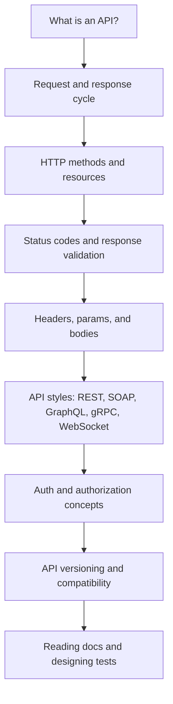
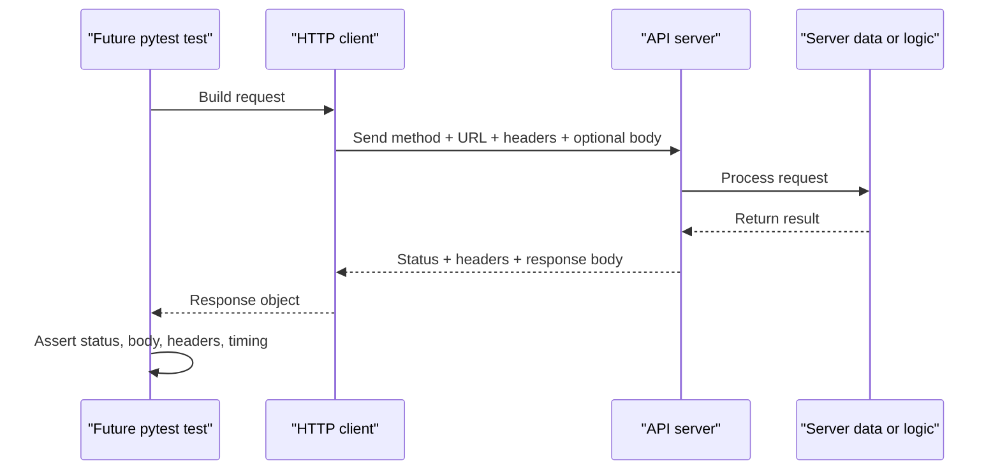

# Module 02: API Fundamentals

## What This Module Builds

Module 02 teaches the web API concepts you need before writing automated API tests. There is still no project code yet. The goal is to understand what an API request is, what a response contains, why HTTP conventions matter, and how API contracts guide test design.

By the end of this module, you should be able to:

- explain what an API is in practical SDET language
- describe the request/response cycle
- identify HTTP methods and when each is used
- classify status codes
- understand headers, query parameters, path parameters, and bodies
- compare REST, SOAP, GraphQL, gRPC, and WebSocket at a high level
- explain common authentication styles
- understand why API versioning affects test strategy
- read API documentation and convert it into test ideas

## Learning Flow

## Files Introduced In This Module

| File | Purpose |
|---|---|
| `docs/module-02-api-fundamentals/00-module-overview.md` | Module map and quality gate |
| `docs/module-02-api-fundamentals/01-what-are-apis.md` | API purpose, request/response cycle, and SDET mental model |
| `docs/module-02-api-fundamentals/02-http-requests-responses.md` | HTTP methods, status codes, headers, idempotency, and CRUD mapping |
| `docs/module-02-api-fundamentals/03-api-styles-and-versioning.md` | REST, SOAP, GraphQL, gRPC, WebSocket, and API versioning |
| `docs/module-02-api-fundamentals/04-authentication-and-authorization.md` | API keys, Basic auth, Bearer/JWT, OAuth2, cookies, and auth test ideas |
| `docs/module-02-api-fundamentals/05-reading-api-documentation.md` | How to turn API docs into test matrices |
| `docs/module-02-api-fundamentals/exercises.md` | Practice tasks for request analysis, status codes, API styles, auth, versioning, and docs |

## Request/Response Big Picture

Automation does not change this flow. It only makes it repeatable and assertable.

## Concepts Covered

| Concept | Why It Matters For Testing |
|---|---|
| API | Defines how systems communicate |
| endpoint | Gives the test a target |
| method | Tells the API what action is requested |
| status code | Gives the first result signal |
| headers | Carry metadata, auth, content type, caching rules |
| query parameters | Filter, sort, paginate, or search |
| path parameters | Identify specific resources |
| request body | Carries data for create/update operations |
| response body | Contains data the test validates |
| API version | Protects compatibility as APIs evolve |

## Test Targets Introduced Conceptually

| API | Role In This Project |
|---|---|
| JSONPlaceholder | Main beginner REST API for Modules 4-14 |
| httpbin | Useful for observing headers, auth, and request behavior |
| DummyJSON | Capstone target with richer product, user, cart, and auth flows |
| FakeStore | Optional comparison API for practice only |

## What Is Deferred

These topics are intentionally deferred:

- installing pytest and requests: Module 03
- writing real automated tests: Module 04
- POST/PUT/PATCH/DELETE tests: Module 05
- auth implementation: Module 08
- schema validation: Module 10
- mocking and contract tests: Module 11
- GraphQL implementation: optional post-capstone extension

Module 02 is concept-first because weak API fundamentals lead to shallow automated tests.

## Quality Gate

Module 02 is complete when:

- docs explain API fundamentals with diagrams and examples
- docs cover versioning at a beginner conceptual level
- exercises ask the learner to inspect real API docs and design test ideas
- no Python project implementation is introduced yet
- `CLAUDE.md` and `AGENTS.md` remain identical

## Key Takeaways

- API tests validate communication contracts between systems.
- HTTP requests and responses have predictable parts that tests can inspect.
- API style and versioning affect how a test suite should be designed.
- Reading documentation is a core SDET skill, not an optional extra.
