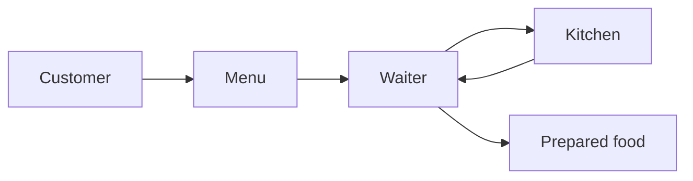
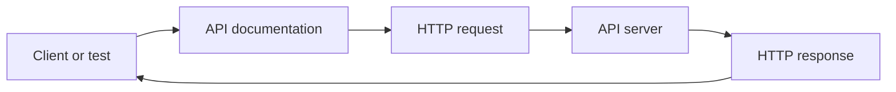
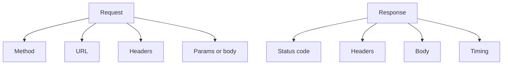
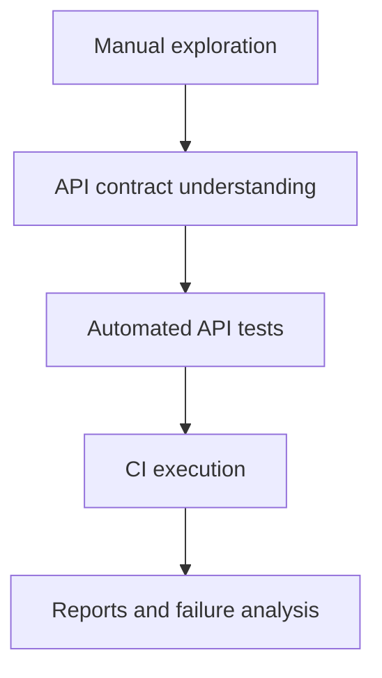

# What Are APIs?

## What You Will Learn

An API is a controlled way for one system to communicate with another. For an SDET, an API is also a testable contract: if you send a valid request, the system should return a predictable response.

## API Meaning

API stands for **Application Programming Interface**.

Break it down:

| Word | Meaning |
|---|---|
| Application | a software system |
| Programming | used by code, not only humans clicking screens |
| Interface | a boundary where two systems interact |

An API defines what one system is allowed to ask another system to do.

## Real-World Analogy

Think of a restaurant:

- you do not walk into the kitchen
- you order from the menu
- the waiter carries the request to the kitchen
- the kitchen returns a prepared result

The menu is like API documentation. The waiter is like the API boundary. The kitchen is the internal system you do not directly control.



For APIs:



## Why APIs Matter To SDETs

APIs let you test business behavior below the UI. This is valuable because:

- API tests are usually faster than UI tests
- they can validate business rules directly
- they are less affected by layout and browser timing
- they help isolate backend defects
- they are useful in CI pipelines

API testing does not replace UI testing. It complements it. A healthy automation strategy has different test layers.

## API As A Contract

A contract says:

- what endpoint exists
- what method to use
- what request data is allowed
- what status code should come back
- what response shape should come back
- what errors should look like

Example contract:

```text
GET /posts/1

Expected:
- status code: 200
- response body has id, userId, title, body
- id is an integer
- title is a string
```

Future automated test:

```python
response = api_client.get("/posts/1")
body = response.json()

assert response.status_code == 200
assert isinstance(body["id"], int)
assert isinstance(body["title"], str)
```

Module 02 teaches how to read the contract. Module 04 teaches how to automate checks against it.

## Request And Response

An API interaction has two halves.

### Request

The request is what the client sends.

Common request parts:

| Part | Example |
|---|---|
| method | `GET` |
| URL | `https://jsonplaceholder.typicode.com/posts/1` |
| headers | `Accept: application/json` |
| query params | `?userId=1` |
| body | JSON payload for create/update |

### Response

The response is what the server returns.

Common response parts:

| Part | Example |
|---|---|
| status code | `200` |
| headers | `Content-Type: application/json` |
| body | `{"id": 1, "title": "..."}` |
| time | how long the request took |



## Endpoint And Resource

A resource is the thing the API exposes:

- posts
- users
- comments
- products
- carts

An endpoint is the URL path used to access that resource:

```text
/posts
/posts/1
/users/1
/products/search
```

Good API tests are usually written around resources and behavior, not only URLs.

## API Testing Questions

When you look at an endpoint, ask:

- What is this endpoint supposed to do?
- What method should be used?
- What input is required?
- What input is optional?
- What does success look like?
- What does failure look like?
- What response fields are required?
- What should happen with invalid data?
- Does this behavior change between API versions?

These questions become test cases.

## API Layers In A Test Strategy



This project gradually builds that full path.

## Key Takeaways

- An API is a controlled communication boundary between systems.
- For testers, an API is a contract that can be inspected and validated.
- Every API call has a request and a response.
- Strong API automation starts with understanding behavior, not writing code first.
