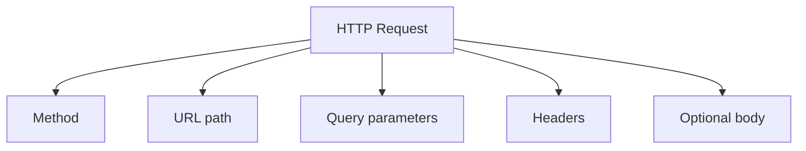
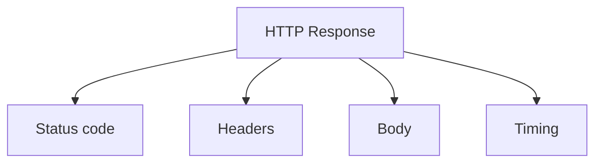
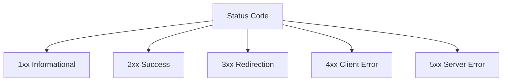
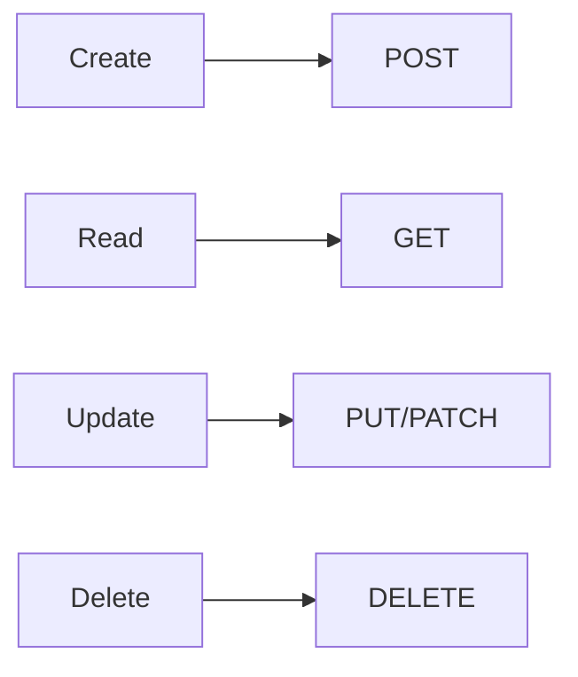

# HTTP Requests And Responses

## What You Will Learn

HTTP is the protocol most REST APIs use. API test automation is mostly about building HTTP requests, sending them, then validating HTTP responses.

This guide covers:

- request anatomy
- response anatomy
- HTTP methods
- status code categories
- headers
- idempotency
- how CRUD maps to HTTP

## HTTP Request Anatomy

An HTTP request asks the server to do something.

```text
GET /posts/1 HTTP/1.1
Host: jsonplaceholder.typicode.com
Accept: application/json
```

For a JSON POST request:

```text
POST /posts HTTP/1.1
Host: jsonplaceholder.typicode.com
Content-Type: application/json
Accept: application/json

{
  "title": "API testing",
  "body": "Learning HTTP",
  "userId": 1
}
```

Request parts:

| Part | Purpose | Example |
|---|---|---|
| method | action to perform | `GET`, `POST` |
| path | resource target | `/posts/1` |
| query string | filters/options | `?userId=1` |
| headers | metadata | `Accept: application/json` |
| body | data being sent | JSON payload |



## HTTP Response Anatomy

An HTTP response tells the client what happened.

```text
HTTP/1.1 200 OK
Content-Type: application/json

{
  "userId": 1,
  "id": 1,
  "title": "example",
  "body": "example body"
}
```

Response parts:

| Part | Purpose | Example |
|---|---|---|
| status code | result category | `200` |
| reason phrase | human-readable status | `OK` |
| headers | metadata about response | `Content-Type` |
| body | returned data or error | JSON object |
| timing | how long it took | `0.245s` |



## HTTP Methods

Methods describe the action the client wants.

| Method | Typical Meaning | Request Body? | Common Success |
|---|---|---:|---|
| `GET` | retrieve data | no | `200 OK` |
| `POST` | create or submit data | yes | `201 Created` or `200 OK` |
| `PUT` | replace a resource | yes | `200 OK` |
| `PATCH` | partially update a resource | yes | `200 OK` |
| `DELETE` | remove a resource | usually no | `200 OK`, `202 Accepted`, or `204 No Content` |
| `HEAD` | retrieve headers only | no | `200 OK` |
| `OPTIONS` | ask what methods are allowed | no | `200 OK` or `204 No Content` |

## GET

`GET` retrieves data.

```text
GET /posts/1
```

SDET checks:

- status code is `200`
- response body has expected fields
- field types are correct
- filters return only matching records
- missing resources return expected errors

`GET` should not change server state.

## POST

`POST` creates or submits data.

```text
POST /posts
Content-Type: application/json

{
  "title": "new post",
  "body": "content",
  "userId": 1
}
```

SDET checks:

- valid payload returns success
- response includes created data or generated ID
- invalid payload returns validation error
- required fields are enforced
- duplicate or boundary data behaves correctly

## PUT

`PUT` usually replaces the full resource.

```text
PUT /posts/1
```

If the original resource has `title`, `body`, and `userId`, a true `PUT` expects the full replacement shape.

SDET checks:

- full update succeeds
- resource ID is preserved when expected
- omitted fields are handled according to the contract

## PATCH

`PATCH` updates part of a resource.

```text
PATCH /posts/1

{
  "title": "updated title"
}
```

SDET checks:

- only specified fields change
- unspecified fields remain unchanged when the API supports persistence
- invalid patch fields are rejected or ignored according to the contract

## DELETE

`DELETE` removes a resource.

```text
DELETE /posts/1
```

SDET checks:

- delete returns expected success status
- deleted resource cannot be fetched afterward, if the API has real persistence
- deleting an already deleted resource behaves predictably

Public fake APIs may simulate deletion without actually changing server data. Tests must respect the API's documented behavior.

## Status Codes

Status codes are the first result signal.



## 2xx Success

| Code | Meaning | Common Test Expectation |
|---|---|---|
| `200` | OK | request succeeded and body is present |
| `201` | Created | resource creation succeeded |
| `202` | Accepted | request accepted for async processing |
| `204` | No Content | success with empty body |

## 3xx Redirection

| Code | Meaning |
|---|---|
| `301` | moved permanently |
| `302` | found temporarily |
| `304` | not modified |

API tests usually do not focus on redirects unless the API contract uses them.

## 4xx Client Errors

| Code | Meaning | Example |
|---|---|---|
| `400` | bad request | malformed payload |
| `401` | unauthenticated | missing or invalid credentials |
| `403` | forbidden | authenticated but not allowed |
| `404` | not found | resource does not exist |
| `409` | conflict | duplicate or state conflict |
| `422` | validation error | semantic validation failed |
| `429` | too many requests | rate limited |

Good negative tests check both the status code and the error body.

## 5xx Server Errors

| Code | Meaning |
|---|---|
| `500` | internal server error |
| `502` | bad gateway |
| `503` | service unavailable |
| `504` | gateway timeout |

If your normal positive test gets a 5xx, that is usually a system or environment failure. In later modules, we will discuss flaky external APIs and when retries are appropriate.

## Headers

Headers carry metadata.

Common request headers:

| Header | Purpose |
|---|---|
| `Accept` | response format the client wants |
| `Content-Type` | format of request body |
| `Authorization` | credentials/token |
| `User-Agent` | client identity |

Common response headers:

| Header | Purpose |
|---|---|
| `Content-Type` | response body format |
| `Cache-Control` | caching rules |
| `Retry-After` | when to retry after rate limiting |
| `Set-Cookie` | cookie sent by server |

Tests should validate headers when they are part of the contract or security posture.

## Path Parameters And Query Parameters

Path parameters identify a specific resource:

```text
/posts/1
/users/5
```

Query parameters modify the request:

```text
/posts?userId=1
/products?limit=10&skip=20
/products/search?q=phone
```

Testing query parameters includes:

- filters
- pagination
- sorting
- search
- field selection
- invalid values

## Idempotency

Idempotency means making the same request multiple times has the same final effect.

| Method | Usually Idempotent? | Why It Matters |
|---|---:|---|
| `GET` | yes | safe to repeat |
| `PUT` | yes | same replacement has same result |
| `PATCH` | depends | depends on patch behavior |
| `DELETE` | usually yes | repeated delete should not create new state |
| `POST` | usually no | repeated create may create duplicates |

Idempotency matters for retries. Retrying a `GET` is usually safer than retrying a `POST`.

## CRUD Mapping

CRUD means Create, Read, Update, Delete.

| CRUD Action | HTTP Method | Example |
|---|---|---|
| Create | `POST` | `POST /posts` |
| Read | `GET` | `GET /posts/1` |
| Update full | `PUT` | `PUT /posts/1` |
| Update partial | `PATCH` | `PATCH /posts/1` |
| Delete | `DELETE` | `DELETE /posts/1` |



## What Tests Should Validate

For each endpoint, think in layers:

1. Status code
2. Response body shape
3. Field types
4. Business rules
5. Headers
6. Error behavior
7. Timing, if relevant

## Key Takeaways

- HTTP requests contain method, URL, headers, parameters, and sometimes a body.
- HTTP responses contain status, headers, body, and timing.
- Methods communicate intent; status codes communicate outcome.
- Idempotency affects retry and CI strategy.
- CRUD maps naturally to `POST`, `GET`, `PUT/PATCH`, and `DELETE`.
