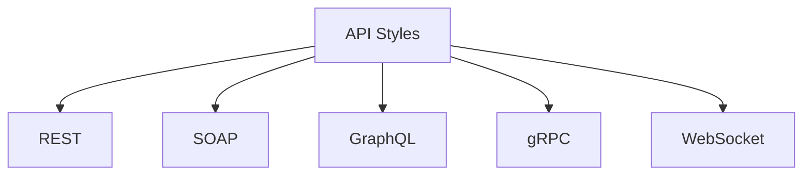
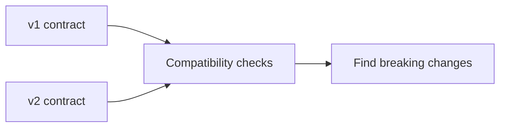

# API Styles And Versioning

## What You Will Learn

Not every API works like a REST API. This project focuses on REST because Python + pytest + requests is a strong beginner path, but SDETs should recognize the major API styles and how each changes testing.

This guide covers:

- REST
- SOAP
- GraphQL
- gRPC
- WebSocket
- how to choose test approaches by API style
- API versioning and compatibility

## API Style Map



## REST

REST stands for Representational State Transfer. REST APIs organize behavior around resources and HTTP methods.

Example:

```text
GET /posts/1
POST /posts
PATCH /posts/1
DELETE /posts/1
```

REST usually uses:

- resource-based URLs
- HTTP methods
- HTTP status codes
- JSON request/response bodies
- stateless requests

## REST Testing Focus

For REST APIs, SDETs test:

- correct method and endpoint behavior
- status codes
- response body shape and field types
- path and query parameters
- request payload validation
- auth and permissions
- pagination, filtering, sorting, and search
- backward compatibility between versions

This project is mostly REST-focused.

## SOAP

SOAP stands for Simple Object Access Protocol. SOAP APIs commonly use XML envelopes and strict service contracts.

Example shape:

```xml
<soap:Envelope>
  <soap:Body>
    <GetUserRequest>
      <UserId>1</UserId>
    </GetUserRequest>
  </soap:Body>
</soap:Envelope>
```

SOAP often appears in:

- banking
- insurance
- legacy enterprise systems
- systems with strict XML contracts

SOAP testing focuses on:

- XML request and response validation
- WSDL/service contract behavior
- SOAP faults
- strict schema compliance
- security headers

## GraphQL

GraphQL lets clients ask for exactly the fields they need.

Example query:

```graphql
query {
  product(id: 1) {
    id
    title
    price
  }
}
```

Unlike REST, GraphQL often uses one endpoint:

```text
POST /graphql
```

The operation is described in the query body, not mainly by the URL.

GraphQL testing focuses on:

- queries
- mutations
- variables
- schema introspection
- partial errors
- authorization by field
- query depth and complexity limits

GraphQL is listed as a post-capstone extension because it deserves its own focused implementation path.

## gRPC

gRPC is a high-performance RPC framework that commonly uses Protocol Buffers.

Instead of JSON over REST-style endpoints, gRPC uses service definitions:

```proto
service UserService {
  rpc GetUser (GetUserRequest) returns (User);
}
```

gRPC testing focuses on:

- proto contracts
- generated clients
- unary and streaming calls
- metadata
- deadline/timeouts
- status codes specific to gRPC

gRPC is outside the core `requests`-based REST framework.

## WebSocket

WebSocket provides a long-lived, bidirectional connection.

Common examples:

- chat
- live notifications
- trading updates
- collaborative editing

WebSocket testing focuses on:

- connection lifecycle
- subscription messages
- message ordering
- reconnect behavior
- heartbeat/ping behavior
- real-time message validation

WebSocket is also outside the core REST path because its lifecycle is very different from request/response HTTP.

## Side-By-Side Comparison

| Style | Common Transport | Payload | Test Shape |
|---|---|---|---|
| REST | HTTP | JSON | method + endpoint + status + body |
| SOAP | HTTP | XML | envelope + schema + faults |
| GraphQL | HTTP | query JSON | query/mutation + schema + partial errors |
| gRPC | HTTP/2 | protobuf | service method + metadata + proto contract |
| WebSocket | persistent socket | messages | connect + send/receive + lifecycle |

## Which Style Does This Project Use?

Core modules use REST APIs:

- JSONPlaceholder for beginner learning
- httpbin for selected request/auth behavior
- DummyJSON for the capstone

Post-capstone extensions can add GraphQL, WebSocket, gRPC, or event-driven testing once the REST framework is solid.

## API Versioning

APIs change over time. Versioning is how teams introduce changes without breaking existing clients.

Common versioning styles:

| Style | Example |
|---|---|
| URL path | `/v1/users`, `/v2/users` |
| header | `API-Version: 2026-04-01` |
| query parameter | `/users?version=2` |
| media type | `Accept: application/vnd.company.v2+json` |

## Why Versioning Matters For Testing

If a team releases `/v2/users`, tests need to answer:

- does `/v1/users` still work?
- what changed in `/v2/users`?
- are removed fields documented?
- are new fields backward compatible?
- do old clients fail gracefully?
- are deprecation headers present?



## Breaking vs Non-Breaking Changes

Usually non-breaking:

- adding optional response fields
- adding new endpoints
- adding optional query parameters

Usually breaking:

- removing fields
- renaming fields
- changing field types
- changing required request fields
- changing error response shape
- changing auth requirements

Schema validation and contract testing later help catch these changes.

## Versioning Test Strategy

For versioned APIs, design tests around contracts:

| Test Type | Purpose |
|---|---|
| smoke tests per version | prove each supported version is reachable |
| contract tests | verify response shape per version |
| compatibility tests | compare old/new behavior intentionally |
| deprecation tests | check warnings and sunset headers |
| migration tests | verify documented upgrade path |

This rebuild introduces versioning as a concept here, then revisits compatibility in Module 11 with mocks and contract-style checks.

## Key Takeaways

- REST is the main style for this project, but SDETs should recognize other API styles.
- Different API styles require different testing strategies.
- GraphQL, gRPC, and WebSocket are important but belong in focused post-capstone extensions.
- API versioning turns "does it work?" into "does every supported contract still work?"
