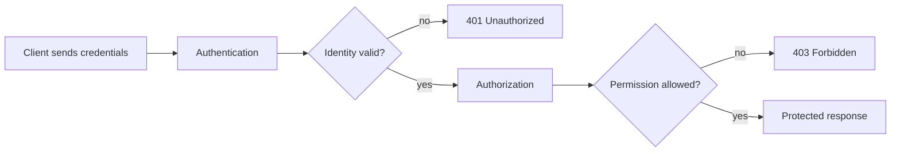
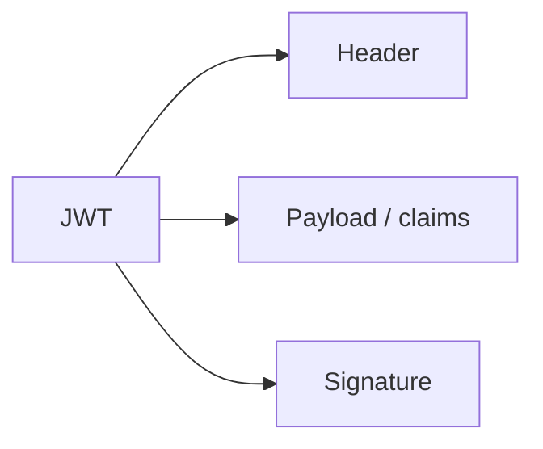
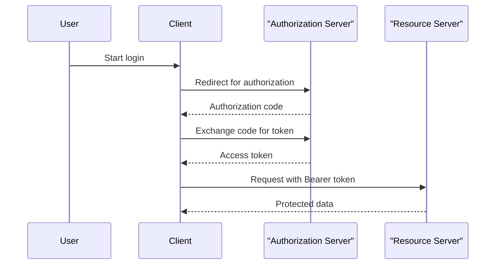
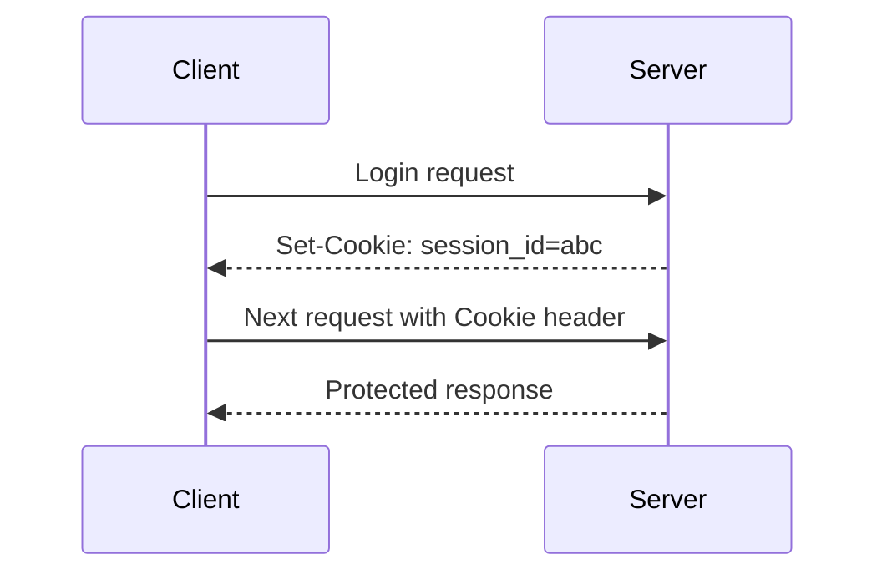

# Authentication And Authorization

## What You Will Learn

Authentication and authorization are related but different.

- Authentication answers: who are you?
- Authorization answers: what are you allowed to do?

API tests must cover both. A user can be logged in and still be forbidden from a protected action.

## The Difference



Important status distinction:

| Status | Meaning |
|---|---|
| `401` | client is not authenticated |
| `403` | client is authenticated but not allowed |

## API Keys

An API key is a shared secret sent with requests.

Common locations:

```text
Authorization: ApiKey abc123
X-API-Key: abc123
/resource?api_key=abc123
```

Header-based keys are usually preferred over query-string keys because URLs are more likely to be logged.

API key test ideas:

- missing key returns `401` or documented error
- invalid key is rejected
- valid key is accepted
- key with insufficient permissions is rejected
- key is not leaked in logs or reports

## Basic Authentication

Basic auth sends username and password encoded in the `Authorization` header.

```text
Authorization: Basic <base64 username:password>
```

Basic auth should only be used over HTTPS.

Test ideas:

- valid credentials succeed
- wrong username fails
- wrong password fails
- missing credentials fail
- empty credentials fail

## Bearer Tokens

Bearer token auth sends a token in the `Authorization` header.

```text
Authorization: Bearer eyJhbGciOi...
```

The word "Bearer" means whoever has the token can use it. Protect tokens like passwords.

Test ideas:

- valid token can access protected endpoint
- missing token is rejected
- malformed token is rejected
- expired token is rejected
- token for user A cannot access user B's private data

## JWT

JWT stands for JSON Web Token. A JWT usually has three dot-separated parts:

```text
header.payload.signature
```



Common claims:

| Claim | Meaning |
|---|---|
| `sub` | subject/user ID |
| `exp` | expiration time |
| `iat` | issued-at time |
| `iss` | issuer |
| `aud` | audience |

SDETs usually do not need to manually implement JWT validation, but they should understand what claims mean when testing auth flows.

## OAuth 2.0

OAuth 2.0 is an authorization framework. It lets one application access resources on behalf of a user or service.

Common roles:

| Role | Meaning |
|---|---|
| resource owner | user who owns the data |
| client | application requesting access |
| authorization server | issues tokens |
| resource server | API being accessed |

Simplified authorization-code flow:



Module 08 will cover auth testing implementation. In this module, the goal is to understand the vocabulary and expected behavior.

## Refresh Tokens

Access tokens are often short-lived. Refresh tokens are used to request a new access token without asking the user to log in again.

Test ideas:

- refresh token returns a new access token
- invalid refresh token fails
- expired refresh token fails
- old access token eventually stops working
- refreshed token can access protected resource

DummyJSON supports token refresh, so this becomes useful in the capstone.

## Cookies And Sessions

Some APIs use cookies to maintain session state.

Flow:



Cookie concepts:

| Attribute | Meaning |
|---|---|
| `HttpOnly` | JavaScript cannot read the cookie |
| `Secure` | sent only over HTTPS |
| `SameSite` | cross-site sending rules |
| expiration | when cookie becomes invalid |

Cookie/session handling is integrated into Module 08 in this rebuild.

## Security Testing Mindset

Auth tests should include both positive and negative paths.

Positive:

- correct credential/token/key succeeds
- correct role can perform allowed action

Negative:

- missing auth fails
- malformed auth fails
- expired auth fails
- insufficient role fails
- token/key for one identity cannot access another identity's data

## What Not To Do In Tests

Avoid:

- hardcoding real secrets
- printing tokens into reports
- committing `.env` files
- using production credentials in learning tests
- assuming `401` and `403` mean the same thing

Use fake public APIs, dummy credentials, environment variables, and mocks where appropriate.

## Key Takeaways

- Authentication proves identity; authorization checks permission.
- API keys, Basic auth, Bearer tokens, JWTs, OAuth2, and cookies are different patterns.
- `401` and `403` should be tested intentionally.
- Auth implementation waits until Module 08, but the concepts start here.
