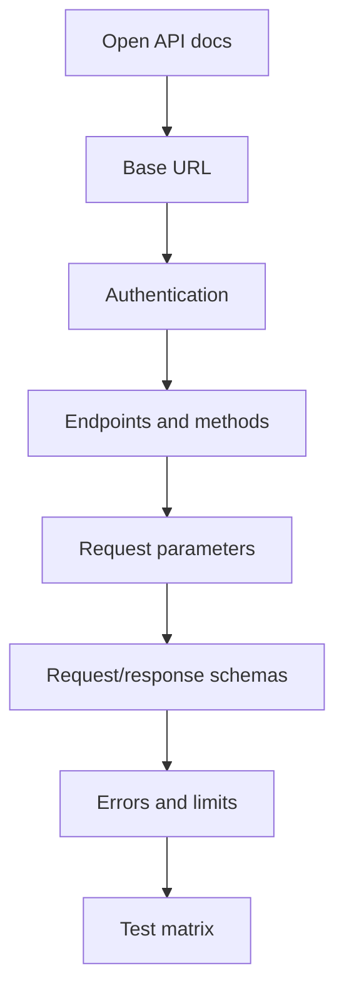
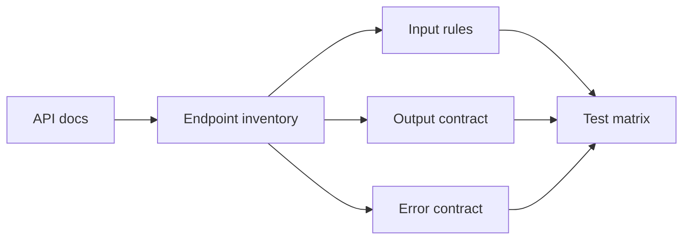

# Reading API Documentation

## What You Will Learn

API documentation is the bridge between product behavior and test design. A strong SDET does not only ask, "Can I call this endpoint?" They ask, "What contract does this endpoint promise, and how can I prove it?"

## Common Documentation Formats

| Format | What It Provides |
|---|---|
| OpenAPI / Swagger | REST endpoints, schemas, auth, examples |
| Postman collection | runnable requests and environments |
| Markdown / README | human-written behavior notes |
| GraphQL schema/playground | queries, mutations, types |
| WSDL | SOAP service contract |
| Protobuf files | gRPC service contract |

This project mostly uses public docs and observed responses, but the same analysis process applies to formal OpenAPI specs.

## What To Look For First



## Base URL And Environment

Find:

- base URL
- environment names
- sandbox vs production
- versioning style

Examples:

```text
https://jsonplaceholder.typicode.com
https://dummyjson.com
https://api.example.com/v1
```

Testing impact:

- framework config needs a base URL
- CI needs environment variables
- versioned APIs may need version-specific tests

## Authentication

Docs should say:

- whether auth is required
- auth type
- how to obtain credentials or tokens
- token lifetime
- refresh process
- permission/role model

If docs do not explain auth clearly, write that down as a risk.

## Endpoints And Methods

Build an endpoint inventory:

| Method | Endpoint | Purpose |
|---|---|---|
| `GET` | `/posts` | list posts |
| `GET` | `/posts/{id}` | get one post |
| `POST` | `/posts` | create post |

This inventory becomes the skeleton of a test suite.

## Parameters

Parameter types:

| Type | Example | Test Ideas |
|---|---|---|
| path | `/posts/{id}` | valid ID, missing ID, nonexistent ID |
| query | `?limit=10` | valid, boundary, invalid type |
| header | `Authorization` | missing, invalid, valid |
| body | JSON payload | required fields, types, boundary values |

## Request And Response Schemas

A schema describes shape and constraints.

Response example:

```json
{
  "id": 1,
  "title": "example",
  "userId": 1
}
```

Test questions:

- Which fields are required?
- What types should fields have?
- Can fields be null?
- Are extra fields allowed?
- Are there enum values?
- Are min/max lengths documented?

Module 10 turns these questions into JSON Schema validation.

## Error Responses

Good docs explain failures, not only happy paths.

Look for:

- status codes
- error body format
- validation messages
- auth errors
- rate-limit errors
- conflict errors

Example error contract:

```json
{
  "message": "Product not found"
}
```

Negative tests should validate both status code and error response shape.

## Pagination, Filtering, Sorting, Search

List endpoints often support query parameters.

Examples:

```text
/products?limit=10&skip=20
/products?sortBy=price&order=asc
/products/search?q=phone
```

Test ideas:

- default page size
- `limit=1`
- max allowed limit
- skip/offset behavior
- empty search results
- sort order correctness
- invalid sort field

DummyJSON supports these patterns, which is why it is useful for the capstone.

## Rate Limiting

Rate-limit docs may include:

- requests allowed per minute
- status code, often `429`
- `Retry-After` header
- rate-limit response body

Rate-limit behavior is part of resilience testing. We introduce the concept here and revisit it later.

## From Docs To Test Matrix

Turn docs into a test matrix.

| Area | Example Test |
|---|---|
| happy path | valid request returns `200` and expected body |
| required fields | missing required field returns validation error |
| type validation | wrong type is rejected |
| boundaries | min/max values behave correctly |
| auth | missing/invalid/valid token paths |
| permissions | unauthorized role gets `403` |
| errors | nonexistent resource returns `404` |
| pagination | limit and skip work together |



## Red Flags In API Docs

Watch for:

- no error examples
- no auth explanation
- no schema or field types
- examples that do not match real responses
- undocumented pagination limits
- unclear versioning
- "coming soon" behavior mixed with current behavior
- no explanation of idempotency or duplicate submissions

These red flags become project risks.

## When Docs Are Incomplete

If docs are incomplete:

1. Explore the API manually.
2. Record observed behavior.
3. Ask product/backend owners for clarification.
4. Avoid encoding guesses as permanent tests.
5. Mark uncertain behavior clearly in test names or comments.

Good tests should protect contracts, not freeze accidental behavior.

## Practice APIs

Use these APIs for exploration:

| API | What To Practice |
|---|---|
| JSONPlaceholder | simple resources, fake CRUD, nested routes |
| httpbin | headers, auth, request echoing |
| DummyJSON | auth, search, pagination, nested objects |
| FakeStore | optional comparison of simpler product API |

## Key Takeaways

- API docs are test-design inputs.
- A test matrix converts documentation into coverage.
- Error behavior, auth, pagination, and versioning matter as much as happy paths.
- Incomplete docs are a risk to communicate, not a reason to guess silently.
