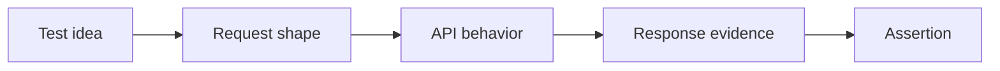

# Module 02 Checkpoint Deep Dive

This checkpoint is the API-thinking layer that sits between Python basics and automated tests. The project still has no real HTTP implementation in [`src/`](../../src/) and no executable API tests under [`tests/`](../../tests/). That is intentional: Module 02 trains you to understand the contract before you automate the contract.

## Mental Model

An API test is a controlled conversation with a service:

The docs in this module explain each part of that conversation. [`01-what-are-apis.md`](01-what-are-apis.md) frames APIs as system boundaries. [`02-http-requests-responses.md`](02-http-requests-responses.md) breaks down the message structure. [`05-reading-api-documentation.md`](05-reading-api-documentation.md) turns that structure into test ideas.

## Execution Flow

When you read an API endpoint, trace it in this order:

1. Resource: what business object or collection is the endpoint about?
2. Method: is the client reading, creating, replacing, partially updating, or deleting?
3. Inputs: which path parameters, query parameters, headers, and body fields are accepted?
4. Expected result: which status code, headers, and body shape should come back?
5. Error cases: what should happen when inputs are missing, invalid, unauthorized, or unsupported?

This flow is the manual version of what future automated tests will do. A test that only checks "status is 200" is usually too shallow because it ignores most of the contract.

## Documentation Walkthrough

Use the module docs as a layered checklist:

| Guide | How To Read It |
|---|---|
| [`01-what-are-apis.md`](01-what-are-apis.md) | Focus on boundaries, consumers, providers, and why APIs need contracts |
| [`02-http-requests-responses.md`](02-http-requests-responses.md) | Map every method and status code to a test expectation |
| [`03-api-styles-and-versioning.md`](03-api-styles-and-versioning.md) | Compare API styles without treating REST as the only possible design |
| [`04-authentication-and-authorization.md`](04-authentication-and-authorization.md) | Separate identity, permissions, credentials, and session state |
| [`05-reading-api-documentation.md`](05-reading-api-documentation.md) | Convert endpoint docs into positive, negative, boundary, and compatibility tests |

The exercises in [`exercises.md`](exercises.md) are not coding drills yet. They are test-design drills.

## Syntax And Protocol Details To Notice

Module 02 is mostly HTTP vocabulary, but the precision matters:

| Term | Testing Meaning |
|---|---|
| `GET` | Should retrieve without changing server state |
| `POST` | Usually creates or triggers processing; repeat behavior may not be safe |
| `PUT` | Usually replaces a resource and should be idempotent by design |
| `PATCH` | Partially updates a resource; tests should inspect only intended changes |
| `DELETE` | Removes or deactivates a resource; follow-up reads matter |
| `2xx` | Request succeeded, but body and side effects still need validation |
| `4xx` | Client-side problem such as bad input, missing auth, or forbidden access |
| `5xx` | Server-side failure; usually a product risk, not a test data issue |

The versioning guide introduces compatibility thinking. A version change is not just a URL change; it can change fields, error formats, defaults, or behavior.

## Responsibility Boundaries

At this checkpoint:

- Docs should explain API concepts and test-design reasoning.
- Exercises should ask the learner to inspect APIs and build test ideas.
- The repo should not yet install or use `requests`.
- The repo should not yet contain real API test modules.
- Authentication should remain conceptual; executable auth tests arrive later.

That boundary keeps the learner from confusing "knowing how to call an endpoint" with "knowing what should be tested."

## Common Mistakes

- Treating every successful response as `200`, even when `201`, `204`, or `206` might be correct.
- Confusing authentication with authorization.
- Testing only happy paths from the docs and ignoring invalid input, missing fields, and permission failures.
- Assuming REST rules apply unchanged to GraphQL, gRPC, SOAP, or WebSocket APIs.
- Ignoring API versioning until a breaking change already fails the suite.
- Validating only the body while missing important headers such as content type, cache control, or auth-related metadata.

## Debugging And Failure Model

Before code exists, debugging means reasoning from the API evidence:

1. Confirm the endpoint and method match the documentation.
2. Check whether the input belongs in the path, query string, header, or body.
3. Classify the status code family before reading the body.
4. Compare the response body with the documented contract.
5. Decide whether the failure indicates bad test data, wrong assumptions, missing permissions, or a real API defect.

This becomes the thinking process behind future automated failure triage.

## Interview Readiness

After this module, you should be able to answer:

- What is the difference between path parameters and query parameters?
- Why is idempotency important for API testing?
- How would you design tests from API documentation?
- What is the difference between authentication and authorization?
- Why do API versions matter to automated regression suites?
- How do REST, GraphQL, and gRPC differ from a testing perspective?

## Revision Checklist

- I can explain the request/response cycle without mentioning a specific Python library.
- I can map methods and status codes to test expectations.
- I can identify where each input belongs in a request.
- I can read endpoint documentation and produce positive and negative test ideas.
- I can explain versioning risk at a beginner level.
- I can say which topics are deferred until executable tests begin.
