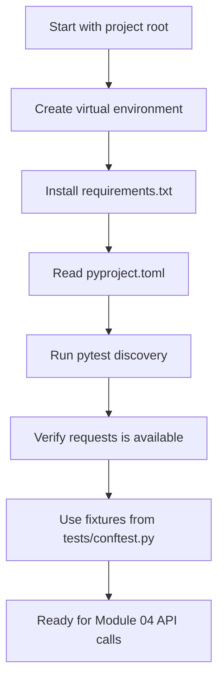

# Module 03: Environment Setup

## Goal

Build the first runnable checkpoint of the framework. Modules 01 and 02 gave you the Python and API vocabulary. This module turns the repository into a repeatable Python test project that can be run the same way on any machine.

The important skill here is not "install pytest once." The skill is knowing how Python, pip, pytest, project configuration, and directory structure work together so later API tests have a stable base.

## What This Module Adds

| Area | Project file | Why it matters |
| --- | --- | --- |
| Dependency recipe | `requirements.txt` | Pins the packages needed for the current module |
| Test configuration | `pyproject.toml` | Teaches pytest where tests live and how to name them |
| Shared test setup | `tests/conftest.py` | Introduces fixtures without building framework architecture yet |
| Learning tests | `tests/learning/test_03_environment_setup/` | Proves Python, pytest, and requests are wired correctly |
| Setup docs | `docs/module-03-environment-setup/` | Explains how to reproduce and troubleshoot the environment |

## Learning Path

## Module Documents

Read these in order:

1. `01-virtual-environments-and-dependencies.md`
2. `02-project-structure-and-configuration.md`
3. `03-pytest-basics-and-discovery.md`
4. `04-requests-library-setup.md`
5. `05-troubleshooting-the-environment.md`
6. `exercises.md`

## What You Should Be Able To Do

By the end of the module, you should be able to:

- Create and activate a Python virtual environment.
- Explain why `.venv/` is ignored but `requirements.txt` is committed.
- Install the exact dependencies required by the project.
- Read the pytest configuration in `pyproject.toml`.
- Predict which files pytest will collect as tests.
- Understand why shared setup belongs in `tests/conftest.py`.
- Run the Module 03 learning tests and interpret the output.
- Troubleshoot the common setup failures that block beginners.

## What This Module Does Not Do Yet

This module does not make live API calls. That starts in Module 04.

The learning tests in this module verify that `requests` can build HTTP requests locally without depending on network availability. That keeps the setup checkpoint deterministic. Once the environment is stable, Module 04 will introduce real `GET` calls against JSONPlaceholder.

## Code References

After this module is implemented, use these files while reading:

- `tests/conftest.py` for the first shared fixtures.
- `tests/learning/test_03_environment_setup/test_python_environment.py` for Python and dependency checks.
- `tests/learning/test_03_environment_setup/test_pytest_behaviour.py` for pytest assertion examples.
- `tests/learning/test_03_environment_setup/test_requests_preparation.py` for local request preparation checks.

## Quality Gate

Module 03 is complete when:

- `python -m pytest tests/learning/test_03_environment_setup -v` passes.
- `python -m pytest tests/ -v` passes.
- `CLAUDE.md` and `AGENTS.md` are identical.
- The docs explain every new file and command introduced in this module.
- Exercises are present and require the learner to run, inspect, and modify code.

