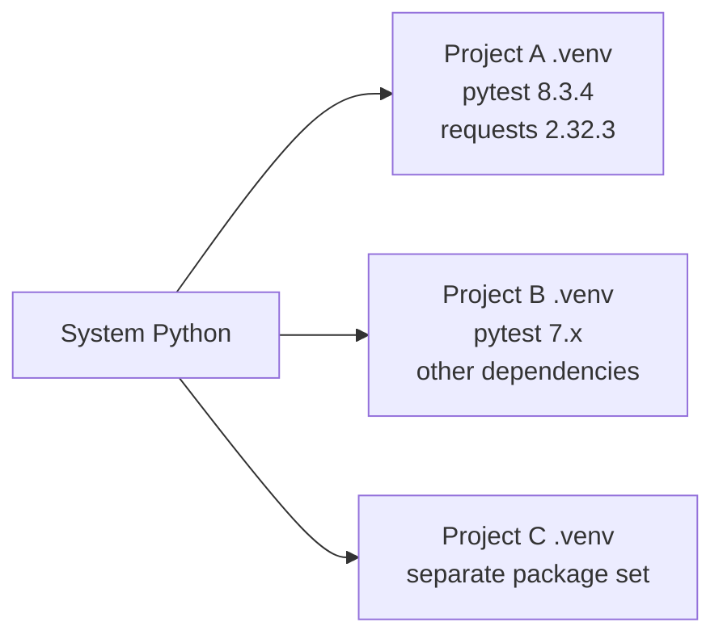
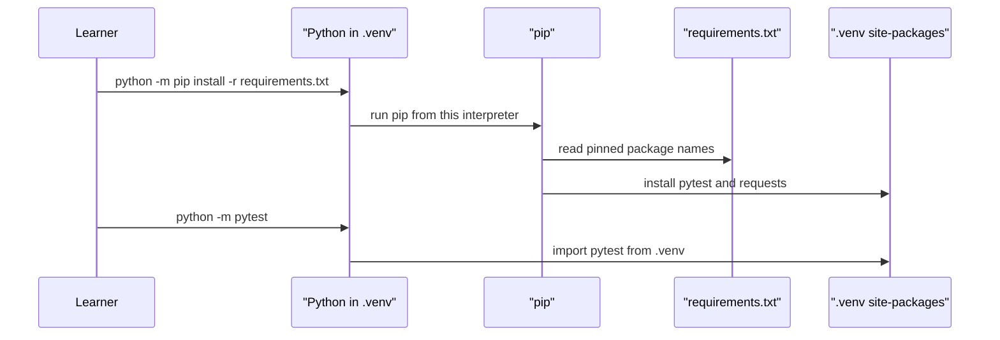

# Virtual Environments and Dependencies

## The Problem A Virtual Environment Solves

A Python project depends on packages. This framework uses `pytest` to run tests and `requests` to work with HTTP. Another project on the same machine might need different package versions.

If every project installs packages into one global Python installation, the projects can break each other. A virtual environment gives this repository its own isolated Python interpreter and package folder.



The system Python starts the process. The virtual environment keeps this project's installed packages separate.

## Create The Environment

From the project root:

```bash
python -m venv .venv
```

This creates a `.venv/` directory. The directory is ignored by git because it is machine-specific generated output. The reproducible source of truth is [`requirements.txt`](../../requirements.txt).

## Activate The Environment

On macOS or Linux:

```bash
source .venv/bin/activate
```

On Windows PowerShell:

```powershell
.\.venv\Scripts\Activate.ps1
```

On Windows Command Prompt:

```bat
.venv\Scripts\activate.bat
```

After activation, `python` and `pip` should point inside `.venv`.

```bash
python --version
python -m pip --version
```

Prefer `python -m pip` over plain `pip` while learning. It makes the relationship explicit: use pip from this Python interpreter.

## Install Dependencies

```bash
python -m pip install --upgrade pip
python -m pip install -r requirements.txt
```

Current active dependencies:

```text
pytest==8.3.4
requests==2.32.3
```

Later module dependencies stay commented in [`requirements.txt`](../../requirements.txt) until the module needs them. That keeps the learner from installing tools before understanding why they exist.

## Why Pin Versions

`pytest==8.3.4` means "install exactly this version." `pytest` without a version means "install the newest version available today."

For a learning framework, exact versions matter because:

- The learner sees the same behavior as the docs describe.
- Test output is easier to compare.
- A future package release cannot silently change behavior.
- CI can reproduce the same setup as a local machine.

## The Dependency Flow



## Verify The Install

```bash
python --version
python -m pytest --version
python -c "import requests; print(requests.__version__)"
python -m pytest tests/learning/test_03_environment_setup -v
```

Expected result:

- Python is 3.10 or newer.
- pytest prints version `8.3.4`.
- requests prints version `2.32.3`.
- Module 03 tests pass.

## [`requirements.txt`](../../requirements.txt) vs `.venv/`

| Item | Commit to git? | Reason |
| --- | --- | --- |
| [`requirements.txt`](../../requirements.txt) | Yes | It is the recipe for rebuilding dependencies |
| `.venv/` | No | It is generated, large, and machine-specific |
| [`.env.example`](../../.env.example) | Yes | It documents expected environment variables |
| `.env` | No | It may contain secrets or personal local settings |

## Common Commands

```bash
# Show installed top-level and transitive packages
python -m pip list

# Show exactly where Python is running from
python -c "import sys; print(sys.executable)"

# Reinstall from the dependency recipe
python -m pip install -r requirements.txt

# Leave the virtual environment
deactivate
```

## Key Takeaways

- A virtual environment isolates project dependencies.
- `.venv/` is local generated state; [`requirements.txt`](../../requirements.txt) is the committed recipe.
- `python -m pip` and `python -m pytest` reduce interpreter confusion.
- Dependencies are introduced only when the learning path needs them.
