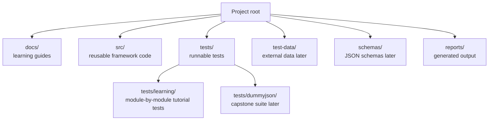
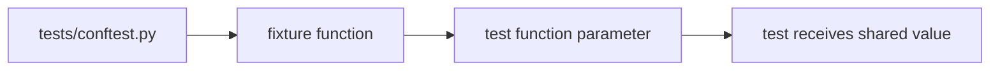

# Project Structure and Configuration

## Why Structure Matters

An API testing framework grows quickly. Without a clear layout, tests, helpers, data, reports, and learning notes get mixed together. This rebuild separates learning material from framework code from final capstone tests from the start.



## Current Layout

```text
api-testing-python-pytest-framework/
├── AGENTS.md
├── CLAUDE.md
├── README.md
├── requirements.txt
├── pyproject.toml
├── .env.example
├── .gitignore
├── docs/
│   └── module-03-environment-setup/
├── src/
│   ├── api_client/
│   ├── config/
│   ├── models/
│   └── utils/
├── tests/
│   ├── conftest.py
│   ├── learning/
│   │   └── test_03_environment_setup/
│   └── dummyjson/
├── test-data/
├── schemas/
└── reports/
```

## `tests/learning/` vs `tests/dummyjson/`

The project intentionally has two test lanes.

| Lane | Purpose | When used |
| --- | --- | --- |
| `tests/learning/` | Small tutorial tests tied to modules | Modules 03-14 |
| `tests/dummyjson/` | Production-style capstone suite | Module 15 |

This avoids a problem from the previous implementation: early learning tests were reorganized later. In this rebuild, the learning lane exists from the start.

## `pyproject.toml`

`pyproject.toml` stores project metadata and pytest configuration.

Current pytest settings:

```toml
[tool.pytest.ini_options]
testpaths = ["tests"]
python_files = ["test_*.py"]
python_classes = ["Test*"]
python_functions = ["test_*"]
addopts = "-v --tb=short"
markers = [
    "smoke: quick health check tests",
    "regression: broader regression coverage",
    "crud: CRUD operation tests",
    "auth: authentication tests",
    "schema: schema validation tests",
    "performance: response-time checks",
    "security: introductory security checks",
    "e2e: end-to-end workflow tests",
]
```

What this means:

| Setting | Meaning |
| --- | --- |
| `testpaths` | Only collect tests under `tests/` by default |
| `python_files` | Test files must be named like `test_something.py` |
| `python_classes` | Test classes must start with `Test` |
| `python_functions` | Test functions must start with `test_` |
| `addopts` | Always run verbose output and short tracebacks |
| `markers` | Register labels used to select test groups |

## `.gitignore`

`.gitignore` keeps generated and local-only files out of version control.

Important examples:

```text
__pycache__/
*.py[cod]
.venv/
.env
.pytest_cache/
reports/
allure-results/
.DS_Store
```

The principle is simple: commit source, docs, examples, and configuration. Do not commit generated files, local secrets, reports, or personal editor state.

## `.env.example`

`.env.example` is a template. It documents environment variables the project will eventually use. It is safe to commit because it contains example values, not secrets.

Actual `.env` files are ignored. Module 07 introduces real configuration loading with `python-dotenv`.

## `tests/conftest.py`

`conftest.py` is pytest's shared fixture file. Tests can ask for a fixture by function parameter name, and pytest supplies the value.

Module 03 keeps the fixtures intentionally small:

- A JSONPlaceholder base URL for later learning tests.
- A default timeout value for HTTP requests.

The file is introduced now because it is a core pytest convention, but the framework-level configuration work waits until Module 07.



## `src/`

`src/` is where reusable framework code will live. It is mostly empty in Module 03 because we are not building abstractions before we need them.

Later modules will add:

- `src/utils/` for small helpers.
- `src/config/` for environment-aware configuration.
- `src/api_client/` for a reusable HTTP client.
- `src/models/` for schema or response model helpers.

## Code References

- `pyproject.toml` contains the test discovery rules described above.
- `.gitignore` contains the generated-file rules described above.
- `tests/conftest.py` contains the first shared fixtures.
- `tests/learning/test_03_environment_setup/` contains this module's runnable examples.

## Key Takeaways

- The rebuild separates learning tests from the capstone suite from the start.
- `pyproject.toml` controls how pytest discovers tests.
- `tests/conftest.py` is the pytest-native place for shared setup.
- `src/` stays small until a real need for reusable framework code appears.

