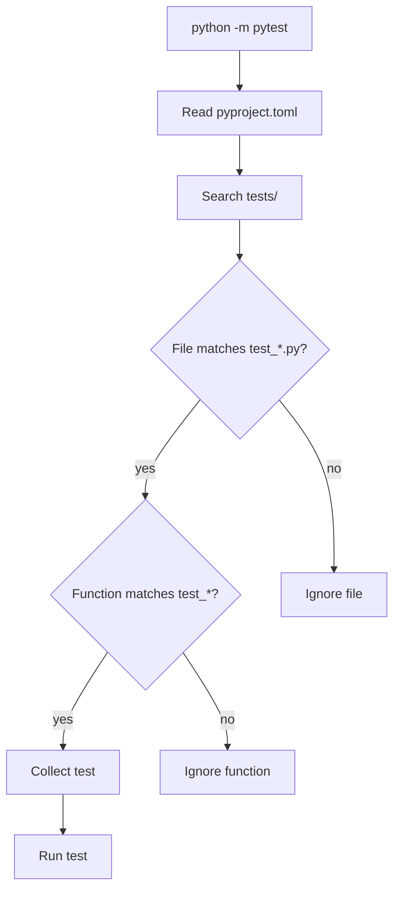
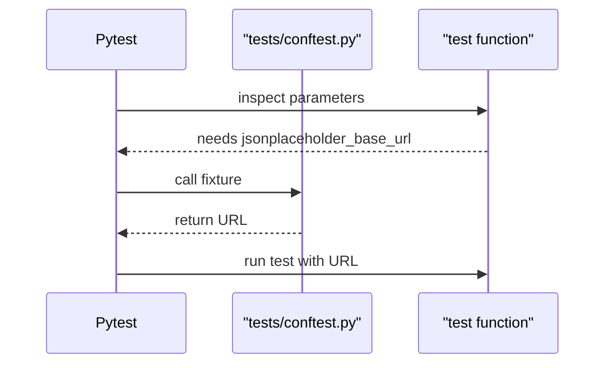

# Pytest Basics and Discovery

## What Pytest Does

Pytest is the test runner for this framework. It finds test functions, runs them, captures failures, and reports results.

In this course, pytest has three jobs:

1. Discover tests from file and function names.
2. Execute each test in a predictable way.
3. Explain failures clearly enough that you can debug fast.

## The Smallest Useful Test

```python
def test_addition():
    assert 1 + 1 == 2
```

There is no class requirement and no assertion library requirement. A function named `test_*` plus a Python `assert` is enough.

## Discovery Rules

Pytest uses naming conventions. Our conventions are registered in `pyproject.toml`.



Examples:

| File or function | Collected? | Why |
| --- | --- | --- |
| `tests/learning/test_03_environment_setup/test_python_environment.py` | Yes | File starts with `test_` |
| `def test_python_version_is_supported()` | Yes | Function starts with `test_` |
| `def check_python_version()` | No | Function does not start with `test_` |
| `environment_check.py` | No | File does not start with `test_` |

## Running Tests

```bash
# Run everything under tests/
python -m pytest

# Run only Module 03 learning tests
python -m pytest tests/learning/test_03_environment_setup -v

# Run one file
python -m pytest tests/learning/test_03_environment_setup/test_python_environment.py -v

# Run one test function
python -m pytest tests/learning/test_03_environment_setup/test_python_environment.py::test_python_version_is_supported -v
```

Use `python -m pytest` instead of plain `pytest` while learning. It makes sure pytest runs under the Python interpreter from your active environment.

## Assertions

Pytest uses plain Python `assert`.

```python
assert status_code == 200
assert "id" in response_data
assert isinstance(response_data, dict)
assert elapsed_seconds < 2
```

When an assertion fails, pytest rewrites the assertion output to show useful details.

```python
def test_status_code():
    status_code = 404
    assert status_code == 200
```

The failure will show both values:

```text
E       assert 404 == 200
```

## Assertion Messages

Add a message when the default failure might not explain the intent.

```python
assert "id" in payload, f"Expected id in payload keys: {payload.keys()}"
```

Good assertion messages explain the expected behavior, not just the value.

## Fixtures

A fixture is shared setup. A test asks for it by parameter name.

```python
def test_base_url_fixture(jsonplaceholder_base_url):
    assert jsonplaceholder_base_url.startswith("https://")
```

Pytest finds the fixture in `tests/conftest.py`, calls it, and passes the returned value to the test.



Fixtures become much more important in Module 06. In Module 03, they are only introduced enough to understand how shared values get into tests.

## Markers

Markers label tests.

```python
import pytest

@pytest.mark.smoke
def test_environment_is_ready():
    assert True
```

Run only smoke tests:

```bash
python -m pytest -m smoke
```

Run everything except smoke tests:

```bash
python -m pytest -m "not smoke"
```

Markers are registered in `pyproject.toml` so pytest does not warn about unknown labels.

## Reading Output

Typical passing output:

```text
tests/learning/test_03_environment_setup/test_python_environment.py::test_python_version_is_supported PASSED
```

Typical failure output:

```text
FAILED tests/learning/test_03_environment_setup/test_pytest_behaviour.py::test_dictionary_contains_expected_keys
E       AssertionError: Expected required API fields to be present
```

The file path, test name, and assertion detail tell you where to look first.

## Code References

- `tests/learning/test_03_environment_setup/test_python_environment.py` shows environment assertions.
- `tests/learning/test_03_environment_setup/test_pytest_behaviour.py` shows basic pytest behavior.
- `tests/conftest.py` contains fixtures used by the tests.
- `pyproject.toml` defines discovery rules and markers.

## Key Takeaways

- Pytest discovery is convention-based.
- Test files and test functions must be named correctly.
- Use `python -m pytest` to run through the active interpreter.
- Plain Python `assert` is the normal assertion style.
- Fixtures are shared setup supplied by pytest through function parameters.
- Markers let you select meaningful subsets of tests.

