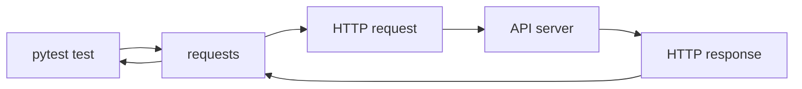

# Requests Library Setup

## Why Requests Is Here

`requests` is the HTTP client used by this framework. It lets Python send HTTP requests and receive HTTP responses.

Module 02 taught the shape of HTTP:

- Method
- URL
- Headers
- Query parameters
- Body
- Status code
- Response body

`requests` is the Python tool that creates and sends those messages.



## What We Verify In Module 03

Module 03 does not call an external API yet. Instead, it verifies that `requests` can build HTTP requests correctly.

That gives us a deterministic setup check:

- No network dependency.
- No third-party API downtime.
- Still proves the package is installed and usable.
- Prepares the learner for Module 04 live `GET` tests.

See `tests/learning/test_03_environment_setup/test_requests_preparation.py`.

## Importing Requests

```python
import requests
```

If this import fails, the dependency install did not complete in the Python environment that is running pytest.

## Request Preparation

`requests` can prepare a request before sending it. This is useful for learning because you can inspect the final method, URL, headers, and body without making a network call.

```python
request = requests.Request(
    method="GET",
    url="https://jsonplaceholder.typicode.com/posts",
    params={"userId": 1},
)

prepared = request.prepare()

assert prepared.method == "GET"
assert prepared.url == "https://jsonplaceholder.typicode.com/posts?userId=1"
```

This demonstrates a core rule: use `params=` for query parameters. Do not manually concatenate query strings unless you have a specific reason.

## JSON Bodies

For JSON APIs, use `json=`.

```python
payload = {"title": "Learning pytest", "userId": 1}

request = requests.Request(
    method="POST",
    url="https://jsonplaceholder.typicode.com/posts",
    json=payload,
)

prepared = request.prepare()
```

`requests` does two helpful things:

- Serializes the Python dictionary into JSON.
- Adds `Content-Type: application/json`.

That is why `json=` is preferred for JSON API testing.

## `json=` vs `data=`

| Argument | Sends | Typical use |
| --- | --- | --- |
| `json=` | JSON body with JSON content type | REST API requests |
| `data=` | Form data or raw body | HTML forms or special cases |
| `params=` | Query string | Filtering, search, pagination |
| `headers=` | HTTP headers | Auth, content negotiation, tracing |

Most API tests in this framework will use `params=`, `json=`, and `headers=`.

## Timeouts

When Module 04 starts making live calls, every request should use a timeout.

```python
response = requests.get(
    "https://jsonplaceholder.typicode.com/posts/1",
    timeout=10,
)
```

Without a timeout, a test can hang for a long time if the network or API is unresponsive. A hanging test is harder to diagnose than a failed test.

Module 03 introduces `default_timeout_seconds` in `tests/conftest.py` so later tests can reuse a consistent timeout value.

## Response Objects Preview

Module 04 covers response assertions deeply. For now, know that a sent request returns a response object.

```python
response = requests.get(url, timeout=10)

response.status_code
response.headers
response.text
response.json()
response.elapsed.total_seconds()
```

These names should already connect to the HTTP concepts from Module 02.

## Code References

- `requirements.txt` activates `requests==2.32.3`.
- `tests/learning/test_03_environment_setup/test_python_environment.py` verifies `requests` can be imported.
- `tests/learning/test_03_environment_setup/test_requests_preparation.py` demonstrates prepared `GET` and `POST` requests.
- `tests/conftest.py` contains a timeout fixture for future live requests.

## Key Takeaways

- `requests` is the HTTP client for this framework.
- Module 03 verifies request preparation without live network calls.
- Use `params=` for query strings.
- Use `json=` for JSON request bodies.
- Use `timeout=` when sending real requests.
- Module 04 will turn this setup into live API tests.

