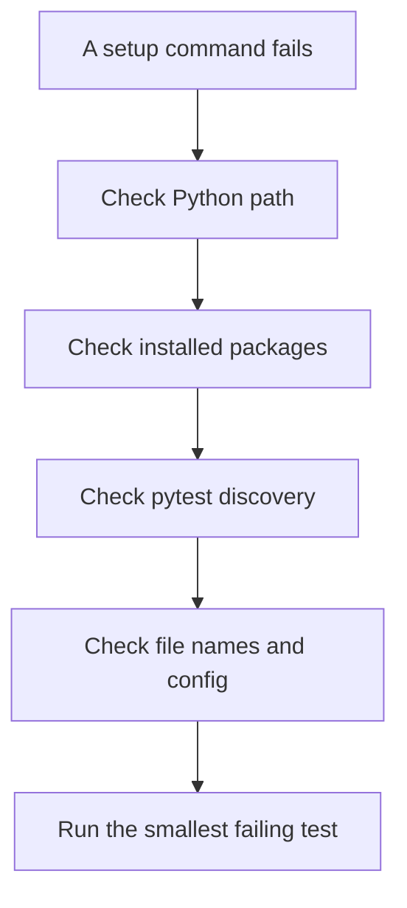

# Troubleshooting The Environment

## The Debugging Mindset

Environment failures usually come from one of four places:

1. The wrong Python interpreter is running.
2. Dependencies were installed into a different environment.
3. Pytest cannot discover the test file or function.
4. A generated/local file is being confused with source code.

Use small checks. Do not guess.



## Check The Python Interpreter

```bash
python -c "import sys; print(sys.executable)"
```

Expected shape:

```text
/path/to/api-testing-python-pytest-framework/.venv/bin/python
```

If the path does not include `.venv`, activate the environment:

```bash
source .venv/bin/activate
```

## Check Package Installation

```bash
python -m pytest --version
python -c "import requests; print(requests.__version__)"
```

If either command fails:

```bash
python -m pip install -r requirements.txt
```

If it still fails, check whether `python -m pip --version` points inside `.venv`.

## Check Pytest Discovery

```bash
python -m pytest --collect-only tests/learning/test_03_environment_setup
```

This lists tests without running them. Use it when pytest says "collected 0 items."

Common causes:

| Symptom | Likely cause | Fix |
| --- | --- | --- |
| `collected 0 items` | File does not start with `test_` | Rename to `test_name.py` |
| Test function ignored | Function does not start with `test_` | Rename to `test_name` |
| Marker warning | Marker not registered | Add marker to `pyproject.toml` |
| Import error | Package missing or wrong interpreter | Reinstall inside `.venv` |

## Check The Project Root

Run tests from the project root, where `pyproject.toml` lives.

```bash
pwd
ls pyproject.toml requirements.txt tests
```

If you run pytest from a nested folder, pytest may not load the project configuration you expect.

## Understand `FAILED` vs `ERROR`

Pytest distinguishes assertion failures from crashes.

| Result | Meaning | Example |
| --- | --- | --- |
| `FAILED` | Test ran, assertion was false | `assert 404 == 200` |
| `ERROR` | Test could not complete normally | Import error, fixture missing, timeout exception |

This matters because the fix is different. A failed assertion usually means behavior did not match expectation. An error usually means setup, import, fixture, or execution failed before the main assertion.

## Fixture Not Found

If you see:

```text
fixture 'jsonplaceholder_base_url' not found
```

Check:

- The fixture exists in `tests/conftest.py`.
- The test is under `tests/` so pytest can see that `conftest.py`.
- The parameter name is spelled exactly like the fixture name.

Fixtures are matched by name.

## Cleaning Generated Files

Generated files can be deleted safely:

```bash
find . -name "__pycache__" -type d
find . -name ".pytest_cache" -type d
```

They are ignored by git and recreated automatically. You normally do not need to delete them unless you are diagnosing a confusing local state.

## Minimal Recovery Recipe

If the setup feels broken, rebuild the environment from the committed recipe:

```bash
deactivate 2>/dev/null || true
rm -rf .venv
python -m venv .venv
source .venv/bin/activate
python -m pip install --upgrade pip
python -m pip install -r requirements.txt
python -m pytest tests/learning/test_03_environment_setup -v
```

Do not commit `.venv/`, `.pytest_cache/`, `__pycache__/`, or generated reports.

## Key Takeaways

- Verify the interpreter before reinstalling packages.
- Use `python -m pytest --collect-only` to debug discovery.
- `FAILED` means an assertion failed; `ERROR` means the test could not run cleanly.
- Fixtures are injected by exact parameter name.
- Rebuild `.venv/` from `requirements.txt` when local package state is confusing.

