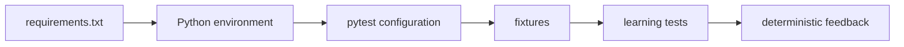

# Module 03 Checkpoint Deep Dive

This checkpoint is the first runnable version of the project. It does not call a live API yet. Instead, it proves that Python, pytest, Requests, fixtures, and project configuration are wired correctly enough for later modules to build on.

## Mental Model

Module 03 turns the repository into a repeatable test environment:

The key idea is separation. [`requirements.txt`](../../requirements.txt) describes packages. [`pyproject.toml`](../../pyproject.toml) describes pytest discovery rules. [`tests/conftest.py`](../../tests/conftest.py) describes shared test setup. The files under [`tests/learning/test_03_environment_setup/`](../../tests/learning/test_03_environment_setup/) prove the pieces work together.

## Execution Flow

When `python -m pytest tests/learning/test_03_environment_setup -v` runs, the flow is:

1. Python starts from the active interpreter.
2. Pytest reads configuration from [`pyproject.toml`](../../pyproject.toml).
3. Pytest discovers files named `test_*.py`.
4. Shared fixtures from [`tests/conftest.py`](../../tests/conftest.py) become available by name.
5. Each test function runs and uses plain Python `assert` statements.
6. Pytest reports which environment assumption passed or failed.

Nothing in this flow depends on external network availability. [`test_requests_preparation.py`](../../tests/learning/test_03_environment_setup/test_requests_preparation.py) prepares requests locally and inspects the prepared request object instead of sending it.

## Code Walkthrough

Start with [`test_python_environment.py`](../../tests/learning/test_03_environment_setup/test_python_environment.py). It checks the active Python version and confirms `pytest` and `requests` are importable from the same interpreter running the tests. That catches a common beginner mistake: installing packages into one Python environment and running tests with another.

Next, read [`test_pytest_behaviour.py`](../../tests/learning/test_03_environment_setup/test_pytest_behaviour.py). These tests show that pytest does not require a special assertion API. It rewrites Python `assert` statements so failures show useful expression detail.

Finally, read [`test_requests_preparation.py`](../../tests/learning/test_03_environment_setup/test_requests_preparation.py). The `requests.Request(...).prepare()` pattern lets the module inspect method, URL, query string, headers, and JSON serialization without making a live call.

## Python And Framework Syntax To Notice

| Syntax | Why It Matters |
|---|---|
| `python -m pytest` | Runs pytest with the selected Python interpreter |
| `@pytest.fixture` | Defines reusable setup that tests request by parameter name |
| `def test_name(...)` | Matches pytest's configured test function pattern |
| `assert condition` | Lets pytest show rich failure details |
| `requests.Request(...)` | Builds a request object without sending it |
| `request.prepare()` | Converts high-level request data into inspectable HTTP details |
| `params={...}` | Safely encodes query parameters |
| `json={...}` | Serializes JSON and sets the content type header |

## Responsibility Boundaries

At this checkpoint:

- Environment tests may verify installation, discovery, fixtures, and local request preparation.
- Fixtures may hold simple shared values such as base URLs and default timeouts.
- Tests should remain deterministic and local.
- Live HTTP behavior is still deferred to Module 04.
- Reusable API client architecture is still deferred to Module 07.

This boundary prevents setup tests from becoming flaky before the learner has a stable base.

## Common Mistakes

- Running `pytest` from a different interpreter than the one used to install dependencies.
- Forgetting that `.venv/` is local machine state and should not be committed.
- Renaming tests so they no longer match the discovery patterns in [`pyproject.toml`](../../pyproject.toml).
- Putting broad framework logic into [`tests/conftest.py`](../../tests/conftest.py) too early.
- Sending real HTTP requests while trying to validate only local setup.

## Debugging And Failure Model

Use the failure location to classify the problem:

| Failure Area | Likely Cause |
|---|---|
| Import error for `pytest` or `requests` | Dependency not installed in the active environment |
| No tests collected | File, class, or function name does not match pytest discovery rules |
| Fixture not found | Fixture name mismatch or `conftest.py` in the wrong location |
| Prepared URL mismatch | Wrong base URL, path, or query parameter construction |
| JSON header missing | Used `data=` instead of `json=` for JSON payloads |

The fix should address the environment or configuration assumption directly, not hide the failing test.

## Interview Readiness

After this module, you should be able to answer:

- Why is `python -m pytest` often safer than calling `pytest` directly?
- What problem does a virtual environment solve?
- How does pytest discover tests in this repository?
- How are fixtures injected into test functions?
- Why does this module prepare Requests objects instead of sending them?
- What belongs in [`requirements.txt`](../../requirements.txt) at this stage?

## Revision Checklist

- I can create and activate the environment described in [`01-virtual-environments-and-dependencies.md`](01-virtual-environments-and-dependencies.md).
- I can explain every pytest setting in [`pyproject.toml`](../../pyproject.toml).
- I can trace how [`tests/conftest.py`](../../tests/conftest.py) supplies fixture values.
- I can run the Module 03 tests and understand each failure type.
- I can explain why live API calls are intentionally deferred.
