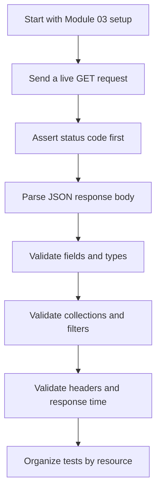
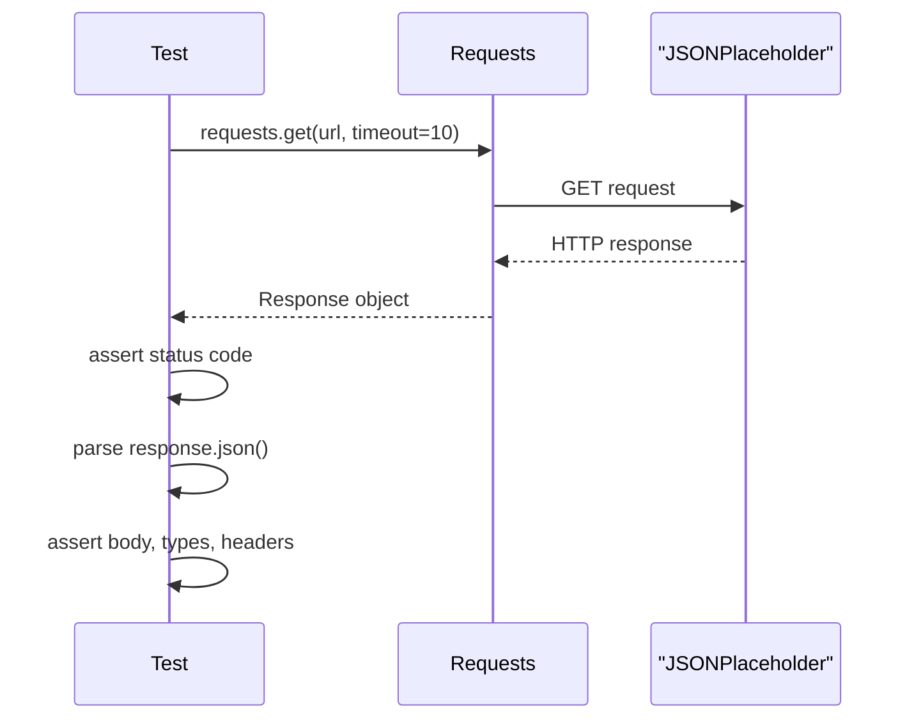

# Module 04: First API Tests

## Goal

Write the first live API tests in the rebuild. Module 03 proved that Python, pytest, and requests are installed. Module 04 uses them to call JSONPlaceholder and verify real HTTP responses.

This is the first point where the framework depends on an external API, so the module also teaches how to write assertions that are useful without being unnecessarily fragile.

## What This Module Adds

| Area | Project file | Why it matters |
| --- | --- | --- |
| Live smoke tests | `tests/learning/test_04_basic_get/test_smoke.py` | Proves JSONPlaceholder is reachable and returns JSON |
| Posts tests | `tests/learning/test_04_basic_get/test_posts.py` | Covers single resources, collections, filtering, headers, and 404s |
| Comments tests | `tests/learning/test_04_basic_get/test_comments.py` | Covers nested routes and query parameter equivalence |
| Users tests | `tests/learning/test_04_basic_get/test_users.py` | Covers nested JSON objects and cross-item validation |
| Learning docs | `docs/module-04-first-api-tests/` | Explains each test pattern before and beside the code |

## Learning Path



## Module Documents

Read in this order:

1. `01-get-requests-with-requests.md`
2. `02-response-assertion-patterns.md`
3. `03-query-parameters-and-nested-resources.md`
4. `04-organizing-first-api-tests.md`
5. `exercises.md`

## API Under Test

Module 04 uses JSONPlaceholder:

```text
https://jsonplaceholder.typicode.com
```

The shared base URL comes from `tests/conftest.py`:

```python
@pytest.fixture
def jsonplaceholder_base_url() -> str:
    return "https://jsonplaceholder.typicode.com"
```

The tests request:

| Resource | Endpoint examples | What it teaches |
| --- | --- | --- |
| Posts | `/posts`, `/posts/1`, `/posts?userId=1` | resource reads and filtering |
| Comments | `/comments`, `/posts/1/comments` | nested resources and relationships |
| Users | `/users`, `/users/1` | nested JSON objects |

## Test Pattern

Most tests in this module follow the same flow:



## What You Should Be Able To Do

By the end of this module, you should be able to:

- Send a live `GET` request with `requests.get`.
- Use `params=` instead of hand-building query strings.
- Assert `status_code` before asserting the response body.
- Parse JSON with `response.json()`.
- Check response body fields, data types, and collection lengths.
- Validate relationships between endpoints.
- Check response headers without overfitting to unstable header values.
- Use pytest node IDs to run one file or one test function.

## What This Module Does Not Do Yet

This module only covers `GET`.

It does not create, update, or delete data. Module 05 introduces `POST`, `PUT`, `PATCH`, and `DELETE`. Module 07 later replaces repeated raw `requests.get` calls with a reusable API client.

## Quality Gate

Module 04 is complete when:

- All docs in `docs/module-04-first-api-tests/` exist.
- GET tests exist under `tests/learning/test_04_basic_get/`.
- The tests use shared fixtures from `tests/conftest.py`.
- The tests pass with `python -m pytest tests/learning/test_04_basic_get -v`.
- The full suite passes with `python -m pytest tests/ -v`.
- Every new test file is referenced by at least one concept doc.

