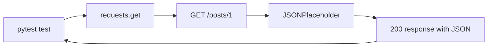

# GET Requests With Requests

## Why Start With GET

`GET` is the safest first API method to automate because it reads data without intentionally changing server state.

In Module 02, you learned that `GET` means "retrieve this resource." In Module 03, you learned how `requests` builds an HTTP request. This module combines those ideas with real API calls.



## Basic GET Call

```python
import requests


def test_get_single_post(jsonplaceholder_base_url, default_timeout_seconds):
    response = requests.get(
        f"{jsonplaceholder_base_url}/posts/1",
        timeout=default_timeout_seconds,
    )

    assert response.status_code == 200
```

Important details:

- `jsonplaceholder_base_url` comes from `tests/conftest.py`.
- `default_timeout_seconds` also comes from `tests/conftest.py`.
- `timeout=` prevents the test from hanging indefinitely.
- `response.status_code` is asserted before body fields.

## Single Resource

Endpoint:

```text
GET /posts/1
```

Expected shape:

```json
{
  "userId": 1,
  "id": 1,
  "title": "example title",
  "body": "example body"
}
```

The parsed JSON is a Python dictionary:

```python
post = response.json()

assert post["id"] == 1
assert post["userId"] == 1
```

See `tests/learning/test_04_basic_get/test_posts.py`.

## Collection Resource

Endpoint:

```text
GET /posts
```

Expected shape:

```json
[
  {"userId": 1, "id": 1, "title": "...", "body": "..."},
  {"userId": 1, "id": 2, "title": "...", "body": "..."}
]
```

The parsed JSON is a Python list of dictionaries:

```python
posts = response.json()

assert isinstance(posts, list)
assert len(posts) == 100
```

Do not assume every collection endpoint in every API has a fixed count. JSONPlaceholder is a stable teaching API, so fixed counts are useful here.

## Query Parameters

Endpoint:

```text
GET /posts?userId=1
```

Use `params=`:

```python
response = requests.get(
    f"{jsonplaceholder_base_url}/posts",
    params={"userId": 1},
    timeout=default_timeout_seconds,
)
```

Do not build this manually:

```python
# Avoid this in tests unless you are specifically testing URL encoding.
requests.get(f"{jsonplaceholder_base_url}/posts?userId=1")
```

`params=` lets requests handle encoding and keeps test intent obvious.

## Nested Resources

Endpoint:

```text
GET /posts/1/comments
```

This reads comments that belong to post 1.

```python
response = requests.get(
    f"{jsonplaceholder_base_url}/posts/1/comments",
    timeout=default_timeout_seconds,
)

comments = response.json()
assert all(comment["postId"] == 1 for comment in comments)
```

Nested resources appear when one resource belongs to another: comments belong to posts, todos belong to users, orders belong to customers.

## Missing Resources

Good API tests include negative paths.

```python
response = requests.get(
    f"{jsonplaceholder_base_url}/posts/9999",
    timeout=default_timeout_seconds,
)

assert response.status_code == 404
```

This proves the API does not pretend a missing resource exists.

## Code References

- `tests/learning/test_04_basic_get/test_smoke.py` shows the smallest live API checks.
- `tests/learning/test_04_basic_get/test_posts.py` shows single resource, collection, filtering, and 404 checks.
- `tests/learning/test_04_basic_get/test_comments.py` shows nested resource checks.
- `tests/conftest.py` provides the shared base URL and timeout.

## Key Takeaways

- `GET` reads data and is safe to repeat.
- Use `requests.get(..., timeout=...)`.
- Use `params=` for query parameters.
- Assert the status code before parsing and checking body fields.
- Single resources usually parse to dictionaries; collections parse to lists.
- Negative GET tests protect error behavior.

