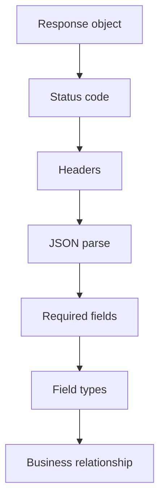

# Response Assertion Patterns

## The Assertion Job

Making a request does not make a test valuable. The value comes from assertions that prove the response matches the API contract.

Think in layers:



Start at the top. If the status code is wrong, body assertions may be misleading.

## Status Code First

```python
response = requests.get(url, timeout=10)

assert response.status_code == 200, (
    f"Expected 200, got {response.status_code}. URL: {response.url}"
)
```

Status code assertions answer: did the server handle this request in the expected category?

Common Module 04 examples:

| Scenario | Expected status |
| --- | --- |
| `GET /posts/1` | `200` |
| `GET /posts` | `200` |
| `GET /posts?userId=1` | `200` |
| `GET /posts/9999` | `404` |

## Parse JSON Once

```python
post = response.json()
```

Store the parsed body in a variable. This makes the rest of the test easier to read.

```python
assert post["id"] == 1
assert post["userId"] == 1
```

## Required Fields

For a single post:

```python
expected_fields = {"userId", "id", "title", "body"}
actual_fields = set(post.keys())

assert actual_fields == expected_fields
```

Exact field assertions are useful for stable teaching APIs. In production, whether you assert exact fields or a required subset depends on the contract:

- Exact fields catch unexpected response drift.
- Required subsets allow backward-compatible optional fields.

Module 10 revisits this through JSON Schema.

## Type Assertions

APIs can return a correct-looking value with the wrong type.

```python
assert isinstance(post["id"], int)
assert isinstance(post["userId"], int)
assert isinstance(post["title"], str)
assert isinstance(post["body"], str)
```

This catches bugs like:

```json
{"id": "1"}
```

That string may display like a number, but client code that expects an integer can break.

## Collection Assertions

For `/posts`:

```python
posts = response.json()

assert isinstance(posts, list)
assert len(posts) == 100
```

For every item:

```python
required_fields = {"userId", "id", "title", "body"}

for post in posts:
    assert required_fields.issubset(post.keys())
```

This pattern checks collection shape without asserting the full body of every object.

## Filter Assertions

For `/posts?userId=1`:

```python
posts = response.json()

assert len(posts) > 0
assert all(post["userId"] == 1 for post in posts)
```

`all()` is a strong fit when every returned item must satisfy a rule.

## Header Assertions

JSON responses should advertise JSON content.

```python
assert "application/json" in response.headers["Content-Type"]
```

Use `in` instead of exact equality because servers often include charset metadata:

```text
application/json; charset=utf-8
```

Do not assert unstable headers unless they are part of the API contract. Headers like `Date`, `Server`, and `Via` may change by environment.

## Response Time Checks

Module 04 includes a basic response-time check:

```python
assert response.elapsed.total_seconds() < 5
```

This is not full performance testing. It is a simple guard against an obviously slow response. Module 12 later treats performance and resilience more carefully.

## Anti-Patterns

Avoid parsing body before status:

```python
# Avoid
post = response.json()
assert post["id"] == 1
assert response.status_code == 200
```

Prefer:

```python
assert response.status_code == 200
post = response.json()
assert post["id"] == 1
```

Avoid exact full-body assertions for large responses:

```python
# Fragile
assert response.json() == entire_expected_response
```

Prefer checking the contract-relevant fields:

```python
post = response.json()
assert post["id"] == 1
assert {"userId", "id", "title", "body"} == set(post.keys())
```

## Code References

- [`test_posts.py`](../../tests/learning/test_04_basic_get/test_posts.py) contains status, field, type, header, and timing assertions.
- [`test_comments.py`](../../tests/learning/test_04_basic_get/test_comments.py) contains relationship assertions.
- [`test_users.py`](../../tests/learning/test_04_basic_get/test_users.py) contains nested object assertions.

## Key Takeaways

- Assert status code before body content.
- Store `response.json()` in a clear variable.
- Check fields, types, and collection shape.
- Use `all()` for filtered collections.
- Check important headers without overfitting to unstable values.
- Response time checks in this module are lightweight guards, not load tests.
