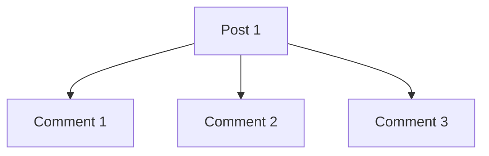
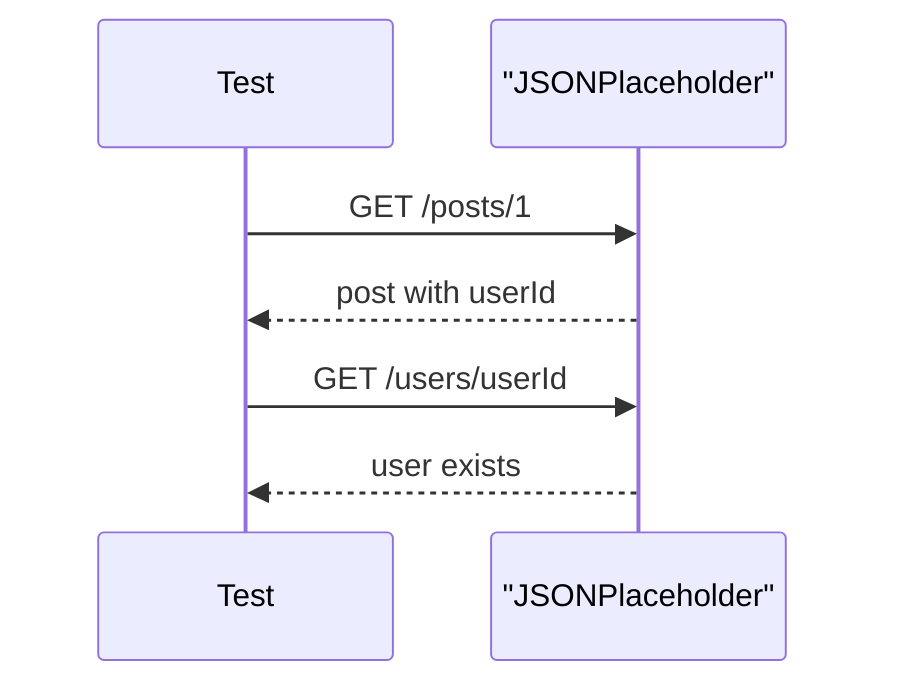

# Query Parameters and Nested Resources

## Why This Matters

Most useful API tests eventually go beyond "get one item by ID." They need to verify filtered lists and relationships between resources.

JSONPlaceholder gives us two ways to retrieve comments for a post:

```text
GET /comments?postId=1
GET /posts/1/comments
```

Both should describe the same relationship: comments belonging to post 1.

## Query Parameters

Query parameters appear after `?` in a URL.

```text
/posts?userId=1
```

They usually modify a collection request:

| Pattern | Meaning |
| --- | --- |
| `/posts?userId=1` | posts for user 1 |
| `/comments?postId=1` | comments for post 1 |
| `/products?limit=10&skip=20` | paginated products |
| `/products/search?q=phone` | search for phone |

In requests:

```python
response = requests.get(
    f"{jsonplaceholder_base_url}/posts",
    params={"userId": 1},
    timeout=default_timeout_seconds,
)
```

The important assertion is not only that the request returns `200`. You must prove the filter worked:

```python
posts = response.json()
assert all(post["userId"] == 1 for post in posts)
```

## Nested Resources

Nested routes place the relationship in the path.

```text
/posts/1/comments
```

This means "comments under post 1."



The assertion still checks the relationship:

```python
comments = response.json()
assert all(comment["postId"] == 1 for comment in comments)
```

## Comparing Two Equivalent Routes

Some APIs offer both a nested route and a query filter. When they should mean the same thing, compare stable identifiers.

```python
nested = requests.get(
    f"{jsonplaceholder_base_url}/posts/1/comments",
    timeout=default_timeout_seconds,
)
filtered = requests.get(
    f"{jsonplaceholder_base_url}/comments",
    params={"postId": 1},
    timeout=default_timeout_seconds,
)

nested_ids = sorted(comment["id"] for comment in nested.json())
filtered_ids = sorted(comment["id"] for comment in filtered.json())

assert nested_ids == filtered_ids
```

Compare IDs instead of full objects when the relationship is the point of the test. It makes the test easier to understand.

## Cross-Resource Validation

Module 04 also introduces light cross-resource thinking.

Example:

1. Fetch `/posts/1`.
2. Read `userId` from the post.
3. Fetch `/users/{userId}`.
4. Assert the user exists.



This is not a full end-to-end workflow yet. It simply teaches that APIs often expose related resources, and tests can verify those relationships.

## What To Avoid

Avoid assuming filters work just because the status code is `200`.

```python
# Weak
assert response.status_code == 200
```

Prefer:

```python
assert response.status_code == 200
comments = response.json()
assert len(comments) > 0
assert all(comment["postId"] == 1 for comment in comments)
```

Avoid mixing too many relationships in one test. If a test calls five endpoints and fails, the failure can be hard to diagnose.

## Code References

- [`test_posts.py`](../../tests/learning/test_04_basic_get/test_posts.py) `::test_filter_posts_by_user_id_returns_only_that_users_posts`
- [`test_comments.py`](../../tests/learning/test_04_basic_get/test_comments.py) `::test_get_comments_for_post_returns_only_that_posts_comments`
- [`test_comments.py`](../../tests/learning/test_04_basic_get/test_comments.py) `::test_nested_comments_route_matches_post_id_filter`
- [`test_users.py`](../../tests/learning/test_04_basic_get/test_users.py) `::test_post_user_id_points_to_existing_user`

## Key Takeaways

- Use `params=` for query parameters.
- A filter test must prove every returned item matches the filter.
- Nested resources express ownership or relationship in the path.
- Equivalent routes can be compared by stable IDs.
- Cross-resource checks are useful, but keep them focused.
