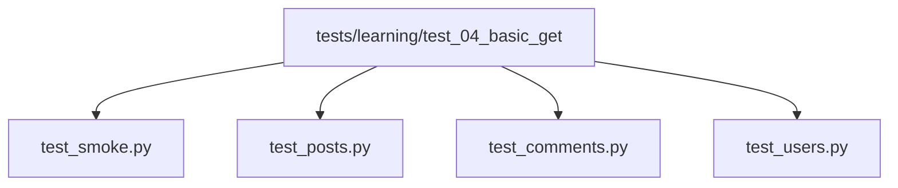

# Organizing First API Tests

## Why Organization Starts Now

Module 04 is small enough that all tests could fit in one file. We still split them by resource because habits formed early scale into the later framework.



## Directory Layout

```text
tests/learning/test_04_basic_get/
├── __init__.py
├── test_smoke.py
├── test_posts.py
├── test_comments.py
└── test_users.py
```

Each file has a clear responsibility:

| File | Responsibility |
| --- | --- |
| [`test_smoke.py`](../../tests/learning/test_04_basic_get/test_smoke.py) | small reachability and JSON sanity checks |
| [`test_posts.py`](../../tests/learning/test_04_basic_get/test_posts.py) | `/posts` single, collection, filter, headers, negative checks |
| [`test_comments.py`](../../tests/learning/test_04_basic_get/test_comments.py) | `/comments` and `/posts/{id}/comments` relationship checks |
| [`test_users.py`](../../tests/learning/test_04_basic_get/test_users.py) | `/users` nested object checks and simple cross-resource validation |

## Test Naming

Use names that read like specifications:

```python
def test_get_single_post_returns_expected_post():
def test_filter_posts_by_user_id_returns_only_that_users_posts():
def test_get_nonexistent_post_returns_404():
```

Avoid vague names:

```python
def test_posts():
def test_api():
def test_case_1():
```

When pytest runs with `-v`, the test names become the report. Good names make failures faster to interpret.

## Fixture Use

Module 04 tests use shared fixtures from [`tests/conftest.py`](../../tests/conftest.py):

```python
def test_get_single_post_returns_expected_post(
    jsonplaceholder_base_url: str,
    default_timeout_seconds: int,
) -> None:
    response = requests.get(
        f"{jsonplaceholder_base_url}/posts/1",
        timeout=default_timeout_seconds,
    )
```

This keeps two values centralized:

- Base URL
- Timeout

Do not duplicate `"https://jsonplaceholder.typicode.com"` in every test. When Module 07 introduces configuration, this fixture will become part of a cleaner framework setup.

## Explicit Code Before Helpers

You will see repeated lines:

```python
response = requests.get(..., timeout=default_timeout_seconds)
assert response.status_code == 200
data = response.json()
```

This repetition is intentional in Module 04. It keeps the learning visible.

We do not introduce an API client yet because that abstraction would hide the mechanics the learner is supposed to understand. Module 07 will introduce reusable client code after the raw request pattern is familiar.

## Running The Tests

```bash
# Run only Module 04 tests
python -m pytest tests/learning/test_04_basic_get -v

# Run one file
python -m pytest tests/learning/test_04_basic_get/test_posts.py -v

# Run one test
python -m pytest tests/learning/test_04_basic_get/test_posts.py::test_get_single_post_returns_expected_post -v

# Run smoke tests only
python -m pytest tests/learning/test_04_basic_get -m smoke -v

# Run by keyword
python -m pytest tests/learning/test_04_basic_get -k "comments" -v
```

## Live API Test Caveat

Module 04 introduces external network dependency. If these tests fail, ask what kind of failure happened:

| Failure type | Likely meaning |
| --- | --- |
| connection timeout | local network or API availability issue |
| status code changed | API behavior or route availability changed |
| body field changed | response contract changed |
| type changed | client compatibility risk |

In real projects, live API test suites need environment controls, retry policy, and ownership rules. Those topics are introduced gradually in later modules.

## Code References

- [`test_smoke.py`](../../tests/learning/test_04_basic_get/test_smoke.py)
- [`test_posts.py`](../../tests/learning/test_04_basic_get/test_posts.py)
- [`test_comments.py`](../../tests/learning/test_04_basic_get/test_comments.py)
- [`test_users.py`](../../tests/learning/test_04_basic_get/test_users.py)
- [`tests/conftest.py`](../../tests/conftest.py)

## Key Takeaways

- Split tests by resource early.
- Use descriptive test names.
- Use shared fixtures for base URL and timeout.
- Keep raw request logic explicit until the learner understands it.
- Live API tests can fail for environment reasons, so read failure output carefully.
