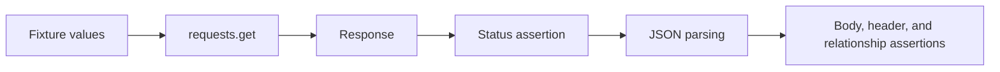

# Module 04 Checkpoint Deep Dive

This checkpoint introduces the first live API calls. The tests still use raw `requests.get(...)` calls directly; there is no reusable API client yet. That is intentional because the learner should first see exactly what an HTTP response object looks like before a framework layer hides the mechanics.

## Mental Model

A Module 04 test is a direct read-only probe:

The base URL and timeout come from [`tests/conftest.py`](../../tests/conftest.py). Each test file under [`tests/learning/test_04_basic_get/`](../../tests/learning/test_04_basic_get/) then focuses on one JSONPlaceholder resource area.

## Execution Flow

Read a test from top to bottom:

1. Pytest injects `jsonplaceholder_base_url` and `default_timeout_seconds`.
2. The test builds a URL with an endpoint such as `/posts/1`.
3. `requests.get(...)` sends the live request and returns a `Response`.
4. The test checks `response.status_code` before trusting the body.
5. The test calls `response.json()` and validates fields, types, lists, or relationships.
6. Some tests also inspect headers, timing, query filters, nested routes, or 404 behavior.

That order is not cosmetic. If the status code is wrong, body assertions can produce misleading failures.

## Code Walkthrough

Start with [`test_smoke.py`](../../tests/learning/test_04_basic_get/test_smoke.py). It contains the smallest useful checks: reachability, JSON content type, expected fields, and non-empty collections.

Then read [`test_posts.py`](../../tests/learning/test_04_basic_get/test_posts.py). It expands the pattern to single resources, collections, filters, ordering, response timing, and missing-resource behavior.

[`test_comments.py`](../../tests/learning/test_04_basic_get/test_comments.py) adds relationship thinking. It compares `/posts/1/comments` with `/comments?postId=1`, which teaches that two endpoint shapes can describe the same business relationship.

[`test_users.py`](../../tests/learning/test_04_basic_get/test_users.py) introduces nested JSON objects. The `address`, `geo`, and `company` checks prepare the learner for deeper response-body validation later.

## Python And Framework Syntax To Notice

| Syntax | Why It Matters |
|---|---|
| `requests.get(url, timeout=...)` | Sends the simplest live HTTP request with an explicit timeout |
| `params={"userId": 1}` | Lets Requests encode query parameters safely |
| `response.status_code` | Gives the first pass/fail signal from the server |
| `response.json()` | Decodes JSON into Python dictionaries and lists |
| `response.headers["Content-Type"]` | Reads response metadata, not just body data |
| `all(...)` | Validates every item in a returned collection |
| `sorted(...)` | Compares collections without depending on original ordering when order is not the point |
| `pytest.mark.smoke` | Marks fast, representative tests for targeted execution |

## Responsibility Boundaries

At this checkpoint:

- Tests may call JSONPlaceholder with live `GET` requests.
- Tests may validate stable response structure, basic relationships, headers, and simple timing.
- Tests should use shared fixtures for base URL and timeout.
- Tests should not create, update, or delete data yet.
- Tests should not introduce client classes, schema validators, auth helpers, mocks, or reporting utilities.

This keeps Module 04 focused on reading responses and writing clear assertions.

## Common Mistakes

- Calling `response.json()` before checking the status code.
- Hand-building query strings instead of using `params=`.
- Asserting every field value in a fake teaching API when only the contract matters.
- Using brittle timing thresholds as if they were performance tests.
- Forgetting that live API tests can fail because of network or service availability.
- Duplicating fixture values inside test files instead of using [`tests/conftest.py`](../../tests/conftest.py).

## Debugging And Failure Model

Classify failures by where they happen:

| Failure | Likely Meaning |
|---|---|
| Connection or timeout error | Network, DNS, service availability, or too-small timeout |
| Wrong status code | Endpoint, resource ID, service behavior, or test assumption changed |
| JSON decode error | Response was not JSON or status/body was not checked first |
| Field missing | Contract changed or test expects the wrong resource shape |
| Type mismatch | API returned a different JSON type than expected |
| Relationship mismatch | Filter, nested route, or cross-resource assumption is wrong |

Useful failure messages should include the status code, URL, missing fields, or unexpected values.

## Interview Readiness

After this module, you should be able to answer:

- Why should status code assertions usually happen before body assertions?
- What does `params=` do for query strings?
- How do you test a JSON array differently from a JSON object?
- What makes a smoke API test useful?
- How do nested resources differ from query-parameter filters?
- What are the risks of live API tests against a public teaching service?

## Revision Checklist

- I can run one file or one test by pytest node ID.
- I can explain every assertion in [`test_posts.py`](../../tests/learning/test_04_basic_get/test_posts.py).
- I can validate list responses with `len`, `all`, and required-field checks.
- I can inspect nested JSON in [`test_users.py`](../../tests/learning/test_04_basic_get/test_users.py).
- I can explain why CRUD behavior is deferred to Module 05.
