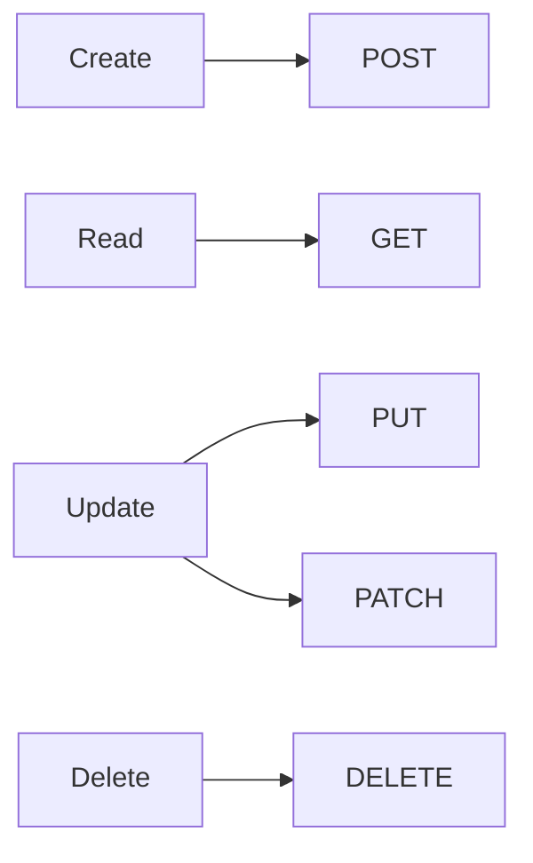
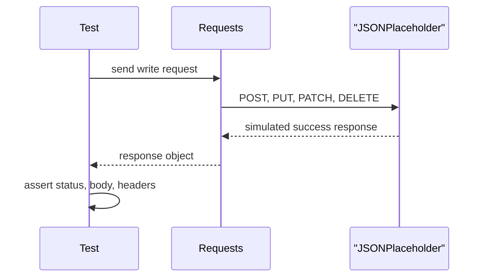

# Module 05: CRUD Operations

## Goal

Extend the framework from read-only `GET` tests to the full CRUD set: create, read, update, and delete.

Module 04 proved that we can read resources from JSONPlaceholder. Module 05 teaches how request bodies, write-method status codes, simulated persistence, and operation chaining work.

## CRUD Map

## What This Module Adds

| Area | Project file | Why it matters |
| --- | --- | --- |
| Create tests | [`test_create.py`](../../tests/learning/test_05_crud/test_create.py) | Sends JSON request bodies with `POST` |
| Update tests | [`test_update.py`](../../tests/learning/test_05_crud/test_update.py) | Compares `PUT` full replacement and `PATCH` partial update |
| Delete tests | [`test_delete.py`](../../tests/learning/test_05_crud/test_delete.py) | Tests delete responses and simulated deletion behavior |
| Lifecycle tests | [`test_crud_lifecycle.py`](../../tests/learning/test_05_crud/test_crud_lifecycle.py) | Demonstrates request chaining across CRUD steps |
| Learning docs | `docs/module-05-crud-operations/` | Explains write-method behavior and JSONPlaceholder limitations |

## Important: JSONPlaceholder Simulates Writes

JSONPlaceholder accepts `POST`, `PUT`, `PATCH`, and `DELETE`, but it does not persist changes.

That means:

- `POST /posts` returns a created-looking response with `id: 101`.
- The new post is not actually saved.
- `PUT /posts/1` returns an updated-looking response.
- A later `GET /posts/1` still returns the original data.
- `DELETE /posts/1` returns success, but the resource is not really removed.

This module is still valuable because it teaches the client-side testing pattern:

In a real API, the same patterns would also verify persistence by reading back created, updated, or deleted resources.

## Module Documents

Read in this order:

1. [`01-post-create-requests.md`](01-post-create-requests.md)
2. [`02-put-and-patch-updates.md`](02-put-and-patch-updates.md)
3. [`03-delete-requests.md`](03-delete-requests.md)
4. [`04-crud-lifecycle-and-test-isolation.md`](04-crud-lifecycle-and-test-isolation.md)
5. [`05-checkpoint-deep-dive.md`](05-checkpoint-deep-dive.md)
6. [`exercises.md`](exercises.md)

## What You Should Be Able To Do

By the end of this module, you should be able to:

- Send JSON payloads with `json=`.
- Explain why `POST` usually returns `201 Created`.
- Assert that a created response echoes the request data.
- Explain the difference between `PUT` and `PATCH`.
- Assert that update responses preserve the resource ID.
- Test delete behavior and response bodies.
- Explain idempotency for `PUT`, `DELETE`, and `POST`.
- Chain values from one response into another request.
- Describe the difference between simulated CRUD and persistent CRUD.

## What This Module Does Not Do Yet

This module does not introduce:

- reusable API client classes
- data factories
- generated test data
- setup/teardown fixtures for real created resources
- authenticated write operations

Those arrive in later modules after the raw HTTP method patterns are clear.

## Quality Gate

Module 05 is complete when:

- All docs in `docs/module-05-crud-operations/` exist.
- CRUD tests exist under [`tests/learning/test_05_crud/`](../../tests/learning/test_05_crud/).
- The tests use `jsonplaceholder_base_url` and `default_timeout_seconds`.
- Module tests pass with `python -m pytest tests/learning/test_05_crud -v`.
- The full suite passes with `python -m pytest tests/ -v`.
- Docs explicitly warn that JSONPlaceholder write operations are simulated.
