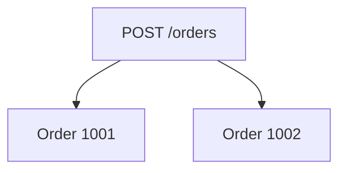

# POST Create Requests

## What POST Means

`POST` sends data to the server to create a new resource or submit an action.

In CRUD terms:

```text
Create -> POST
```

Example HTTP request:

```text
POST /posts HTTP/1.1
Content-Type: application/json

{
  "title": "Learning POST",
  "body": "Creating a resource",
  "userId": 1
}
```

## POST With Requests

```python
payload = {
    "title": "Learning POST",
    "body": "Creating a resource",
    "userId": 1,
}

response = requests.post(
    f"{jsonplaceholder_base_url}/posts",
    json=payload,
    timeout=default_timeout_seconds,
)
```

Use `json=payload`, not `data=payload`, for JSON API bodies.

`json=` does two things:

- serializes the Python dictionary to JSON
- sets `Content-Type: application/json`

## What To Assert

### Status Code

Successful creation usually returns `201 Created`.

```python
assert response.status_code == 201
```

Some APIs return `200 OK` for creation, but `201` communicates the intent more clearly. Tests should follow the API contract.

### Echoed Fields

For JSONPlaceholder, the response echoes the submitted fields:

```python
created_post = response.json()

assert created_post["title"] == payload["title"]
assert created_post["body"] == payload["body"]
assert created_post["userId"] == payload["userId"]
```

This verifies the server understood the body you sent.

### Server-Generated Fields

The client does not send the new ID. The server generates it.

```python
assert isinstance(created_post["id"], int)
assert created_post["id"] == 101
```

JSONPlaceholder always returns `101` for new posts because its teaching data contains 100 posts. A real API would normally return a unique ID.

### Content Type

```python
assert "application/json" in response.headers["Content-Type"]
```

The response should identify its body format.

## Minimal And Empty Payloads

A strict production API usually validates required fields.

JSONPlaceholder is intentionally lenient:

```python
requests.post(f"{jsonplaceholder_base_url}/posts", json={"title": "Only title"})
requests.post(f"{jsonplaceholder_base_url}/posts", json={})
```

Both return `201`.

This is useful for learning because it lets you observe a design difference:

| Payload | JSONPlaceholder | Stricter production API |
| --- | --- | --- |
| valid post | `201` | `201` |
| missing body | `201` | often `400` or `422` |
| empty object | `201` | often `400` or `422` |

Document observed behavior, but do not assume lenient behavior is desirable.

## POST And Idempotency

`POST` is usually not idempotent. Sending the same create request twice may create two resources.



That matters for real test suites:

- Use unique test data.
- Clean up created resources.
- Avoid blind retries for create requests unless the API supports idempotency keys.

JSONPlaceholder does not persist creates, so this risk is only discussed here. Later modules add stronger data strategy.

## Code References

- [`test_create.py`](../../tests/learning/test_05_crud/test_create.py) `::test_create_post_returns_201_and_echoes_payload`
- [`test_create.py`](../../tests/learning/test_05_crud/test_create.py) `::test_created_post_has_server_generated_id`
- [`test_create.py`](../../tests/learning/test_05_crud/test_create.py) `::test_create_post_with_minimal_payload_documents_lenient_api`
- [`test_create.py`](../../tests/learning/test_05_crud/test_create.py) `::test_create_post_with_empty_payload_documents_lenient_api`

## Key Takeaways

- `POST` is the normal HTTP method for create operations.
- Use `json=` for JSON request bodies.
- Creation usually returns `201 Created`.
- Assert both server-generated fields and echoed request fields.
- JSONPlaceholder accepts weak payloads, but stricter APIs usually should not.
- `POST` is usually not idempotent, so real tests need careful data isolation.
