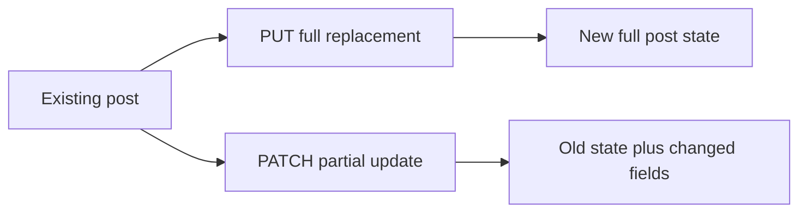

# PUT And PATCH Updates

## Two Update Methods

`PUT` and `PATCH` both update resources, but their intent is different.

| Method | Meaning | Payload shape |
| --- | --- | --- |
| `PUT` | replace the resource | full resource representation |
| `PATCH` | modify part of the resource | only changed fields |



## PUT: Full Replacement

Example:

```python
payload = {
    "title": "Completely New Title",
    "body": "Completely new body.",
    "userId": 1,
}

response = requests.put(
    f"{jsonplaceholder_base_url}/posts/1",
    json=payload,
    timeout=default_timeout_seconds,
)
```

Assertions:

```python
assert response.status_code == 200
updated = response.json()
assert updated["id"] == 1
assert updated["title"] == payload["title"]
assert updated["body"] == payload["body"]
assert updated["userId"] == payload["userId"]
```

The ID should remain stable. Updating a post should not turn it into a different post.

## PATCH: Partial Update

Example:

```python
payload = {"title": "Only Title Changed"}

response = requests.patch(
    f"{jsonplaceholder_base_url}/posts/1",
    json=payload,
    timeout=default_timeout_seconds,
)
```

Assertions:

```python
assert response.status_code == 200
patched = response.json()
assert patched["id"] == 1
assert patched["title"] == payload["title"]
assert "body" in patched
assert "userId" in patched
```

For JSONPlaceholder, PATCH returns the existing object plus your changed field.

## Idempotency

`PUT` is idempotent: sending the same full replacement repeatedly leaves the resource in the same final state.

`PATCH` can be idempotent or non-idempotent depending on the operation.

| PATCH payload | Idempotent? | Why |
| --- | --- | --- |
| `{"title": "New"}` | usually yes | setting the same value twice has same final state |
| `{"views": "+1"}` | no | incrementing twice changes state twice |

This matters when retrying failed requests in real frameworks.

## Nonexistent Resources

Updating a missing resource is a contract decision.

Possibilities:

| Behavior | Meaning |
| --- | --- |
| `404 Not Found` | resource must exist before update |
| `201 Created` | upsert behavior |
| `500 Server Error` | poor handling of a missing resource |

JSONPlaceholder returns `500` for `PUT /posts/9999`. That is useful to observe, but a production API should usually return a clearer client-facing response.

## PUT vs PATCH Test Design

A good update suite checks:

- status code
- response content type
- echoed updated fields
- ID stability
- behavior for nonexistent resources
- behavior for partial payloads
- behavior for unexpected fields

Do not assume that `PUT` and `PATCH` behave the same just because both update data.

## Code References

- `tests/learning/test_05_crud/test_update.py::test_put_replaces_post_and_preserves_id`
- `tests/learning/test_05_crud/test_update.py::test_patch_updates_only_title_and_preserves_other_fields`
- `tests/learning/test_05_crud/test_update.py::test_put_nonexistent_post_documents_jsonplaceholder_500`
- `tests/learning/test_05_crud/test_update.py::test_patch_with_unknown_field_documents_lenient_api`

## Key Takeaways

- `PUT` means full replacement.
- `PATCH` means partial update.
- Update responses should preserve resource identity.
- Idempotency affects retry safety.
- Missing-resource update behavior must be tested because APIs differ.
- JSONPlaceholder's `500` on missing update is observed behavior, not an ideal API design.

