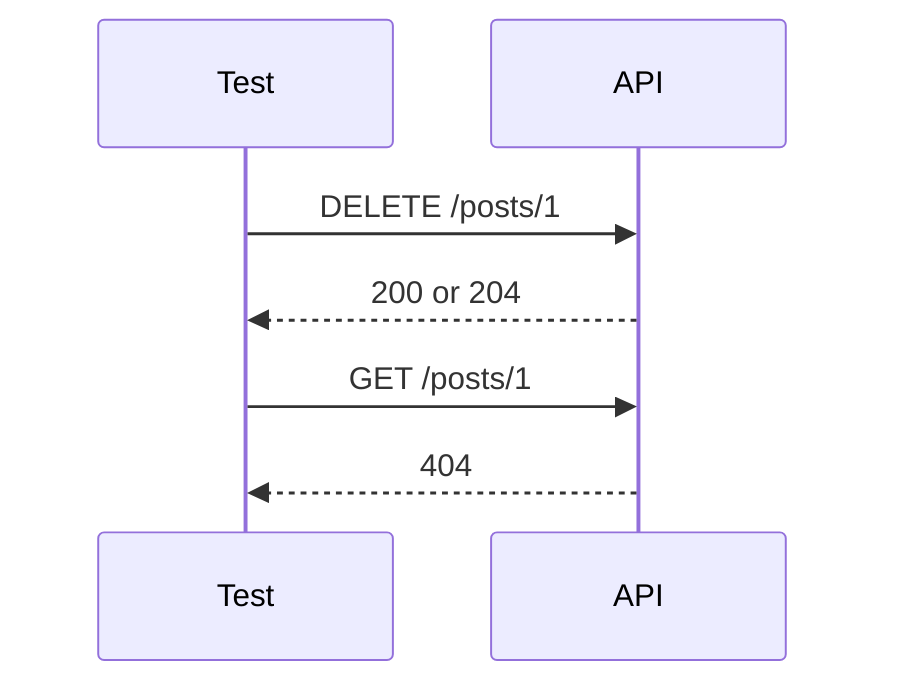

# DELETE Requests

## What DELETE Means

`DELETE` asks the server to remove a resource identified by the URL.

```python
response = requests.delete(
    f"{jsonplaceholder_base_url}/posts/1",
    timeout=default_timeout_seconds,
)
```

DELETE usually does not need a request body. The path identifies what should be removed.

## Successful DELETE Status Codes

APIs commonly use:

| Status | Meaning | Body |
| --- | --- | --- |
| `200 OK` | deletion succeeded and response may include confirmation | often JSON |
| `202 Accepted` | deletion accepted for asynchronous processing | often status details |
| `204 No Content` | deletion succeeded with no body | empty |

JSONPlaceholder returns:

```text
200 OK
{}
```

So Module 05 asserts:

```python
assert response.status_code == 200
assert response.json() == {}
```

## Verify Delete On Real APIs

On a real persistent API, a delete test often follows this pattern:



JSONPlaceholder does not actually delete data, so a follow-up `GET /posts/1` still returns `200`. The docs and tests call this out explicitly.

## Deleting A Missing Resource

APIs vary:

| API design | Possible status |
| --- | --- |
| missing resource is an error | `404` |
| delete is treated as already complete | `204` |
| lenient fake API | `200` |

JSONPlaceholder returns `200` for `DELETE /posts/9999`. This documents that the fake API does not validate whether the ID exists.

## DELETE And Idempotency

DELETE is idempotent in final state: after one delete or ten deletes, the resource should be gone.

The response status may differ:

```text
First DELETE /posts/1  -> 200 or 204
Second DELETE /posts/1 -> 404 or 204
```

Both can be valid if the contract says so. Tests should assert documented behavior.

## What To Be Careful With

In real APIs:

- Never run destructive tests against production data.
- Create test data inside the test or fixture.
- Clean up data even when later assertions fail.
- Understand soft delete vs hard delete.
- Check authorization before allowing delete operations.

Those topics become more important in Modules 08, 09, and 15.

## Code References

- [`test_delete.py`](../../tests/learning/test_05_crud/test_delete.py) `::test_delete_post_returns_200_and_empty_object`
- [`test_delete.py`](../../tests/learning/test_05_crud/test_delete.py) `::test_delete_nonexistent_post_documents_lenient_api`
- [`test_delete.py`](../../tests/learning/test_05_crud/test_delete.py) `::test_delete_then_get_documents_simulated_persistence`

## Key Takeaways

- `DELETE` removes the resource identified by the URL.
- Successful deletes may return `200`, `202`, or `204`.
- Real APIs should usually verify deletion with a follow-up `GET`.
- JSONPlaceholder simulates deletion but does not persist it.
- DELETE is idempotent in final state, even if status codes vary by API.
