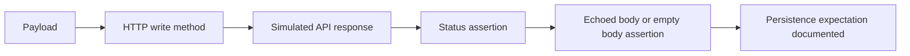

# Module 05 Checkpoint Deep Dive

This checkpoint extends the raw Requests style from Module 04 into write operations: `POST`, `PUT`, `PATCH`, and `DELETE`. The tests still call JSONPlaceholder directly, and the API still behaves like a teaching fake: it returns successful-looking responses without real persistence.

## Mental Model

CRUD tests validate both the request you send and the response the service claims:

The important discipline is knowing which checks prove real persistence and which checks only prove the fake API echoed a valid-looking response.

## Execution Flow

Most Module 05 tests follow this sequence:

1. Build a Python dictionary payload.
2. Send it with `json=payload` so Requests serializes JSON and sets the header.
3. Assert the method-specific status code.
4. Parse the response body with `response.json()`.
5. Compare echoed fields, generated IDs, preserved IDs, or empty delete bodies.
6. Add a comment or assertion that documents JSONPlaceholder's fake persistence.

[`test_crud_lifecycle.py`](../../tests/learning/test_05_crud/test_crud_lifecycle.py) chains several operations, but it still does not prove real database state. It teaches sequencing and evidence gathering.

## Code Walkthrough

Start with [`test_create.py`](../../tests/learning/test_05_crud/test_create.py). The first test sends a post payload and expects `201 Created`. The later tests document that JSONPlaceholder accepts minimal and empty payloads, which is useful for learning but would be suspicious in a strict production API.

[`test_update.py`](../../tests/learning/test_05_crud/test_update.py) compares `PUT` and `PATCH`. `PUT` is treated as full replacement and checks the returned post contains all expected fields. `PATCH` sends partial payloads and verifies the response merges changed fields with existing resource identity.

[`test_delete.py`](../../tests/learning/test_05_crud/test_delete.py) shows that JSONPlaceholder returns `{}` and `200` for deletes, even for nonexistent IDs. A real API might return `204`, `404`, or a domain-specific response instead.

[`test_crud_lifecycle.py`](../../tests/learning/test_05_crud/test_crud_lifecycle.py) demonstrates lifecycle flow while making the fake persistence limitation explicit.

## Python And Framework Syntax To Notice

| Syntax | Why It Matters |
|---|---|
| `requests.post(..., json=payload)` | Sends a JSON request body and JSON content type |
| `requests.put(...)` | Models full replacement of a resource |
| `requests.patch(...)` | Models partial update of selected fields |
| `requests.delete(...)` | Models delete behavior and response expectations |
| `created_post["id"]` | Reads server-generated identity from the response |
| `payload["title"]` | Compares response data to the exact request input |
| `created_id = ...` | Captures response values for later requests |
| `assert response.json() == {}` | Documents empty JSON response behavior |

## Responsibility Boundaries

At this checkpoint:

- CRUD tests may use raw Requests calls.
- Tests may document JSONPlaceholder's lenient validation and fake persistence.
- Tests may chain requests inside one learning test.
- Tests should not introduce generated test data, cleanup fixtures, auth, schema validation, mocks, or a reusable client.
- Tests should not pretend JSONPlaceholder has production-grade persistence rules.

The module teaches HTTP method semantics first; production-grade resource management comes later.

## Common Mistakes

- Assuming `POST /posts` really created a retrievable post.
- Treating `PUT` and `PATCH` as interchangeable.
- Sending JSON with `data=` and forgetting content type behavior.
- Expecting every API to return `200` for `DELETE`; many return `204 No Content`.
- Writing lifecycle tests that depend on fake persistence as if it were real state.
- Calling a lenient fake API "correct" instead of documenting that stricter APIs may reject the same input.

## Debugging And Failure Model

Classify CRUD failures by the request stage:

| Failure | Likely Meaning |
|---|---|
| `400` or validation error | Payload shape, required field, or content type is wrong |
| `404` | Resource ID does not exist or endpoint path is wrong |
| `500` on missing update | Fake API behavior or server-side handling problem |
| Echoed field mismatch | Payload was not sent as expected or response contract changed |
| Follow-up read mismatch | API is fake, eventually consistent, or state was not persisted |
| Delete body mismatch | Test assumed the wrong delete response convention |

For real APIs, a strong CRUD test usually includes setup, action, verification, and cleanup. Module 05 only shows the action and response-verification parts because the target API does not persist writes.

## Interview Readiness

After this module, you should be able to answer:

- What is the difference between `POST`, `PUT`, `PATCH`, and `DELETE`?
- Why is `POST` usually not idempotent?
- Why might a delete endpoint return `200`, `202`, `204`, or `404`?
- How would you verify real persistence after create or update?
- Why is JSONPlaceholder useful but limited for CRUD learning?
- What checks belong in a CRUD lifecycle test?

## Revision Checklist

- I can explain every test in [`test_create.py`](../../tests/learning/test_05_crud/test_create.py).
- I can describe the difference between full replacement and partial update.
- I can identify which assertions prove response echoing and which would prove persistence.
- I can explain JSONPlaceholder's fake write behavior clearly.
- I can say why framework abstractions are still deferred until Module 07.
