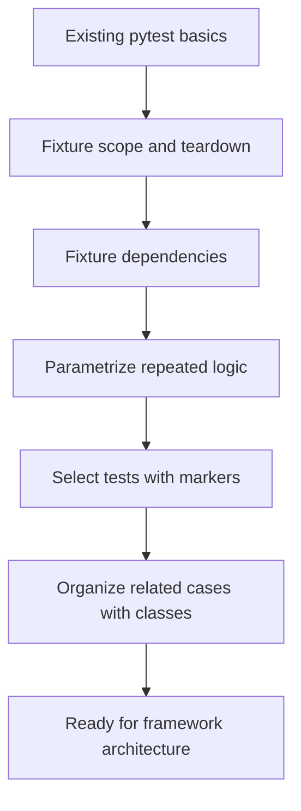

# Module 06: Pytest Deep Dive

## Goal

Turn pytest from a simple test runner into a tool you can use deliberately: fixtures, fixture scopes, yield teardown, parametrization, markers, classes, and test selection.

Modules 03-05 used pytest basics. Module 06 explains the pytest features that make a growing API suite maintainable.

## What This Module Adds

| Area | Project file | Why it matters |
| --- | --- | --- |
| Rich shared fixtures | `tests/conftest.py` | Adds session-scoped base URL, timeout, and `api_session` |
| Local fixtures | `tests/learning/test_06_pytest_features/conftest.py` | Shows fixture hierarchy for one test directory |
| Parametrize examples | `tests/learning/test_06_pytest_features/test_parametrize.py` | Replaces copy-paste tests with data-driven cases |
| Marker examples | `tests/learning/test_06_pytest_features/test_markers.py` | Demonstrates selection, skip, xfail, smoke, regression |
| Class examples | `tests/learning/test_06_pytest_features/test_classes.py` | Groups related tests without sharing unsafe state |

## Learning Path

## Module Documents

Read in this order:

1. `01-fixtures-deep-dive.md`
2. `02-parametrize-data-driven-tests.md`
3. `03-markers-and-test-selection.md`
4. `04-test-organization-classes-and-layout.md`
5. `exercises.md`

## Why This Module Matters

API suites grow by repetition:

- same base URL
- same timeout
- same headers
- same endpoint pattern with different IDs
- same assertions across multiple resources
- same test categories for CI selection

Pytest gives you tools to manage that repetition without hiding intent too early.

## Quality Gate

Module 06 is complete when:

- Docs explain fixture scope, yield teardown, parametrization, markers, and classes.
- `tests/conftest.py` contains the reusable session fixture.
- Demo tests exist under `tests/learning/test_06_pytest_features/`.
- Module tests pass with `python -m pytest tests/learning/test_06_pytest_features -v`.
- The full suite exits successfully with `python -m pytest tests/ -v`.
- Docs reference the actual files added in this module.

