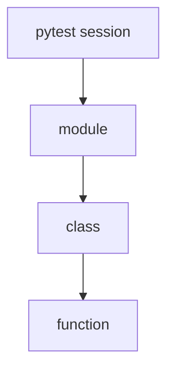
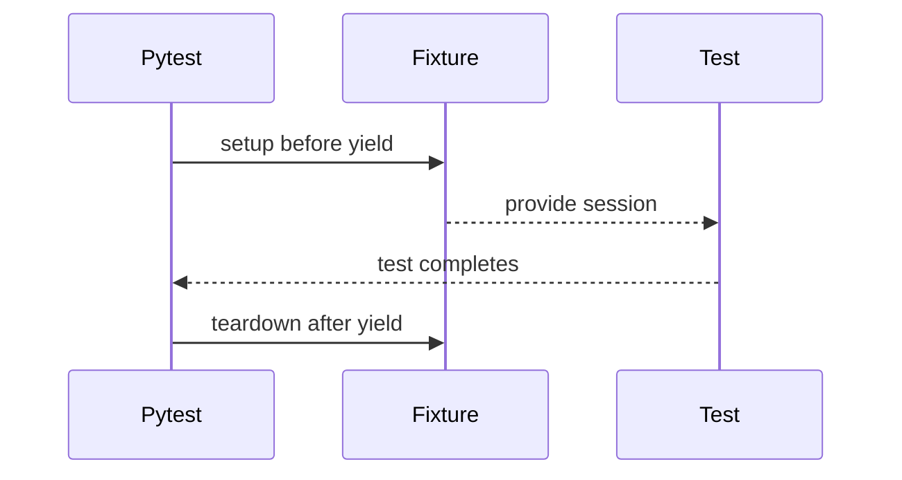

# Fixtures Deep Dive

## What A Fixture Does

A fixture provides setup data or setup objects to tests. A test asks for a fixture by parameter name; pytest resolves it.

```python
def test_get_post(jsonplaceholder_base_url):
    assert jsonplaceholder_base_url.startswith("https://")
```

The fixture lives in `tests/conftest.py`, and no import is needed.

## Fixture Scope

Scope controls how often a fixture runs.

| Scope | Runs once per | Good for |
| --- | --- | --- |
| `function` | test function | mutable test data |
| `class` | test class | grouped class setup |
| `module` | test file | expensive file-level setup |
| `session` | entire pytest run | read-only global resources |



Module 06 updates the global fixtures to session scope where safe:

```python
@pytest.fixture(scope="session")
def jsonplaceholder_base_url() -> str:
    return "https://jsonplaceholder.typicode.com"
```

The base URL and timeout are read-only. They do not need to be recreated for every test.

## Yield Fixtures

A fixture can use `yield` when it needs teardown.

```python
@pytest.fixture(scope="session")
def api_session(jsonplaceholder_base_url):
    session = requests.Session()
    session.headers.update({"Accept": "application/json"})
    session.base_url = jsonplaceholder_base_url
    yield session
    session.close()
```

Everything before `yield` is setup. Everything after `yield` is teardown.



The teardown runs even when a test fails. That is why yield fixtures are important for closing sessions, files, database connections, and created resources.

## Fixture Dependencies

Fixtures can depend on other fixtures:

```python
@pytest.fixture(scope="session")
def api_session(jsonplaceholder_base_url):
    ...
```

Pytest resolves the dependency chain:

```text
jsonplaceholder_base_url -> api_session -> test
```

Scope rule: a broad fixture cannot depend on a narrower fixture. A session fixture cannot depend on a function fixture because the function fixture changes per test.

## conftest Hierarchy

`conftest.py` files apply to their directory and child directories.

```text
tests/conftest.py
tests/learning/test_06_pytest_features/conftest.py
```

Global fixtures belong in `tests/conftest.py`. Demo-only fixtures for Module 06 belong in `tests/learning/test_06_pytest_features/conftest.py`.

## Autouse Fixtures

`autouse=True` makes a fixture run without being listed as a test parameter.

Use it sparingly. It can be helpful for class-level setup, logging, or cleanup, but invisible setup can make tests harder to debug.

## Code References

- `tests/conftest.py` shows session-scoped fixtures and `api_session`.
- `tests/learning/test_06_pytest_features/conftest.py` shows a local fixture.
- `tests/learning/test_06_pytest_features/test_classes.py` shows class-level autouse setup.

## Key Takeaways

- Fixtures make setup explicit through test parameters.
- Scope controls lifetime.
- Yield fixtures add reliable teardown.
- Fixtures can depend on fixtures.
- Put shared fixtures at the highest directory where they are truly needed.

