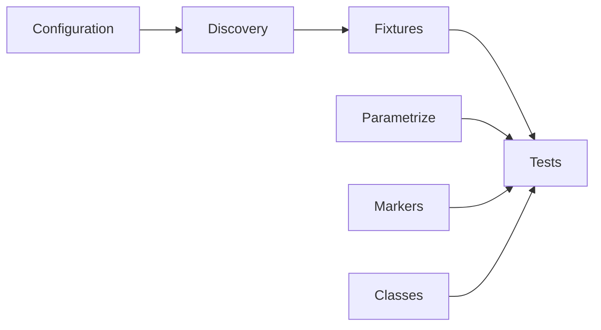

# Module 06 Checkpoint Deep Dive

This checkpoint teaches pytest as a framework tool, not just a command that runs files. The code still uses raw Requests calls, but the test suite now has reusable fixtures, parametrized cases, markers, local fixture hierarchy, and class-based organization.

## Mental Model

Pytest grows a suite by composing small pieces:

[`pyproject.toml`](../../pyproject.toml) tells pytest what to collect. [`tests/conftest.py`](../../tests/conftest.py) provides global fixtures. [`tests/learning/test_06_pytest_features/conftest.py`](../../tests/learning/test_06_pytest_features/conftest.py) provides local fixtures only for this module's examples.

## Execution Flow

For a typical Module 06 test run:

1. Pytest discovers test files and test functions using the configured naming rules.
2. It reads fixture definitions from parent `conftest.py` files.
3. It expands parametrized tests into multiple cases.
4. It applies markers for selection, skipping, or expected failure behavior.
5. It runs each test with the fixtures and parameter values requested by name.
6. It executes fixture teardown after the configured scope is complete.

The session-scoped [`api_session`](../../tests/conftest.py) fixture is the first example of setup with teardown: create a `requests.Session`, yield it to tests, then close it.

## Code Walkthrough

Read [`test_parametrize.py`](../../tests/learning/test_06_pytest_features/test_parametrize.py) first. It shows how repeated endpoint checks become one test function plus a table of inputs. `pytest.param(..., id=...)` improves test output, and parameter-level markers document expected edge behavior.

Read [`test_markers.py`](../../tests/learning/test_06_pytest_features/test_markers.py) next. It demonstrates selection markers like `smoke` and `regression`, and control markers like `skip`, `skipif`, and `xfail`.

Then read [`test_classes.py`](../../tests/learning/test_06_pytest_features/test_classes.py). Classes group related tests but should not become shared mutable state containers. The autouse fixture example fetches user data before each method so each test can focus on one assertion.

## Python And Framework Syntax To Notice

| Syntax | Why It Matters |
|---|---|
| `@pytest.fixture(scope="session")` | Reuses setup across the test session |
| `yield session` | Splits fixture setup from teardown |
| `@pytest.mark.parametrize(...)` | Generates multiple cases from one test body |
| `pytest.param(..., id="...")` | Makes verbose output readable |
| `marks=pytest.mark.xfail(...)` | Applies behavior to one parameter set |
| `@pytest.mark.smoke` | Lets a subset run by marker expression |
| `class Test...` | Groups related tests while preserving pytest discovery |
| `@pytest.fixture(autouse=True)` | Runs setup automatically for each test in scope |

## Responsibility Boundaries

At this checkpoint:

- Fixtures may manage shared values and a simple `requests.Session`.
- Parametrization may reduce copy-paste endpoint checks.
- Markers may categorize tests and document expected failures.
- Classes may group related tests but should avoid hidden test ordering dependencies.
- The suite should remain compatible with future parallel execution by keeping tests isolated.
- A custom API client class is still deferred to Module 07.

## Common Mistakes

- Using fixtures as global mutable storage between tests.
- Making class tests depend on execution order.
- Parametrizing so heavily that a failure no longer explains the business case.
- Marking failing tests as `xfail` instead of fixing a real product or test problem.
- Forgetting to register custom markers in [`pyproject.toml`](../../pyproject.toml).
- Using session scope for data that should be fresh per test.

## Debugging And Failure Model

| Symptom | Debugging Direction |
|---|---|
| Fixture not found | Check fixture name, location, and directory hierarchy |
| Test not collected | Check file, class, and function naming rules |
| Too many generated cases | Inspect stacked parametrization and parameter lists |
| Marker warning | Register the marker in [`pyproject.toml`](../../pyproject.toml) |
| Unexpected xpass | A strict expected failure now passes and should be reviewed |
| State leakage | Look for mutable fixture data or class attributes reused across tests |

When a parametrized test fails, read the parameter ID first. A good ID should tell you the case without opening the source file.

## Interview Readiness

After this module, you should be able to answer:

- How does pytest find fixtures?
- When should a fixture be function-scoped versus session-scoped?
- What problem does parametrization solve?
- What is the difference between `skip` and `xfail`?
- Why can class-level shared state make tests flaky?
- How would you select only smoke tests from this suite?

## Revision Checklist

- I can explain the setup and teardown in [`api_session`](../../tests/conftest.py).
- I can trace how one parametrized function becomes multiple test cases.
- I can run tests by marker, file, or node ID.
- I can explain why the local [`conftest.py`](../../tests/learning/test_06_pytest_features/conftest.py) does not affect unrelated modules.
- I can identify fixture choices that would block future parallel execution.
