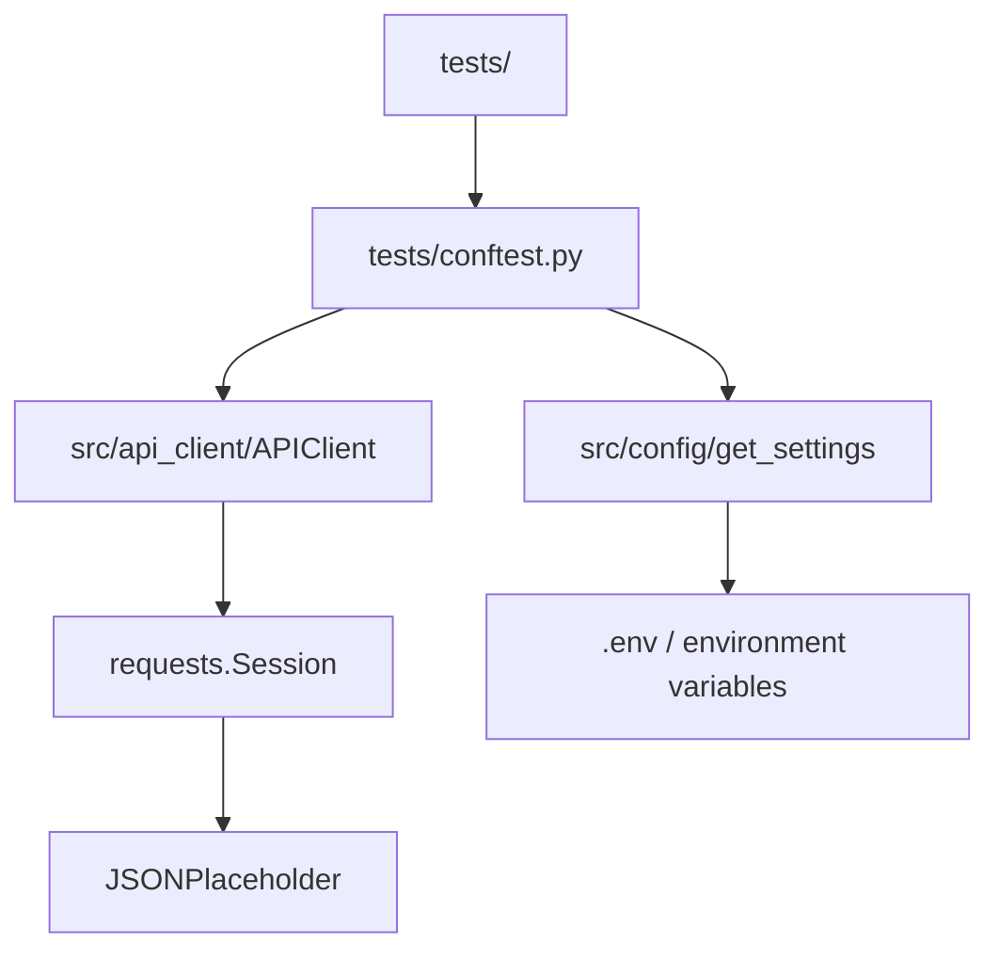

# Module 07: Framework Architecture

## Goal

Move from raw HTTP calls in test files to a small reusable framework.

Modules 04-06 intentionally repeated `requests.get(...)`, `requests.post(...)`, URL building, and timeout arguments so the mechanics stayed visible. Module 07 keeps that knowledge but moves shared concerns into the right layer.

## What This Module Adds

| Layer | Files | Responsibility |
| --- | --- | --- |
| Config | [`src/config/settings.py`](../../src/config/settings.py), [`.env.example`](../../.env.example) | Centralized URLs, timeout, environment name, log level |
| API client | [`src/api_client/client.py`](../../src/api_client/client.py) | URL joining, session reuse, default headers, timeout defaults |
| Test fixtures | [`tests/conftest.py`](../../tests/conftest.py) | Shared `api_client` fixture wired from settings |
| Learning tests | [`tests/learning/test_07_framework/`](../../tests/learning/test_07_framework/) | Proves config and client behavior |
| Docs | [`docs/module-07-framework-architecture/`](.) | Explains the framework shape and tradeoffs |

## Architecture Map



## Before And After

Before:

```python
response = requests.get(
    f"{jsonplaceholder_base_url}/posts/1",
    timeout=default_timeout_seconds,
)
```

After:

```python
response = api_client.get("/posts/1")
```

The new version is not just shorter. It moves shared behavior to one place:

- base URL
- timeout default
- JSON headers
- session lifecycle
- request/response logging hook point

## Module Documents

Read in this order:

1. [`01-why-framework-architecture.md`](01-why-framework-architecture.md)
2. [`02-config-management.md`](02-config-management.md)
3. [`03-api-client.md`](03-api-client.md)
4. [`04-sessions-and-fixtures.md`](04-sessions-and-fixtures.md)
5. [`05-checkpoint-deep-dive.md`](05-checkpoint-deep-dive.md)
6. [`exercises.md`](exercises.md)

## What You Should Be Able To Do

By the end of the module, you should be able to:

- Explain the difference between test logic, client logic, and config logic.
- Load framework settings from defaults or environment variables.
- Use `.env.example` as a safe template.
- Use `APIClient` for `GET`, `POST`, `PUT`, `PATCH`, and `DELETE`.
- Explain why `requests.Session` belongs inside the client.
- Use the `api_client` fixture in tests.
- Know when not to abstract too early.

## Quality Gate

Module 07 is complete when:

- `python-dotenv` is active in [`requirements.txt`](../../requirements.txt).
- Settings exist in [`src/config/settings.py`](../../src/config/settings.py).
- `APIClient` exists in [`src/api_client/client.py`](../../src/api_client/client.py).
- `api_client` fixture exists in [`tests/conftest.py`](../../tests/conftest.py).
- Framework tests pass with `python -m pytest tests/learning/test_07_framework -v`.
- Full suite exits successfully with `python -m pytest tests/ -v`.
