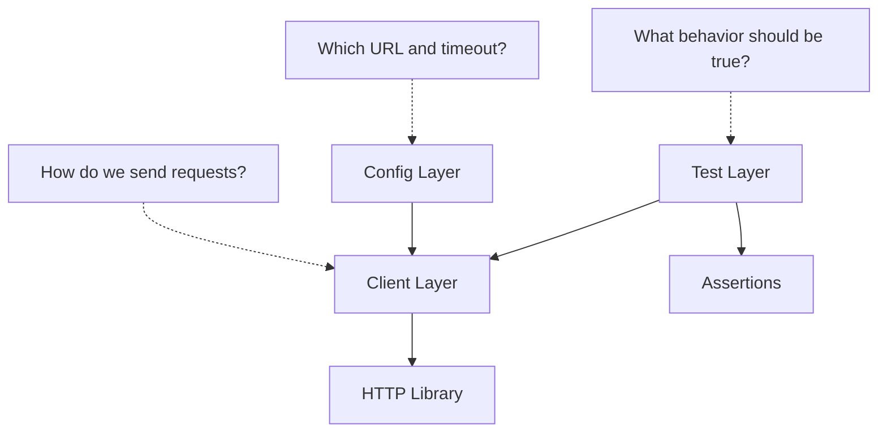

# Why Framework Architecture Matters

## The Problem With Raw Requests Everywhere

Modules 04 and 05 used raw requests intentionally:

```python
response = requests.get(
    f"{jsonplaceholder_base_url}/posts/1",
    timeout=default_timeout_seconds,
)
```

That is good for learning HTTP mechanics, but it creates repetition as the suite grows:

- Every test builds URLs manually.
- Every test passes timeout values.
- Default headers are scattered or implicit.
- Session reuse is not consistently hidden behind one API.
- Future auth headers would need to be added in many places.
- Environment switching is harder when config is not centralized.

Framework architecture is the response to that repetition.

## Separation Of Concerns

Each layer should have one job.



| Layer | Owns | Should not own |
| --- | --- | --- |
| tests | scenario and assertions | URL joining, default headers |
| API client | request mechanics | business assertions |
| settings | runtime values | HTTP logic |

## Before vs After

Before:

```python
def test_get_single_post(jsonplaceholder_base_url, default_timeout_seconds):
    response = requests.get(
        f"{jsonplaceholder_base_url}/posts/1",
        timeout=default_timeout_seconds,
    )
    assert response.status_code == 200
```

After:

```python
def test_get_single_post(api_client):
    response = api_client.get("/posts/1")
    assert response.status_code == 200
```

The test now focuses on the scenario. The client handles request construction.

## What We Are Not Doing Yet

Module 07 does not rewrite all earlier tests to use the client. That would create a large mechanical refactor and reduce learning value.

Instead, Module 07 adds the new architecture alongside existing tests. Later modules can use the client naturally as new needs appear.

## Architecture Direction

```text
src/
├── api_client/
│   └── client.py
├── config/
│   └── settings.py
├── models/
└── utils/
```

Only `api_client` and `config` get real code in this module. `models` and `utils` remain for later modules.

## Code References

- [`src/config/settings.py`](../../src/config/settings.py)
- [`src/api_client/client.py`](../../src/api_client/client.py)
- [`tests/conftest.py`](../../tests/conftest.py)
- [`test_api_client.py`](../../tests/learning/test_07_framework/test_api_client.py)

## Key Takeaways

- Architecture reduces duplication when the test suite grows.
- Tests should describe behavior, not infrastructure mechanics.
- The client layer wraps HTTP details.
- The config layer owns runtime values.
- Good architecture is incremental; do not refactor everything at once without a learning or maintenance reason.
