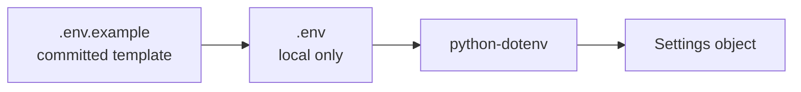

# Config Management

## Why Config Belongs Outside Tests

Hardcoding runtime values in tests makes the suite rigid.

Examples of config:

- base URL
- timeout
- environment name
- log level
- future auth credentials

These values can change by environment, but test logic should not need to change.

## Environment Variables

Environment variables are process-level key-value pairs.

```bash
export BASE_URL=https://jsonplaceholder.typicode.com
export TEST_TIMEOUT=10
```

Python can read them:

```python
import os

base_url = os.getenv("BASE_URL")
```

## `.env` and `.env.example`

`.env.example` is committed as a safe template:

```env
BASE_URL=https://jsonplaceholder.typicode.com
HTTPBIN_URL=https://httpbin.org
DUMMYJSON_URL=https://dummyjson.com
TEST_TIMEOUT=10
TEST_ENV=local
LOG_LEVEL=INFO
```

`.env` is ignored by git. It can contain local overrides or secrets.



## Settings Implementation

Module 07 adds [`src/config/settings.py`](../../src/config/settings.py).

Important pieces:

```python
PROJECT_ROOT = Path(__file__).resolve().parents[2]
load_dotenv(PROJECT_ROOT / ".env")
```

This loads a project-root `.env` file if present.

```python
@dataclass(frozen=True)
class Settings:
    base_url: str = os.getenv("BASE_URL", "https://jsonplaceholder.typicode.com")
    timeout: int = _get_int("TEST_TIMEOUT", 10)
```

The settings object has defaults, so the suite runs without a `.env` file.

## Accessing Settings

Use:

```python
from src.config import get_settings

settings = get_settings()
print(settings.base_url)
print(settings.timeout)
```

The tests use the same function through [`tests/conftest.py`](../../tests/conftest.py):

```python
@pytest.fixture(scope="session")
def jsonplaceholder_base_url() -> str:
    return get_settings().base_url
```

## Why Keep Defaults

Defaults make the learning project easy to run:

- clone repo
- install requirements
- run tests

No `.env` file is required for the public JSONPlaceholder modules.

In real projects, defaults should be safe. Never default to production credentials.

## Code References

- [`src/config/settings.py`](../../src/config/settings.py)
- [`src/config/__init__.py`](../../src/config/__init__.py)
- [`.env.example`](../../.env.example)
- [`requirements.txt`](../../requirements.txt)
- [`tests/conftest.py`](../../tests/conftest.py)
- [`test_config.py`](../../tests/learning/test_07_framework/test_config.py)

## Key Takeaways

- Config should not be scattered through tests.
- `.env.example` documents expected values safely.
- `.env` stays local and gitignored.
- `python-dotenv` loads local config for development.
- `get_settings()` gives the framework one config entry point.
