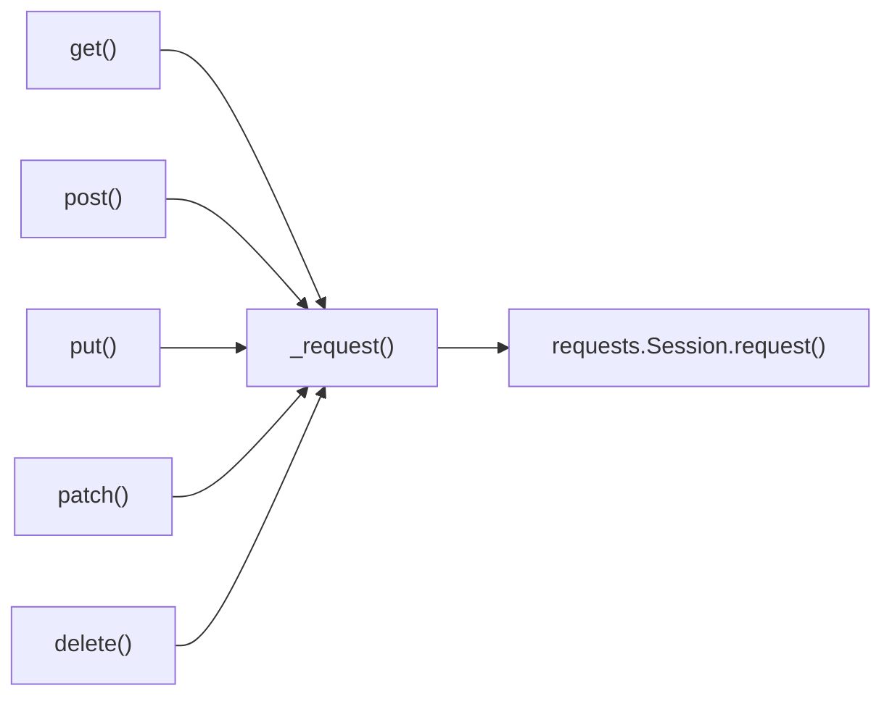

# API Client

## What The Client Solves

The API client wraps repeated HTTP mechanics:

- base URL joining
- default timeout
- default JSON headers
- `requests.Session` lifecycle
- future logging, auth, retry, and tracing hooks

Tests call the client:

```python
response = api_client.get("/posts/1")
```

They do not need to build:

```python
f"{jsonplaceholder_base_url}/posts/1"
```

## Client Shape

Module 07 adds [`src/api_client/client.py`](../../src/api_client/client.py).

```python
class APIClient:
    def __init__(self, base_url: str, timeout: int = 10) -> None:
        self.base_url = base_url.rstrip("/")
        self.timeout = timeout
        self.session = requests.Session()
```

HTTP methods are small wrappers:

```python
def get(self, endpoint: str, **kwargs: Any) -> requests.Response:
    return self._request("GET", endpoint, **kwargs)
```

Every method routes through `_request`.



## Why One `_request` Method

One request path means one place for shared behavior:

- URL building
- timeout default
- request logging
- response logging
- `last_response`

If we add retries or correlation IDs later, we add them once.

## URL Building

The client accepts relative endpoints:

```python
api_client.get("/posts/1")
api_client.get("posts/1")
```

Both resolve to:

```text
https://jsonplaceholder.typicode.com/posts/1
```

It also accepts absolute URLs when needed:

```python
api_client.get("https://jsonplaceholder.typicode.com/posts/1")
```

## `**kwargs` Pass-Through

The client does not block normal requests features.

```python
api_client.get("/posts", params={"userId": 1})
api_client.post("/posts", json={"title": "New"})
api_client.get("/posts/1", headers={"X-Debug": "true"})
```

This matters because a wrapper should reduce repetition without making the underlying HTTP library unusable.

## Context Manager Support

```python
with APIClient(base_url=settings.base_url) as client:
    response = client.get("/posts/1")
```

When the `with` block exits, the session is closed.

The pytest fixture also closes the client:

```python
@pytest.fixture(scope="session")
def api_client():
    client = APIClient(...)
    yield client
    client.close()
```

## Code References

- [`src/api_client/client.py`](../../src/api_client/client.py)
- [`src/api_client/__init__.py`](../../src/api_client/__init__.py)
- [`tests/conftest.py`](../../tests/conftest.py)
- [`test_api_client.py`](../../tests/learning/test_07_framework/test_api_client.py)

## Key Takeaways

- The API client is the framework boundary around `requests`.
- Tests use relative endpoints.
- `_request` is the single place for shared request behavior.
- `**kwargs` keeps the client flexible.
- The client owns session cleanup.
