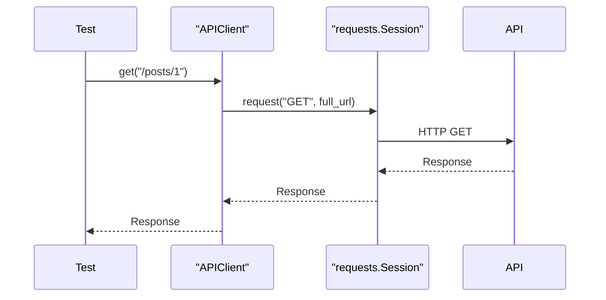

# Sessions And Fixtures

## Why Use A Session

`requests.Session` keeps useful state across requests:

- connection pooling
- default headers
- cookies
- auth defaults later

Without a session, every raw `requests.get()` call is independent.



## Default Headers

The client sets JSON headers once:

```python
self.session.headers.update(
    {
        "Accept": "application/json",
        "Content-Type": "application/json",
    }
)
```

Every request through that client inherits them unless a request overrides headers.

## Existing `api_session` vs New `api_client`

Module 06 added a raw `api_session` fixture:

```python
response = api_session.get(f"{api_session.base_url}/posts/1")
```

Module 07 adds a higher-level client:

```python
response = api_client.get("/posts/1")
```

The session fixture is still useful for demonstrating pytest yield fixtures. The API client is the preferred framework-facing abstraction from Module 07 onward.

## Fixture Wiring

`tests/conftest.py` now exposes:

| Fixture | Scope | Purpose |
| --- | --- | --- |
| `jsonplaceholder_base_url` | session | backward-compatible base URL fixture |
| `default_timeout_seconds` | session | backward-compatible timeout fixture |
| `api_session` | session | raw session demo from Module 06 |
| `api_client` | session | framework client for new tests |

## Cleanup

Both `api_session` and `api_client` are yield fixtures:

```python
yield client
client.close()
```

This ensures network resources are released after the test session.

## Code References

- `tests/conftest.py`
- `src/api_client/client.py`
- `tests/learning/test_06_pytest_features/test_classes.py`
- `tests/learning/test_07_framework/test_api_client.py`

## Key Takeaways

- Sessions reuse connection state and shared headers.
- APIClient wraps a session so tests do not build URLs manually.
- Yield fixtures guarantee cleanup.
- Existing raw fixtures remain for compatibility and learning references.

