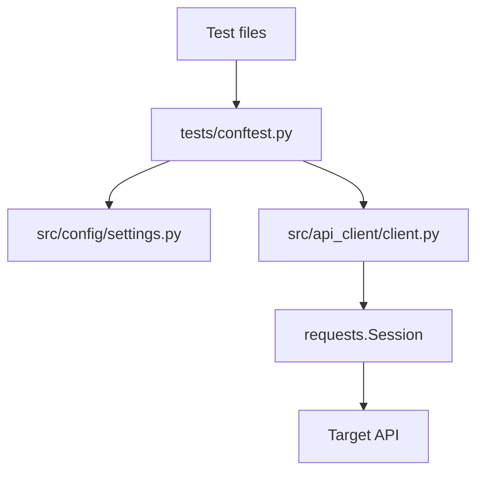

# Module 07 Checkpoint Deep Dive

This checkpoint is where the project becomes a small framework instead of a collection of raw Requests examples. The goal is not to hide HTTP. The goal is to put shared responsibilities in one place so test files can focus on behavior.

## Mental Model

Framework architecture separates decisions by responsibility:

Test files ask for an `api_client` fixture. The fixture reads settings and creates [`APIClient`](../../src/api_client/client.py). The client owns URL joining, default headers, default timeout, logging hooks, session reuse, and session cleanup.

## Execution Flow

When a test calls `api_client.get("/posts/1")`, the flow is:

1. Pytest creates the session-scoped `api_client` fixture in [`tests/conftest.py`](../../tests/conftest.py).
2. The fixture calls [`get_settings()`](../../src/config/settings.py) to read environment-aware configuration.
3. The fixture creates [`APIClient`](../../src/api_client/client.py) with base URL and timeout.
4. The test calls a method such as `get`, `post`, `put`, `patch`, or `delete`.
5. The client routes the call through `_request`.
6. `_request` builds the full URL, applies a timeout default, logs request/response metadata, sends through `requests.Session`, stores `last_response`, and returns the response.
7. Fixture teardown closes the client session after the test session.

## Code Walkthrough

[`src/config/settings.py`](../../src/config/settings.py) defines a frozen `Settings` dataclass. Defaults allow local execution without a `.env` file, while environment variables allow CI or alternate API targets to override values. `_get_int` intentionally fails on invalid integer text so bad configuration is visible.

[`src/api_client/client.py`](../../src/api_client/client.py) is the framework boundary around Requests. Public methods (`get`, `post`, `put`, `patch`, `delete`) keep test code readable. `_request` centralizes shared behavior. `_build_url` accepts both relative endpoints and absolute URLs.

[`tests/learning/test_07_framework/test_api_client.py`](../../tests/learning/test_07_framework/test_api_client.py) mixes unit-style client tests with live examples. Monkeypatching `client.session.request` verifies framework behavior without network calls, while the fixture class proves the client works against JSONPlaceholder.

[`tests/learning/test_07_framework/test_config.py`](../../tests/learning/test_07_framework/test_config.py) verifies defaults, environment overrides, and visible failure for invalid numeric config.

## Python And Framework Syntax To Notice

| Syntax | Why It Matters |
|---|---|
| `@dataclass(frozen=True)` | Makes settings simple value objects and prevents accidental mutation |
| `field(default_factory=...)` | Reads environment values when a settings object is created |
| `load_dotenv(...)` | Allows local `.env` values without committing secrets |
| `requests.Session()` | Reuses connection and default headers across calls |
| `kwargs.setdefault("timeout", self.timeout)` | Applies a default while allowing explicit override |
| `urljoin(...)` | Handles URL joining better than manual string concatenation |
| `monkeypatch.setattr(...)` | Replaces a dependency in a focused test |
| `with client as active_client` | Exercises context-manager cleanup |

## Responsibility Boundaries

At this checkpoint:

- Settings own environment-derived values.
- `APIClient` owns HTTP mechanics and shared defaults.
- Fixtures own object creation and teardown.
- Tests own scenario intent and assertions.
- The client should not contain test assertions.
- Tests should not duplicate base URL, timeout, or default headers.
- Authentication, schemas, retries, mocks, and reports are still deferred.

Clear boundaries make later modules easier to add without rewriting every test.

## Common Mistakes

- Moving assertions into the API client and making failures harder to understand.
- Letting tests manually build full URLs after `APIClient` exists.
- Reading environment variables directly inside many tests instead of through settings.
- Forgetting to close sessions.
- Hiding bad config with silent fallbacks.
- Creating abstractions before repeated behavior is clear.

## Debugging And Failure Model

| Failure | Where To Look |
|---|---|
| Wrong target API | `Settings.base_url`, `.env`, or environment variables |
| Timeout not applied | `APIClient._request` and per-request kwargs |
| Malformed URL | `APIClient._build_url` and endpoint leading slashes |
| Missing headers | `APIClient.__init__` session headers |
| Fixture not available | [`tests/conftest.py`](../../tests/conftest.py) fixture name and scope |
| Session leak | `api_client` fixture teardown or `APIClient.close()` |

For framework bugs, prefer unit-style tests with monkeypatching. For API behavior, use live tests through the fixture.

## Interview Readiness

After this module, you should be able to answer:

- Why introduce an API client wrapper?
- What should stay in tests versus the client?
- Why centralize configuration?
- Why use `requests.Session`?
- How do fixtures manage client lifecycle?
- How would you test timeout defaults without making a network call?

## Revision Checklist

- I can trace `api_client.get("/posts/1")` from test to Requests.
- I can explain every field in [`Settings`](../../src/config/settings.py).
- I can explain why `_request` is private but `get` is public.
- I can identify which tests are unit-style and which are live examples.
- I can explain what this architecture intentionally does not solve yet.
