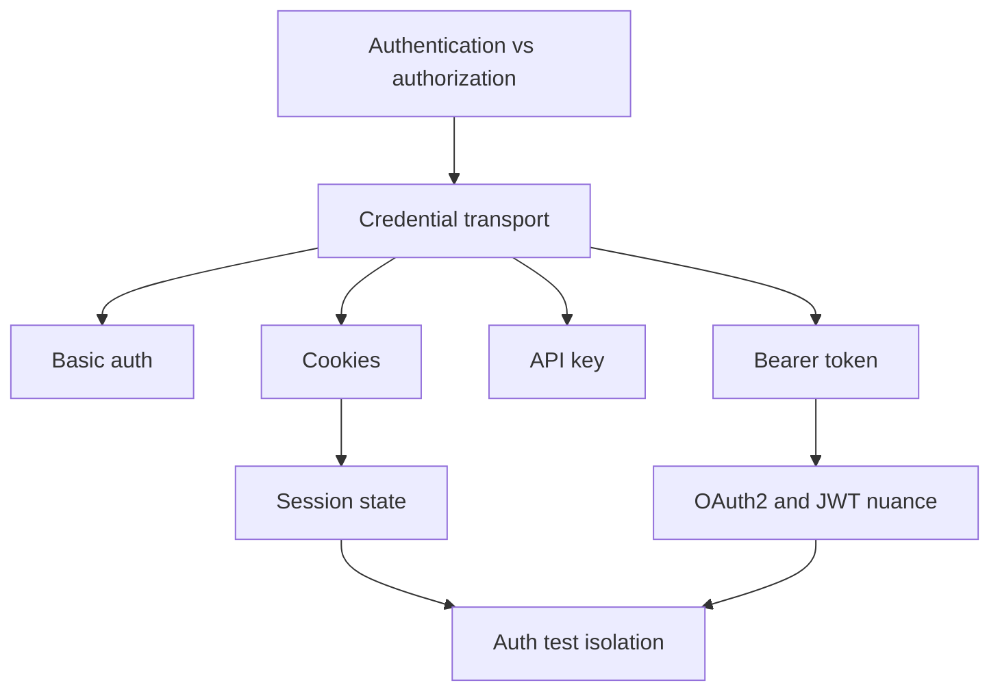

# Module 08: Authentication Testing

Module 08 teaches how API tests prove access control behavior without hiding the HTTP mechanics. You will test successful authentication, failed authentication, token headers, API keys, cookies, and session state.

The module uses `httpbin` because JSONPlaceholder is intentionally public and does not protect endpoints. The framework still keeps JSONPlaceholder as the main learning API for REST behavior.

## What This Module Builds

| Area | Files | Purpose |
| --- | --- | --- |
| Client auth helpers | [`src/api_client/client.py`](../../src/api_client/client.py) | Central methods for Basic auth, Bearer auth, and auth cleanup |
| Auth fixture | [`tests/conftest.py`](../../tests/conftest.py) | Function-scoped `httpbin_client` for isolated auth and cookie examples |
| Auth tests | [`tests/learning/test_08_auth/`](../../tests/learning/test_08_auth/) | Executable examples for Basic auth, Bearer tokens, API keys, cookies, and sessions |
| Learning docs | `docs/module-08-authentication-testing/` | Concept guides linked to the implementation |

## Learning Flow



## Concepts Covered

| Concept | What you learn | Code reference |
| --- | --- | --- |
| Basic auth | Credentials are sent through the HTTP auth mechanism | [`test_basic_auth.py`](../../tests/learning/test_08_auth/test_basic_auth.py) |
| Bearer token | Tokens are sent in the `Authorization` header | [`test_bearer_and_api_keys.py`](../../tests/learning/test_08_auth/test_bearer_and_api_keys.py) |
| API keys | Query keys vs header keys and why URLs are risky | [`test_bearer_and_api_keys.py`](../../tests/learning/test_08_auth/test_bearer_and_api_keys.py) |
| Cookies | Server-set cookies are stored by `requests.Session` | [`test_cookies_and_sessions.py`](../../tests/learning/test_08_auth/test_cookies_and_sessions.py) |
| Session isolation | Function-scoped clients prevent credential leakage | [`tests/conftest.py`](../../tests/conftest.py) |
| OAuth2 nuance | OAuth2 is a delegated authorization framework, not just a token string | [`04-oauth2-and-jwt-nuance.md`](04-oauth2-and-jwt-nuance.md) |
| Checkpoint review | Auth execution flow, isolation rules, failure model, and interview readiness | [`05-checkpoint-deep-dive.md`](05-checkpoint-deep-dive.md) |

## Test Target

Module 08 uses:

```text
https://httpbin.org
```

`httpbin` gives predictable request-behavior endpoints:

| Endpoint | Used for |
| --- | --- |
| `/basic-auth/{user}/{password}` | HTTP Basic auth success and failure |
| `/bearer` | Bearer token success and missing-token failure |
| `/get` | Query string API key visibility |
| `/headers` | Header-based API key assertion |
| `/cookies/set/...` and `/cookies` | Cookie and session behavior |

## What Is Intentionally Deferred

Module 08 does not build a complete login flow or refresh-token system yet. DummyJSON provides realistic JWT-style auth in the Module 15 capstone. This module focuses on the transport patterns and the testing mindset first.

OAuth2 is explained conceptually, but the project does not fake a full OAuth provider. Real OAuth2 testing requires token issuance, scopes, expiry, refresh behavior, and often environment-specific secrets.

## Quality Gate

Module 08 is complete when:

- `APIClient` has auth helper methods.
- `httpbin_client` is function-scoped.
- Basic auth tests cover success and failure.
- Bearer token tests cover success and missing credentials.
- API key tests explain URL visibility vs header placement.
- Cookie tests prove session persistence and per-request cookie isolation.
- Auth docs explain concepts and link back to code.
- `python -m pytest tests/learning/test_08_auth -v` passes.
- The full suite passes with `python -m pytest tests/ -v`.

## Key Takeaways

- Authentication proves identity; authorization decides what that identity may do.
- Positive auth tests are incomplete without negative auth tests.
- Headers are usually safer than query strings for secrets.
- Cookie behavior depends on session state.
- Auth tests need isolation because credentials and cookies can leak through shared sessions.
