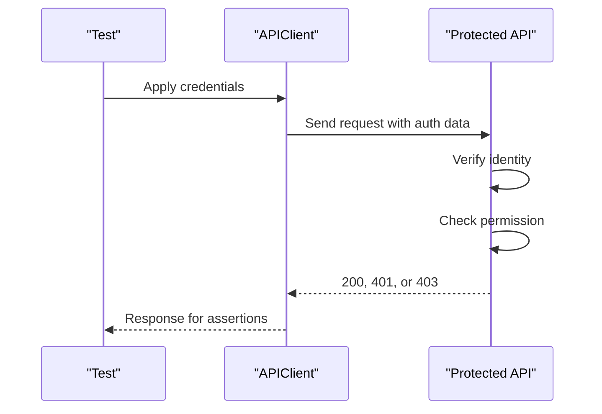

# Authentication vs Authorization

Authentication and authorization are related, but they answer different questions.

| Question | Name | API testing example |
| --- | --- | --- |
| Who are you? | Authentication | Valid Basic auth credentials return `200` |
| What are you allowed to do? | Authorization | A user token can read orders but cannot delete users |

A common mistake is to call every protected endpoint an authentication test. If the test is about missing, invalid, or expired credentials, it is authentication-focused. If the test is about role, scope, ownership, or permission, it is authorization-focused.

## Request Flow

## Status Codes To Understand

| Status | Meaning in auth tests | Common assertion |
| --- | --- | --- |
| `200` | Credentials are accepted and access is allowed | Response body confirms authenticated user or token |
| `401` | Missing or invalid credentials | Protected endpoint rejects the request |
| `403` | Credentials are valid, but permission is denied | User is authenticated but not authorized |

Module 08 uses `401` examples because `httpbin` focuses on request behavior. Later modules can cover richer `403` scenarios when the target API exposes roles or scopes.

## Testing Pattern

For every auth mechanism, ask:

1. Does the endpoint accept valid credentials?
2. Does it reject missing credentials?
3. Does it reject wrong credentials?
4. Does the test isolate credentials from other tests?
5. Does the test avoid logging or committing secrets?

## Code References

- `src/api_client/client.py`
- `tests/conftest.py`
- `tests/learning/test_08_auth/test_basic_auth.py`
- `tests/learning/test_08_auth/test_bearer_and_api_keys.py`

## Key Takeaways

- Authentication and authorization are separate concerns.
- `401` usually means authentication failed or is missing.
- `403` usually means authentication succeeded but permission is denied.
- Negative tests are essential for proving access control.
