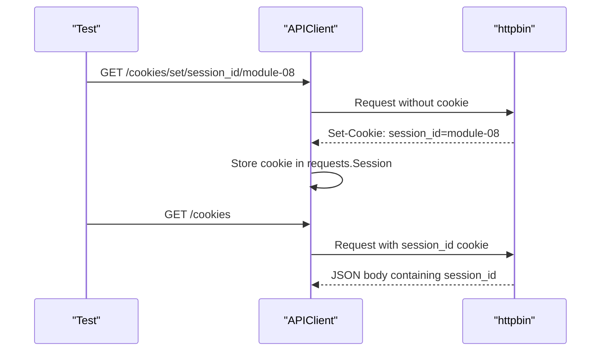

# Cookies And Sessions

Some APIs authenticate or track clients through cookies. A cookie is sent by the server and stored by the client. Later requests from the same session can send that cookie back automatically.

## Cookie Flow



## Why `requests.Session` Matters

A plain `requests.get(...)` call does not remember cookies between independent calls. A `requests.Session` does.

Module 07 introduced `APIClient` as a wrapper around `requests.Session`. Module 08 uses that session behavior directly:

```python
set_response = httpbin_client.get("/cookies/set/session_id/module-08")
cookies_response = httpbin_client.get("/cookies")
```

The second request can see the cookie because both calls use the same `httpbin_client`.

## Session Cookies vs Request-Level Cookies

There are two useful cookie patterns:

| Pattern | Example | Behavior |
| --- | --- | --- |
| Session cookie | Server sends `Set-Cookie` | Stored in `client.session.cookies` |
| Request-level cookie | `client.get("/cookies", cookies={...})` | Sent for that call only |

Module 08 tests both:

- `test_session_stores_cookie_after_set_cookie_response`
- `test_request_level_cookies_do_not_pollute_session_cookie_jar`

## Test Isolation

Cookies are state. State can leak between tests.

That is why `httpbin_client` in [`tests/conftest.py`](../../tests/conftest.py) is function-scoped:

```python
@pytest.fixture
def httpbin_client() -> APIClient:
    ...
```

Each auth test gets a fresh client, fresh session headers, fresh session auth, and fresh cookie jar.

## Code References

- [`tests/conftest.py`](../../tests/conftest.py)
- [`src/api_client/client.py`](../../src/api_client/client.py)
- [`test_cookies_and_sessions.py`](../../tests/learning/test_08_auth/test_cookies_and_sessions.py)

## Key Takeaways

- Cookies are part of HTTP state.
- `requests.Session` persists cookies between calls.
- Request-level cookies are useful when a test should not modify the session cookie jar.
- Auth and cookie tests should prefer function-scoped clients unless there is a strong reason to share state.
