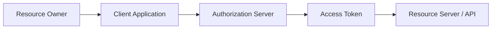

# OAuth2 And JWT Nuance

Bearer token examples are useful, but they are not the same thing as fully testing OAuth2.

## Important Distinctions

| Term | Meaning | Testing angle |
| --- | --- | --- |
| Bearer token | A token sent by whoever holds it | Check header construction and protected endpoint behavior |
| JWT | A structured token format with claims | Check claims, expiry, issuer, audience, and signature strategy when appropriate |
| OAuth2 | A delegated authorization framework | Check flows, scopes, token issuance, refresh, and revocation |
| OIDC | Identity layer on top of OAuth2 | Check identity claims and user info behavior |

OAuth2 is not just this header:

```http
Authorization: Bearer token
```

That header is only how the access token is presented to an API.

## OAuth2 Roles



In a real system, tests may need to cover:

- valid token can access protected endpoint
- missing token returns `401`
- expired token returns `401`
- token with wrong scope returns `403`
- refresh token can issue a new access token
- revoked token is rejected
- token intended for another audience is rejected

## What Module 08 Does

Module 08 tests Bearer token transport with `httpbin`:

```python
httpbin_client.set_bearer_token("module-08-token")
response = httpbin_client.get("/bearer")
```

This proves that the framework can place a token correctly and assert a protected endpoint response.

## What Later Modules Can Do

The Module 15 DummyJSON capstone can add more realistic JWT-style examples:

- login request returns token-like values
- authenticated user endpoint requires a valid token
- refresh-token behavior is validated
- tests are organized by auth domain under `tests/dummyjson/`

If a future project uses a real OAuth2 provider, keep credentials and client secrets outside git, usually through CI secrets or a local `.env` file.

## Key Takeaways

- Bearer token testing is one part of auth testing.
- OAuth2 includes flows, scopes, refresh, expiry, and revocation.
- JWT is a token format; OAuth2 is an authorization framework.
- Do not overbuild OAuth2 machinery in a beginner module before the learner understands request headers and protected endpoint responses.
