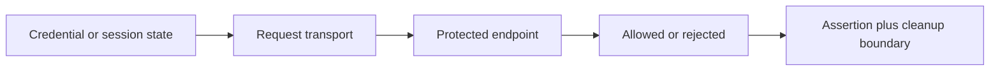

# Module 08 Checkpoint Deep Dive

This checkpoint teaches authentication transport and auth-state isolation. The main REST learning API remains JSONPlaceholder, but auth examples use httpbin because it exposes predictable endpoints for Basic auth, Bearer tokens, headers, query parameters, and cookies.

## Mental Model

Authentication tests answer two questions:

The key testing habit is pairing positive and negative cases. A test that proves valid credentials work is incomplete unless another test proves missing or wrong credentials are rejected.

## Execution Flow

For a Basic auth test:

1. Pytest creates a function-scoped [`httpbin_client`](../../tests/conftest.py).
2. The test calls `httpbin_client.set_basic_auth("learner", "secret")`.
3. [`APIClient`](../../src/api_client/client.py) stores credentials on the underlying `requests.Session`.
4. The test calls `/basic-auth/learner/secret`.
5. httpbin returns `200` and an authenticated body for valid credentials, or `401` for invalid credentials.
6. Fixture teardown closes that client so auth state does not leak to the next test.

Bearer, API key, and cookie examples follow the same shape: set state or send a credential, call a behavior endpoint, then assert both success and isolation.

## Code Walkthrough

[`test_auth_helpers.py`](../../tests/learning/test_08_auth/test_auth_helpers.py) is the fast local safety net. It verifies that `set_bearer_token`, `set_basic_auth`, and `clear_auth` change client state as expected without making network calls.

[`test_basic_auth.py`](../../tests/learning/test_08_auth/test_basic_auth.py) demonstrates valid and invalid Basic auth. The negative test is important because it proves the endpoint is not accidentally open.

[`test_bearer_and_api_keys.py`](../../tests/learning/test_08_auth/test_bearer_and_api_keys.py) compares token-in-header behavior with API keys in query strings and headers. The query-string test intentionally shows why URL-visible secrets are risky.

[`test_cookies_and_sessions.py`](../../tests/learning/test_08_auth/test_cookies_and_sessions.py) shows that a `requests.Session` stores cookies across calls, while request-level cookies do not pollute the session cookie jar.

## Python And Framework Syntax To Notice

| Syntax | Why It Matters |
|---|---|
| `self.session.headers["Authorization"] = ...` | Stores a bearer token for future calls |
| `self.session.auth = (username, password)` | Uses Requests' Basic auth support |
| `headers={"X-API-Key": "..."}` | Sends a per-request header without changing client defaults |
| `params={"api_key": "..."}` | Demonstrates why secrets in URLs are visible |
| `cookies={"mode": "learning"}` | Sends cookies for one request only |
| `session.cookies.get(...)` | Inspects persistent session cookie state |
| function-scoped fixture | Gives each auth test a fresh client and cookie jar |

## Responsibility Boundaries

At this checkpoint:

- `APIClient` may own small auth helper methods and auth cleanup.
- `httpbin_client` owns isolated client setup for auth examples.
- Tests own the expected access-control behavior.
- Docs may explain OAuth2 and JWT nuance conceptually.
- The project should not implement a fake OAuth provider, refresh-token lifecycle, or capstone login flow yet.
- Secrets should remain training values, not real credentials.

## Common Mistakes

- Testing only the happy path and missing unauthorized cases.
- Reusing an authenticated session across tests that are supposed to be independent.
- Putting API keys in query strings without understanding URL/log exposure.
- Confusing authentication with authorization.
- Treating OAuth2 as just "Bearer token syntax" instead of a delegated authorization flow.
- Forgetting to clear auth state when changing credential modes in the same client.

## Debugging And Failure Model

| Failure | Likely Cause |
|---|---|
| Expected `200`, got `401` | Credential missing, wrong, or sent in the wrong place |
| Expected `401`, got `200` | Endpoint may not be protected or auth state leaked |
| Token not visible in httpbin body | Authorization header was not set correctly |
| API key appears in URL | Query-string credential was used |
| Cookie missing on second call | Session did not store cookie or redirect behavior changed |
| Cookie appears in later test | Fixture scope is too broad or session state leaked |

For auth failures, always inspect where the credential was placed: `Authorization` header, `auth` tuple, query string, custom header, or cookie jar.

## Interview Readiness

After this module, you should be able to answer:

- What is the difference between authentication and authorization?
- Why should auth tests include negative cases?
- Why are query-string API keys risky?
- How does Requests store Basic auth versus Bearer auth?
- Why is `httpbin_client` function-scoped?
- What OAuth2 topics are intentionally not implemented here?

## Revision Checklist

- I can explain each helper in [`APIClient`](../../src/api_client/client.py).
- I can trace a Basic auth request from fixture to httpbin response.
- I can explain why cookie tests require a session.
- I can identify which examples are transport-focused and which are conceptual.
- I can explain why DummyJSON auth is deferred to Module 15.
