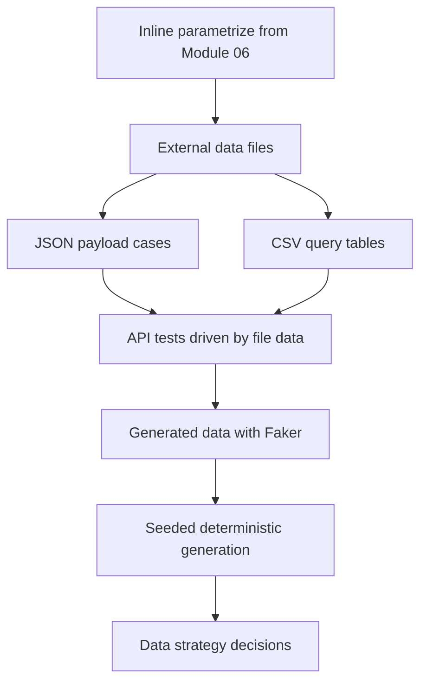

# Module 09: Data-Driven Testing

Module 09 teaches how to separate test logic from test data. Earlier modules used small inline lists inside `@pytest.mark.parametrize`. That is still useful, but real API suites often need external payload files, readable data tables, and controlled generated data.

This module keeps JSONPlaceholder as the target API and introduces `faker` for generated payload examples.

## What This Module Builds

| Area | Files | Purpose |
| --- | --- | --- |
| Data dependency | `requirements.txt` | Activates `faker` for generated test data |
| Data loader | `src/utils/data_loader.py` | Loads project-relative JSON and CSV data |
| Static data files | `test-data/module_09/post_payloads.json`, `test-data/module_09/post_filters.csv` | Keeps payloads and query combinations outside test logic |
| Data-driven tests | `tests/learning/test_09_data_driven/` | Demonstrates JSON, CSV, and generated data patterns |
| Learning docs | `docs/module-09-data-driven-testing/` | Explains data strategy and links concepts to code |

## Learning Flow

## Concepts Covered

| Concept | Why it matters | Code reference |
| --- | --- | --- |
| External test data | Keeps large payloads out of test functions | `test-data/module_09/post_payloads.json` |
| CSV tables | Works well for tabular combinations | `test-data/module_09/post_filters.csv` |
| JSON data | Preserves nested objects and numeric types | `src/utils/data_loader.py` |
| Parametrize from files | One test function can run many cases from data | `tests/learning/test_09_data_driven/test_static_file_data.py` |
| Faker | Generates realistic values without hand-writing every payload | `tests/learning/test_09_data_driven/test_generated_data.py` |
| Deterministic generation | Seeds make failures reproducible | `build_fake_post_payload()` |

## Data Sources In This Module

| Source | Best for | Example |
| --- | --- | --- |
| Inline list | Small concept examples | Module 06 parameter lists |
| JSON file | API request bodies, nested structures, typed data | `post_payloads.json` |
| CSV file | Table-shaped filters and combinations | `post_filters.csv` |
| Faker | Realistic generated names, text, emails, addresses | generated post payloads |

## What Is Intentionally Deferred

Module 09 does not validate full response schemas. Schema validation starts in Module 10.

Module 09 also does not build a database-backed data factory. That belongs in later real-world or post-capstone topics because it requires persistence, setup, cleanup, and environment management.

## Quality Gate

Module 09 is complete when:

- `faker` is active in `requirements.txt`.
- Static data exists under `test-data/module_09/`.
- JSON and CSV loading helpers exist in `src/utils/data_loader.py`.
- Tests load JSON and CSV data from files.
- Faker examples use seeds so generated data is reproducible.
- Docs explain deterministic vs generated data strategy.
- `python -m pytest tests/learning/test_09_data_driven -v` passes.
- The full suite passes with `python -m pytest tests/ -v`.

## Key Takeaways

- Data-driven testing is about separating inputs from test behavior.
- JSON is usually better for API payloads because it keeps nested structure and data types.
- CSV is useful for simple tables, but every cell starts as text.
- Faker is valuable when realism matters, but seeded data is easier to debug.
- Generated data should still satisfy a clear API contract.
