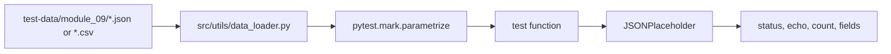

# Why Data-Driven Testing Matters

Data-driven testing lets one test function validate many inputs. The test owns the behavior; the data owns the examples.

## Before Data-Driven Testing

Without data-driven design, similar tests multiply:

```python
def test_user_1_posts(api_client):
    response = api_client.get("/posts", params={"userId": 1})
    assert len(response.json()) == 10


def test_user_5_posts(api_client):
    response = api_client.get("/posts", params={"userId": 5})
    assert len(response.json()) == 10
```

The behavior is the same. Only the data changes.

## After Data-Driven Testing

```python
@pytest.mark.parametrize("row", POST_FILTER_ROWS, ids=_case_ids(POST_FILTER_ROWS))
def test_filter_posts_with_csv_rows(api_client, row):
    user_id = int(row["user_id"])
    expected_count = int(row["expected_count"])

    response = api_client.get("/posts", params={"userId": user_id})

    assert response.status_code == 200
    assert len(response.json()) == expected_count
```

The test now describes one behavior: filtering posts by `userId`. The CSV rows describe the examples.

## Data Flow



## What Makes A Good Data-Driven Test

| Good practice | Why |
| --- | --- |
| Use readable case IDs | Failing parameter rows are easy to identify |
| Keep test logic small | The behavior is visible |
| Keep data realistic but not noisy | Learners can understand why each row exists |
| Convert CSV values intentionally | CSV rows are text by default |
| Seed generated data | Failures can be reproduced |

## When Not To Use External Data

External files are not always better. Keep data inline when:

- there are only two or three tiny values
- the values are part of the concept being taught
- moving them to a file would make the test harder to read

Module 06 used inline lists because it was teaching `parametrize`. Module 09 introduces external files because the test data is now part of the framework design.

## Code References

- `tests/learning/test_06_pytest_features/test_parametrize.py`
- `tests/learning/test_09_data_driven/test_static_file_data.py`
- `test-data/module_09/post_filters.csv`

## Key Takeaways

- Data-driven testing reduces duplication without hiding behavior.
- Keep the scenario in the test and the examples in data.
- External data is useful when the data is large, shared, or table-shaped.
