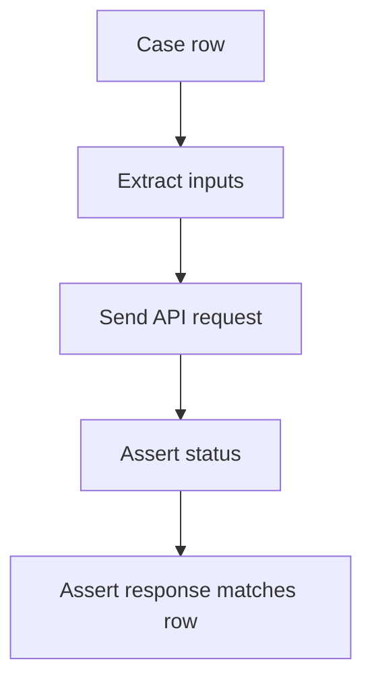

# Pytest Parametrize From Files

Module 06 introduced inline `@pytest.mark.parametrize`. Module 09 extends that idea by loading parameter rows from files.

## Static JSON Payload Cases

`tests/learning/test_09_data_driven/test_static_file_data.py` loads JSON at module import time:

```python
POST_PAYLOAD_CASES = load_json_data("test-data/module_09/post_payloads.json")
```

Then pytest uses each JSON object as one test case:

```python
@pytest.mark.parametrize("case", POST_PAYLOAD_CASES, ids=_case_ids(POST_PAYLOAD_CASES))
def test_create_post_with_json_file_payloads(api_client, case):
    payload = case["payload"]
    expected_status = case["expected_status"]

    response = api_client.post("/posts", json=payload)
```

## Why Custom IDs Matter

Without custom IDs, a failing case can look like `case0` or a long dictionary. With IDs, the output is readable:

```text
test_create_post_with_json_file_payloads[complete-post]
test_create_post_with_json_file_payloads[minimal-title-only]
test_create_post_with_json_file_payloads[extra-client-field]
```

The helper is intentionally small:

```python
def _case_ids(cases: list[dict[str, object]]) -> list[str]:
    return [str(case["case_id"]) for case in cases]
```

## CSV Query Rows

CSV rows drive the filter test:

```python
@pytest.mark.parametrize("row", POST_FILTER_ROWS, ids=_case_ids(POST_FILTER_ROWS))
def test_filter_posts_with_csv_rows(api_client, row):
    user_id = int(row["user_id"])
    expected_count = int(row["expected_count"])
```

The conversion is part of the lesson: CSV gives strings, and tests should decide how to interpret them.

## Data-Driven Assertion Pattern



For POST payloads, the response should echo each submitted field.

For filter rows, every returned post should match the requested `userId`.

## What To Avoid

Avoid turning tests into generic loops that hide failures:

```python
for case in cases:
    response = api_client.post("/posts", json=case["payload"])
    assert response.status_code == case["expected_status"]
```

That creates one test with many hidden examples. `pytest.mark.parametrize` gives each example its own result.

## Code References

- `tests/learning/test_09_data_driven/test_static_file_data.py`
- `test-data/module_09/post_payloads.json`
- `test-data/module_09/post_filters.csv`

## Key Takeaways

- File-loaded data can drive `pytest.mark.parametrize`.
- Custom IDs make failures readable.
- Prefer parametrized tests over manual loops.
- Let each data row become one independent test result.
